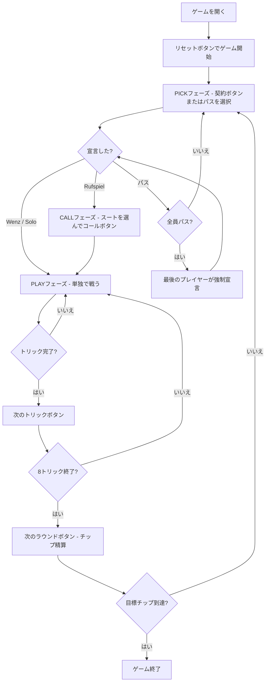

# シャーフコップ（Web版）遊び方

## ゲーム概要

Schafkopf（シャーフコップ）はバイエルンの国民的トリックテイキングゲームです。32枚デッキ（A,7,8,9,10,J,Q,K × 4スート）を4人（1人の人間 + 3人のCPU）でプレイし、各プレイヤーに8枚を配り切ります。**ブラインドも埋め札もありません** — デッキの120点すべてが誰かの手札にあります。宣言側が61点以上を獲得すれば勝利です。

このゲームの中心は**契約**です。宣言したプレイヤーは Rufspiel / Wenz / Solo の3つから選び、**何が切り札かは契約が決めます**。同じ8枚でも、宣言次第でカードの強さの順序そのものが入れ替わります。

## 起動方法

```sh
go run ./cmd/trumpcards web         # CLI経由でWebサーバーを起動
go run ./cmd/trumpcards web --open  # サーバー起動 + ブラウザを開く
go run ./cmd/server                 # 直接Webサーバーを起動
```

ブラウザで `http://localhost:8080` にアクセスし、ナビゲーションバーから「シャーフコップ」を選択します。
ナビバーのJA/ENボタンで日本語・英語を切り替えられます。

## ルール

### デッキと配布

- **デッキ**: 32枚（A,7,8,9,10,J,Q,K × ♠♣♥♦）
- **プレイヤー**: 4人（あなた = プレイヤー0、CPU1〜3）
- **配布**: 各プレイヤー8枚（32 ÷ 4 = 8 で配り切り、伏せ札は残りません）

### 3つの契約

| 契約 | ボタン | 切り札 | 味方 |
|------|--------|--------|------|
| Rufspiel | 「Rufspiel（A呼び）」 | Q全4枚 + J全4枚 + ♥全6枚（14枚） | フェイルAを呼んで隠れた相棒を作る |
| Wenz | 「Wenz（Unterのみ切り札）」 | **J全4枚のみ**（4枚） | なし（単独） |
| Solo | 「♠ Solo」〜「♦ Solo」 | 指定スート + Q全4枚 + J全4枚 | なし（単独） |

**契約が切り札の構成そのものです。** Wenz では Q が切り札でなくなり、各スートは A,10,K,Q,9,8,7 の7枚に増えます。Solo では選んだスートが♥の位置に入ります。画面上部の「契約:」行に、現在採用されている契約（Solo なら切り札スートまで）が常に表示されます。

### 固定切り札（Rufspiel、14枚）

強い順: **Q♣ > Q♠ > Q♥ > Q♦ > J♣ > J♠ > J♥ > J♦ > A♥ > 10♥ > K♥ > 9♥ > 8♥ > 7♥**

Q・Jはスートに関わらずすべて切り札に含まれます。

### Wenz の切り札（4枚）

強い順: **J♣ > J♠ > J♥ > J♦**。Q は切り札から外れ、各フェイルスートの中で A > 10 > K > Q > 9 > 8 > 7 の位置に戻ります。

### フェイルスート

Rufspiel/Solo では Q・J を除く6枚（A,10,K,9,8,7）、Wenz では J のみを除く7枚（A,10,K,Q,9,8,7）で構成。強さ: **A > 10 > K > (Q) > 9 > 8 > 7**

### カード点数と勝利条件

| カード | 点数 |
|--------|------|
| A | 11点 |
| 10 | 10点 |
| K | 4点 |
| Q | 3点 |
| J | 2点 |
| 9・8・7 | 0点 |

全カードの合計は120点。宣言側（Rufspiel なら宣言者＋相棒）の合計が **61点以上** で宣言側の勝利です。

### シュナイダー・シュバルツ

| 条件 | 効果 |
|------|------|
| 負けた側が30点以下（シュナイダー） | チップ賭け金 × 2 |
| 負けた側がトリックを1枚も取れない（シュバルツ） | チップ賭け金 × 3 |

## ゲームの流れ



## 画面の操作方法

### PICKフェーズ

- **「Rufspiel（A呼び）」ボタン**: 標準の切り札で宣言し、続くCALLフェーズで相棒を呼びます。
- **「Wenz（Unterのみ切り札）」ボタン**: Jだけを切り札にして単独で戦います。CALLフェーズは飛ばしてそのままプレイに入ります。
- **「♠ Solo」〜「♦ Solo」ボタン**: スートごとに独立したボタンです。押したボタンのスートがそのまま切り札になるので、宣言してから別途スートを選ぶ手順はありません。
- **「パスする」ボタン**: 宣言せずに見送ります。全員がパスすると最後のプレイヤーが強制的に宣言します。

### CALLフェーズ

Rufspiel を宣言したときだけ通ります。Wenz と Solo は単独契約なので、このフェーズを飛ばします。

- 呼べるスート（自分が持っていないフェイルスート）のボタンだけが表示されます。
- **「〜を呼ぶ」ボタン**: そのスートのAを持つプレイヤーが秘密の相棒になります。

### PLAYフェーズ

- あなたの手番のとき、手札のカードをクリックして選択します。数字キーでの選択と Enter での確定にも対応しています。
- **「出す」ボタン**: 選択したカードをプレイします。リードスートに従う義務があります（切り札は切り札スート扱い）。
- **「次のトリック」ボタン**: トリックが解決したら次へ進みます。
- **「次のラウンド」ボタン**: 8トリック終了後にチップを精算して次のラウンドへ進みます。

## 画面構成

```
┌────────────────────────────────────────────┐
│  Schafkopf (シャーフコップ)  [JA/EN] [CLI] │
├────────────────────────────────────────────┤
│  ラウンド: 1  トリック: 1  契約: Rufspiel   │
├──────────┬─────────────────────────────────┤
│  CPU1    │                                  │
│  CPU2    │     現在のトリック表示エリア      │
│  CPU3    │     （各プレイヤーの出したカード） │
├──────────┼─────────────────────────────────┤
│  チップ表 │  メッセージ / 結果表示           │
│  各PL得点 │                                  │
├──────────┴─────────────────────────────────┤
│  あなたの手札（クリックで選択）              │
│  [Q♣] [J♦] [A♠] [10♥] [K♣] [7♥] [9♠] [8♣] │
│  [出す] [次のトリック] [次のラウンド]        │
└────────────────────────────────────────────┘
```

- **ヘッダー**: ゲーム名・言語切り替えトグル・CLI切り替えトグル。
- **ラウンド／トリック／契約表示**: 現在のラウンド番号・トリック番号と、採用された契約。**契約表示は切り札の構成そのものです** — Wenz で Q が切り札にならない理由はここに出ます。
- **プレイヤー表示エリア（左）**: CPU各プレイヤーの手札枚数・チップ残高・トリック数。
- **トリック表示エリア（中央）**: 場に出ているカードと出したプレイヤー名。
- **サイドバー**: ピッカー・相棒・呼びスート。相棒は呼ばれたAが出るまで「（未公開）」と表示されます。
- **ラウンド結果**: ラウンド終了時に表示される得点・倍率・勝敗。
- **メッセージボックス**: フェーズ・勝敗・シュナイダー/シュバルツ結果の案内。
- **フッター（手札エリア）**: あなたの手札と操作ボタン（契約/パス/コール/出す/次へ）。

## 遊び方のコツ

- **契約の選び方**: Q・Jが3枚以上あれば Rufspiel が有利。Jを3枚以上握っているなら Wenz、1スートに5枚以上偏っているなら Solo が候補です。
- **Wenz の落とし穴**: 切り札が4枚しか無いぶん、フェイルスートの A・10 が直接勝負を決めます。Qは切り札ではなく3点のフェイル札になります。
- **コール（CALL）**: 呼べるスートのボタンしか出ないので、自分が持つAを誤って呼ぶ心配はありません。
- **切り札の温存**: 強いQ系・J系は高得点トリックの奪取やラストトリック狙いに取っておきましょう。
- **フェイルスートのリード**: 相手の切り札を消費させてから枯らすのが基本戦術です。
- **シュナイダー狙い**: 相手を30点以下に抑えるとチップが2倍になります。序盤から積極的に高得点カードを取りに行きましょう。
- **相棒の把握**: 呼ばれたスートのAが出た瞬間に相棒が判明します。それまでは全員が敵の可能性があるため、連携の判断を慎重に行いましょう。Wenz と Solo には相棒がいないので、宣言者以外は全員味方です。
