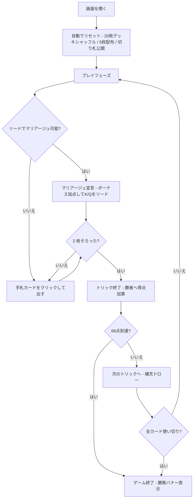

# シュナプセン（Web版）遊び方

## ゲーム概要

ドイツ・オーストリアで絶大な人気を誇る、2人用の高度なトリックテイキングゲームです。20枚デッキ (A, 10, K, Q, J × 4スート) を使い、山札がある間は **「リードスートに従う義務 (must-follow) がない」** 第1フェーズ、山札が尽きると **マストフォロー** の第2フェーズに移行します。同スートの K と Q を揃えて「マリアージュ」を宣言するとボーナス点が入り、**先に 66 点に達した側がラウンド勝利**します。

## 起動方法

```sh
go run ./cmd/trumpcards web   # CLI経由でWebサーバーを起動
go run ./cmd/server           # 直接Webサーバーを起動
```

ブラウザで `http://localhost:8080` にアクセスし、ナビゲーションバーから「シュナプセン」を選択します。
ナビバーのJA/ENボタンで日本語・英語を切り替えられます。

## ルール

### 基本ルール

- 20枚のデッキ (A, 10, J, Q, K × 4スート) を使用
- 各プレイヤーに 5 枚ずつ配り、次の 1 枚を表向きで山札の底に置きます (この札の**スートが切り札**)
- **第1フェーズ (山札あり)**: リードスートに従う義務はなし — どのカードでも出せます
- 1 トリックが終わるごとに、勝者が先に 1 枚、敗者が 1 枚を山札から補充
- 山札が尽きると **第2フェーズ** に移行: フォローできるなら同スート、勝てるなら勝つ、無ければ切り札を出す義務が生じます

### カードの強さ (スート内)

A > 10 > K > Q > J

### カードの得点

| カード | 点数 |
|-------|------|
| A (エース) | 11 |
| 10 (テン) | 10 |
| K (キング) | 4 |
| Q (クイーン) | 3 |
| J (ジャック) | 2 |

合計 120点。

### マリアージュ (Marriage)

- 自分のリード番で **同スートの K と Q を両方** 持っていれば「マリアージュ」を宣言できます
- 宣言すると **ボーナス点 20 点** (切り札スートなら **40 点 = ロイヤルマリアージュ**) を獲得し、その K か Q をリードします
- 同じスートのマリアージュは 1 ラウンドにつき 1 回のみ

### トリックの勝者

1. **両者が切り札**: 上記スート内強さの大きい方が勝つ
2. **片方だけ切り札**: 切り札の方が勝つ
3. **両者非切り札**: リードスートで返したカード同士で強さ比べ。リードスートを切らないとそもそも勝てない

### ゲーム終了

- カード点 + マリアージュボーナスの合計が **66 点に達した側が即勝利**
- 誰も 66 点に届かないまま全カードを使い切った場合は、**最後のトリックを取った側** の勝ち

### CPU難易度

| レベル | 説明 |
|--------|------|
| Normal | 標準戦略 (v1で唯一サポート)。リード時は低得点札を温存しマリアージュを優先、追随時はトリックに高得点があれば取りに行く |

## ゲームの流れ



## 画面の操作方法

| 操作 | 動作 |
|------|------|
| 手札カードをクリック | そのカードをプレイ (第2フェーズでは合法手のみ有効) |
| 「👑 マリアージュ宣言」ボタン | 宣言可能なカードの下に表示。宣言してその K/Q をリード |
| 「次のトリックへ」ボタン | トリック終了後に表示。次のトリックに進む (両者ドロー) |
| 「リセット」ボタン | 確認ダイアログを経てゲームをリセット |

## 画面構成

- **ヘッダー**: 現在のトリック番号、山札残り枚数、両者の得点、第1/第2フェーズ表示
- **トランプカード表示**: 場に表向きで置かれている切り札表示カード。山札が尽きて現物が手札へ渡ったあとは、代わりに **切り札スートの記号**（例: 切り札: ♥（山札なし））を表示し続けます。第2フェーズはマストフォローなので、スートが分からないと合法手の枠の意味が読めません
- **CPU 情報パネル**: CPU の手札枚数と獲得トリック数 (カード裏面のみ)
- **トリックエリア**: 現在進行中のトリックに出されたカード
- **メッセージ欄**: ゲーム状態や結果バナー (ja/en で切替可能)
- **自分の手札**: 0-4 のインデックスで並び、クリック対象。マリアージュ可能札には宣言ボタンが付きます

## 遊び方のコツ

- **マリアージュは大きな得点源** — K と Q が揃ったら積極的に宣言しましょう。特に切り札マリアージュ (40点) は一気に勝利を引き寄せます
- 第1フェーズでは相手が高得点 (A=11, 10=10) を出してきたら切り札で取りに行きましょう
- 自分から切り札を出すのは控えめに。切り札マリアージュを狙うなら K・Q を温存します
- **山札が空になる第2フェーズ** はマストフォロー — 相手の残り札を読み切り、確実に 66 点に到達させない立ち回りが重要です
