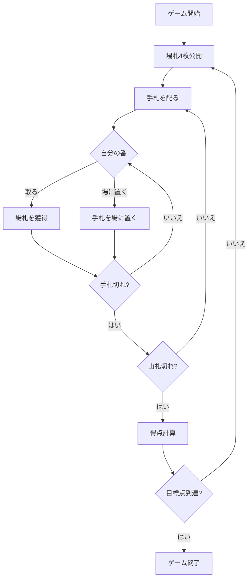

# スコパ（Web版）遊び方

## ゲーム概要

手札を1枚出して場札を取り合う、イタリア発祥の数合わせゲームです。獲得したカードの枚数・ダイヤの枚数・7の枚数・セッテベッロ（7♦）・スコパ（場を払い切ること）で得点を競います。先に目標点（デフォルト11点）に到達したプレイヤーの勝ちです。

## 起動方法

```sh
go run ./cmd/trumpcards web  # CLI経由でWebサーバーを起動
go run ./cmd/server          # 直接Webサーバーを起動
```

ブラウザで `http://localhost:8080` にアクセスし、ナビゲーションバーから「スコパ」を選択します。
ナビバーのJA/ENボタンで日本語・英語を切り替えられます。

## ルール

1. 各プレイヤーに手札3枚が配られ、場札が4枚公開されます。
2. 自分の番に手札を1枚選び、アクションを選択します。
   - **取る**: 同じ値の単札があればその1枚を必ず取ります。なければ合計が手札の値になる場札の組み合わせを取ります。
   - **場に置く**: 取れない（または取らない）場合は手札を場に置きます。
3. カードの値: A=1、2〜7はそのまま、J=8、Q=9、K=10。
4. 場札をすべて取り切ると「スコパ」となり1点加算されます。
5. 手札がなくなると新しいカードが配られます。山札が尽きるとラウンド終了、得点を計算します。

## ゲームの流れ



## 得点

| 項目 | 点数 |
|------|------|
| 最多カード | 1点 |
| 最多ダイヤ | 1点 |
| 最多の7 | 1点 |
| 7♦ (セッテベッロ) | 1点 |
| スコパ | 各1点 |

## 画面の操作方法

1. 手札をクリックして選択します。
2. 取りたい場札をクリックして選択します（単札一致なら1枚、合計一致なら複数）。
3. 「取る」ボタンを押すとカードを獲得します。
4. 取れない場合は場札を選ばずに「場に置く」を押します。

## 画面構成

| 要素 | 説明 |
|------|------|
| 場札 | テーブル中央のカード。取る対象です。 |
| 手札 | 画面下のあなたのカード。 |
| アクションボタン | 取る・場に置く から選びます。 |
| 設定パネル | CPU難易度・目標点を切り替えます。 |

## 困ったときは

- **取れるカードがわからない**: 手札を選ぶと取れる場札が緑色で表示されます。
- **CPUが強すぎる**: 設定でCPU難易度を下げてください。
- **ゲームをやり直したい**: リセットボタンを押してください。
