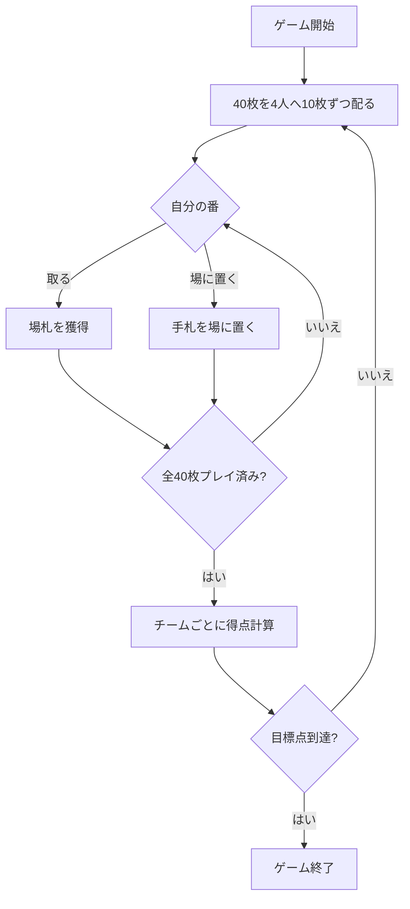

# スコポーネ（Web版）遊び方

## ゲーム概要

スコパ (Scopa) を4人2チーム（座席0+2 対 座席1+3）で行うイタリア発祥の数合わせゲームです。最初に40枚すべてを各プレイヤーへ10枚ずつ配り（最初は場札なし・引き札なし）、手札を出して場札を取り合います。獲得したカードの枚数・ダイヤ（denari）の枚数・7の枚数・セッテベッロ（7♦）・スコパ（場を払い切ること）でチーム単位の得点を競い、先に目標点（デフォルト11点）に到達したチームの勝ちです。

スコパとの主な違いは、**4人2チーム制**であることと、山札・初期場札を作らず**40枚をすべて配り切る**ことです。

## 起動方法

```sh
go run ./cmd/trumpcards web  # CLI経由でWebサーバーを起動
go run ./cmd/server          # 直接Webサーバーを起動
```

ブラウザで `http://localhost:8080` にアクセスし、ナビゲーションバーから「スコポーネ」を選択します。
ナビバーのJA/ENボタンで日本語・英語を切り替えられます。

## ルール

1. 40枚を4人へ10枚ずつ配ります。最初は場札がありません（山札・引き札もありません）。
2. 自分の番に手札を1枚選び、アクションを選択します。取れる場札があれば必ず取ります。
   - **取る**: 同じ値の単札があればその1枚を必ず取ります。なければ合計が手札の値になる場札の組み合わせを取ります。複数の取り方があれば選べます。
   - **場に置く**: 取れない場合は手札を場に置きます。
3. カードの値: A=1、2〜7はそのまま、J=8、Q=9、K=10。
4. 場札をすべて取り切ると「スコパ」となり1点加算されます（最後の1手を除く）。
5. 40枚すべてを出し終えるとラウンド終了、チームごとに得点を計算します。先に目標点に到達したチームが勝ちです。

## ゲームの流れ



## 得点（チーム単位）

| 項目 | 点数 |
|------|------|
| 最多カード (carte) | 1点 |
| 最多ダイヤ (denari) | 1点 |
| 最多の7 | 1点 |
| 7♦ (セッテベッロ) | 1点 |
| スコパ | 各1点 |

## 画面の操作方法

1. 手札をクリックして選択します。
2. 取りたい場札をクリックして選択します（単札一致なら1枚、合計一致なら複数）。
3. 「取る」ボタンを押すとカードを獲得します。
4. 取れない場合は場札を選ばずに「場に置く」を押します。**取れる組み合わせがある手札を選んでいる間は「場に置く」は選べません**（取り札が必須のルールのため、理由が横に表示されます）。
5. ラウンド終了後は内訳を確認し「次のラウンド」へ進みます。

## 画面構成

| 要素 | 説明 |
|------|------|
| 場札 | テーブル中央のカード。取る対象です。 |
| プレイヤー | 各プレイヤーの所属チーム・手札枚数・獲得枚数・スコパ数。 |
| 手札 | 画面下のあなた（P0 / team0）のカード。 |
| チームスコア | チームごとの累計得点。 |
| アクションボタン | 取る・場に置く から選びます。取れる手札を選んでいるときは「場に置く」が無効になります。 |
| 設定パネル | CPU難易度・目標点を切り替えます。 |

## 困ったときは

- **取れるカードがわからない**: 手札を選ぶと取れる場札が強調表示されます。
- **チームの考え方**: 座席0と2、座席1と3がそれぞれチームです。得点はチーム単位で集計されます。
- **CPUが強すぎる**: 設定でCPU難易度を下げてください。
- **ゲームをやり直したい**: リセットボタンを押してください。
