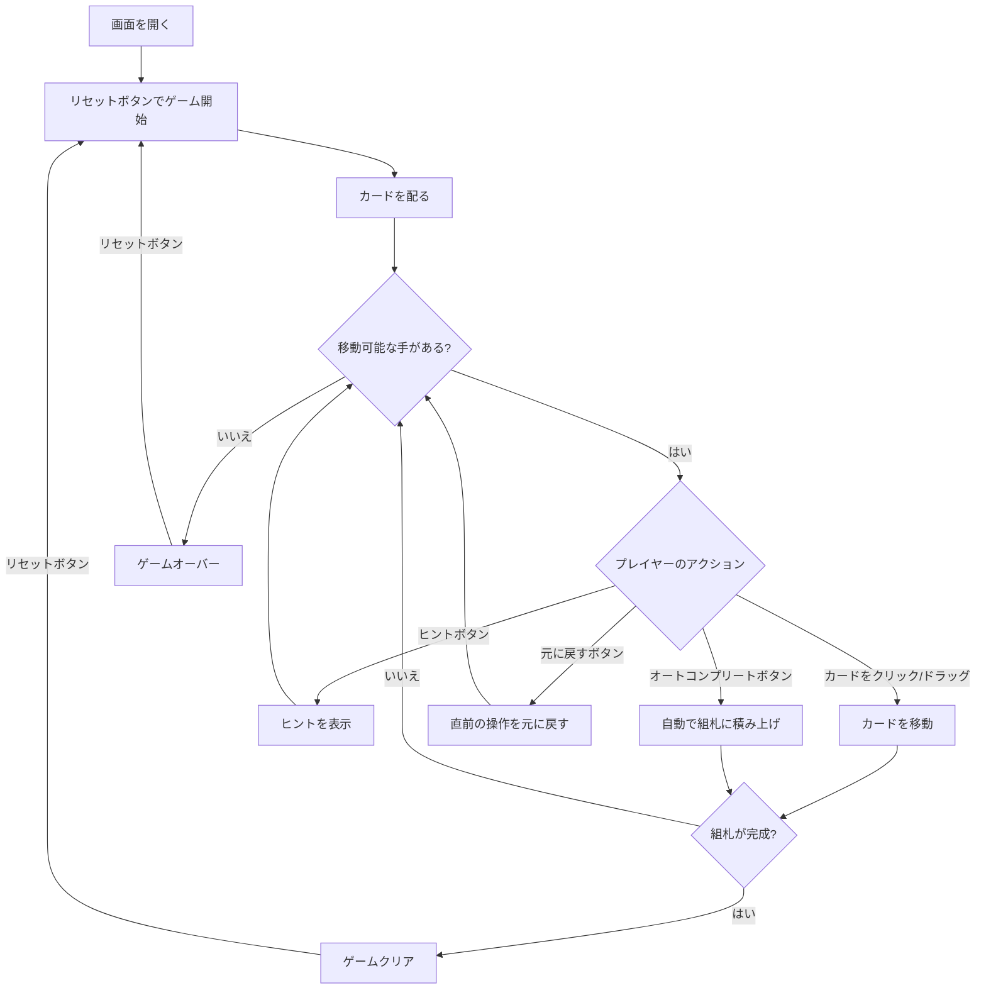

# シーヘイブンタワーズ（Web版）遊び方

## ゲーム概要

1人用のソリティアカードゲームです。フリーセルと類似の構造ながら、より厳しいルールを持つ派生ゲームです。52 枚のカードを使い、10 列のタブロー、2 つの上部リザーブセル（タワー）、4 つの組札で構成されます。すべてのカードが表向きに配られ、組札に A→K までスート別に積み上げればクリアです。

## 起動方法

```sh
go run ./cmd/trumpcards web     # CLI経由でWebサーバーを起動
go run ./cmd/server             # 直接Webサーバーを起動
```

ブラウザで `http://localhost:8080` にアクセスし、ナビゲーションバーから「シーヘイブンタワーズ」を選択します。
ナビバーの JA/EN ボタンで日本語・英語を切り替えられます。

## ルール

### 基本ルール

- 52 枚のトランプ（ジョーカーなし）を使用
- 10 列のタブローに 5 枚ずつ配る（合計 50 枚）、すべて表向き
- 上部リザーブセル（タワー）2 枚: 残りの 2 枚を最初から置いた状態でスタート
- 4 つの組札（ファンデーション）はスート別に A→K の順に積み上げる
- タブローでは「**同じスートで 1 つ小さいランク**」のみ重ねられる（例: ♠Q の上に ♠J）
- **空いた列にはキング（K）のみ置くことができる**

### スーパームーブ

一度に移動できるカード数は以下の式で決まります:

```
最大移動枚数 = 1 + 空きリザーブセル数
```

空タブロー列を中継してカード数を倍化することはできません（空列はキングしか受け付けないため）。

### ゲームクリア

- 4 つの組札すべてに A→K まで 13 枚ずつ積み上げるとゲームクリア

### ゲームオーバー

- これ以上移動可能な手がない場合はゲームオーバー

### 手詰まり検出

- 各操作の後、ソルバー（A* + メモ化）がボード全体を解析し、解法が存在しないと判定された場合「手詰まりです」とメッセージが表示されます
- 手詰まり状態では「元に戻す」またはギブアップを選択できます
- ソルバーの探索上限（100,000 状態）を超えた場合は手詰まりとは判定しません

## ゲームの流れ



## 画面の操作方法

### カードを移動する

1. 移動元のカードをクリックして選択します
2. 移動先のカード（またはエリア）をクリックして移動を確定します
3. タブロー内では同じスートで降順に並んだカード列をまとめて移動できます（スーパームーブ）

### リザーブセル（タワー）を使う

1. タブローのカードを選択し、空いているリザーブセルをクリックして退避します
2. リザーブセルのカードを選択し、タブローや組札をクリックして戻します

### アンドゥ（元に戻す）

**「元に戻す」** ボタンまたは `z` キーで直前の操作を取り消せます。何度でも元に戻せます。

### ヒント・オートコンプリート

1. **「ヒント」** ボタンをクリックすると、次に可能な手を提案します
2. **「オートコンプリート」** ボタンをクリックすると、組札に安全に移動できるカードを自動で移動します

### キーボードショートカット

ゲーム中、以下のキーボードショートカットが使用できます。

| キー | アクション | 有効条件 |
|------|-----------|---------|
| `z` | 元に戻す（アンドゥ） | プレイ中 |
| `h` | ヒント | プレイ中 |
| `a` | オートコンプリート | プレイ中 |
| `g` | ギブアップ | プレイ中 |

※ テキスト入力欄にフォーカスがある場合、ショートカットは無効になります。

## 画面構成

```
┌──────────────────────────────────────────────────────┐
│                  ゲーム情報                           │
│  手数: 15                                            │
├──────────────────────────────────────────────────────┤
│   リザーブセル              組札エリア                │
│   [♠K][♥7]               [♠A][♥A 2][  ][  ]        │
├──────────────────────────────────────────────────────┤
│                  タブロー (10列 × 5枚)                │
│  [0] [1] [2] [3] [4] [5] [6] [7] [8] [9]              │
│  ...                                                 │
├──────────────────────────────────────────────────────┤
│   [元に戻す] [ヒント] [オートコンプリート]            │
│   [ギブアップ] [リセット]                             │
└──────────────────────────────────────────────────────┘
```

- **リザーブセル**: 2 つの一時退避スペース（タワー、カード 1 枚ずつ）
- **組札エリア**: 4 つのスート別の組札（A→K の順に積み上げ）
- **タブロー**: 10 列のカード列（すべて表向き）
- **ボタン**:
  - 「元に戻す」: 直前の操作を取り消す
  - 「ヒント」: 次の一手を提案
  - 「オートコンプリート」: 自動で組札へ移動
  - 「ギブアップ」: 現在のゲームを終了
  - 「リセット」: 新しいゲームを開始

## 遊び方のコツ

- リザーブセルは 2 つしかありません。フリーセルよりも慎重に使う必要があります
- 空列にはキング（K）しか置けないため、序盤からキングの動かし方を計画しましょう
- A が出たらすぐに組札へ移動するのが安全です
- タブロー間移動はスート縛りで制限的なので、序盤は組札を進めることを優先しましょう
- ヒントボタンで詰まった時のアドバイスを得られます
- オートコンプリートは終盤の片付けに便利です
