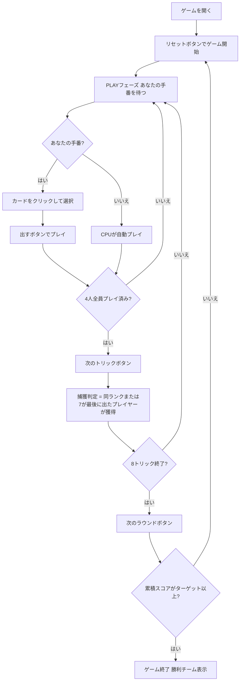

# セドマ（Web版）遊び方

## ゲーム概要

Sedma（セドマ）はチェコ・スロバキア地方で親しまれているトリックテイキングゲームです。32枚のデッキを4人（2チーム制、席0&2 対 席1&3）でプレイします。**切り札なし**、**マスト・フォロー義務なし**で、リードカードと同じランク、または **7（ワイルド）** でのみトリックを捕獲できるというシンプルながら奥深いルールが特徴です。カード点数（A=10点、10=10点）をラウンドをまたいで累積し、先にターゲット（デフォルト101点）に達したチームが勝ちます。あなたは席0（チームA）としてプレイします。

## 起動方法

```sh
go run ./cmd/trumpcards web        # REST API + Web GUI サーバを起動
go run ./cmd/trumpcards web --open # 起動してブラウザを開く
```

ブラウザで `/sedma` にアクセスします。

## ルール

### デッキと配布

- **デッキ**: 32枚（7,8,9,10,J,Q,K,A × 4スート）
- **プレイヤー**: 4人（あなた = 席0、CPU1〜3）
- **チーム**: 席0&2（あなたのチーム）対 席1&3
- **配布**: 各プレイヤー8枚
- **切り札**: なし（切り札スートは存在しない）

### 捕獲ルール（Sedmaの核心）

- カードを出す順番に制約はなく、**任意のカードを出せる**（マスト・フォロー義務なし）
- 出したカードがトリックを**捕獲できる**条件は以下のいずれか:
  1. **リードカードと同じランク**（例: リードが K♠ なら K♥、K♦、K♣ は捕獲可）
  2. **7（ワイルド）**: スートに関わらずトリックを捕獲できる
- **最後に捕獲したプレイヤー**がトリックを獲得（リード後に誰も捕獲しない場合はリードプレイヤーが獲得）
- トリック獲得者が次のトリックをリードする

### カード点数

**A=10点、10=10点、その他=0点**（4スート合計80点）

最終（8枚目）トリックの獲得チームに **+10ボーナス点** が加算されます。

### 勝利条件

各ラウンドで獲得したカード点数がチームスコアに累積され、先にターゲット（デフォルト **101点**）に達したチームがマッチ勝利となります。

## ゲームの流れ



## 画面の操作方法

### PLAYフェーズ

- あなたの手番のとき、手札のカードをクリックして選択します。
- **「出す」ボタン**: 選択したカードをプレイします。Sedmaはマスト・フォロー義務がないため、任意のカードを選択できます。
- **「次のトリック」ボタン**: トリックが解決したら次へ進みます。トリック結果（捕獲者・獲得点数）を確認してから進みましょう。
- **「次のラウンド」ボタン**: 8トリック終了後にスコアを集計して次のラウンドへ進みます。

### キーボードショートカット

このゲームではキーボードショートカットはありません。すべての操作はボタンまたはカードのクリックで行います。

## 画面構成

```
┌─────────────────────────────────────────────┐
│  Sedma (セドマ) [JA/EN] [CLI]               │
├─────────────────────────────────────────────┤
│  ラウンド: 1  トリック: 1  フェーズ: PLAY   │
│  チームスコア: あなた=0 相手=0               │
├──────────┬──────────────────────────────────┤
│  CPU1    │                                   │
│  CPU2    │     現在のトリック表示エリア       │
│  CPU3    │     （各プレイヤーの出したカード）  │
│          │                                   │
├──────────┼──────────────────────────────────┤
│  チームA │  メッセージ / 結果表示            │
│  チームB │  ラウンド結果・スコア情報          │
├──────────┴──────────────────────────────────┤
│  あなたの手札（クリックで選択）               │
│  [A♠][10♠][K♥][J♠][Q♣]...                 │
│  [出す] [次のトリック] [次のラウンド]         │
└─────────────────────────────────────────────┘
```

- **ヘッダー**: ゲーム名・フェーズ表示・言語切り替えトグル・CLI切り替えトグル。
- **ラウンド／トリック表示**: 現在のラウンド番号・トリック番号。切り札表示はありません（Sedmaに切り札なし）。
- **チームスコア**: 各チームの累積スコア（カード点数の合算）をリアルタイムで表示。
- **プレイヤー表示エリア（左）**: CPU各プレイヤーの手札枚数・取得トリック数・チームを表示。
- **トリック表示エリア（中央）**: 場に出ているカードと出したプレイヤー名。捕獲カード（同ランク・7）はハイライト表示されます。
- **メッセージボックス**: フェーズ・ラウンド結果（カード点数・スコア）・勝敗の案内。
- **フッター（手札エリア）**: あなたの手札と操作ボタン（出す／次のトリック／次のラウンド）。マスト・フォローがないため、すべてのカードが選択可能です。

## 遊び方のコツ

- **7（ワイルド）は切り札代わりの切り札**: 7はどのリードに対しても捕獲できます。AやK・10などの高得点トリックが場に出たときに7を温存しておき、プレイ順で最後に出すことで確実に奪えます。
- **最後の捕獲が勝負**: Sedmaは「最後に捕獲したプレイヤー」がトリックを獲得します。パートナーがすでに同ランクを出していても、さらに同ランクや7を後から出せばチームとしてトリックを確定できます。
- **高得点カード（A・10）を狙う**: デッキの点数のすべてはAと10に集中しています。対戦相手がAや10をリードしたときに7または同ランクで奪うのが基本戦略です。
- **プレイ順を活かす**: 後手番（プレイ順が遅い）は選択の幅が広がります。場のカードを見てから出すカードを決められるため、不必要な7を使わずに済む場合があります。
- **7の温存と使いどころ**: 7はデッキに4枚あります（各スート1枚）。全局通して高得点トリックが出る場面で使うよう計画しましょう。
- **パートナーと連携**: 席0&2が同じチームです。パートナーが高得点カードをリードしたら、そこに7や同ランクを出してチームでトリックを確保しましょう。パートナーがすでにトリックを取っている状況なら7を温存するのも有効です。
- **101点目標の長期戦**: セドマは複数ラウンド続く長期戦です。序盤からスコアの累積を意識し、7の使用タイミングを慎重に管理しましょう。
