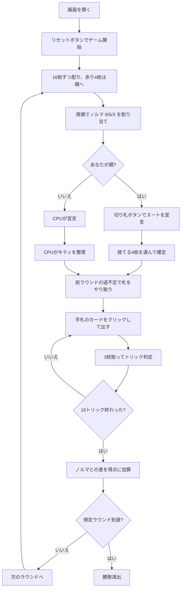

# サージェントメジャー（Web版）遊び方

## ゲーム概要

イギリス軍隊に由来するとされる**3人専用**のトリックテイキング。**ノルマは席順で決まり、宣言しません**——親が8、左隣が5、右隣が3で、名前の「8-5-3」がそのままこの3つの数です。合計16がトリック数と一致します。52枚を16枚ずつ配り、**余った4枚（キティ）は親が取り込んで4枚捨てます**。

## 起動方法

```sh
go run ./cmd/trumpcards web  # CLI経由でWebサーバーを起動
go run ./cmd/server          # 直接Webサーバーを起動
```

ブラウザで `http://localhost:8080` にアクセスし、ナビゲーションバーから「サージェントメジャー」を選択します。
ナビバーのJA/ENボタンで日本語・英語を切り替えられます。

## ルール

- **52枚**、**3人専用**、16枚ずつ。**52は3で割り切れない**ので、余った**4枚（キティ）は親が取り込み、4枚捨てます**
- **ノルマは席順で固定**: 親が **8**、左隣が **5**、その次が **3**。8 + 5 + 3 = 16 でトリック数と一致し、宣言する余地はありません
- 親が**切り札を宣言**し、キティを取り込んで4枚捨てます
- **ノルマとの差がそのまま得点**。多く取れば取っただけ得点で、届かなければマイナス
- **届かなかった人は次のラウンドで良い札を召し上げられます**（不足ぶんだけ最強札を渡し、相手の最弱札を受け取る）
- フォロー義務あり。切り札 > リードのスート > その他。同じスートなら A > K > Q > J > 10 > … > 2
- **親はラウンドごとに交代**し、ノルマも一緒に回ります
- 規定ラウンド（既定3、**3の倍数**）を終えた時点で、**累計得点がいちばん高い人の勝ち**

## ゲームの流れ



## 画面の操作方法

| 操作 | 説明 |
|------|------|
| 切り札ボタン（♠♣♥♦の4つ） | 切り札スートを宣言する（**あなたが親のときだけ表示**） |
| 手札のカードをクリック（キティ整理） | 捨てる札を選ぶ（黄色の枠が付きます）。**キティから入ってきた 4 枚には左上に「キティ」バッジ**が付くので、元から持っていた札と区別できます |
| 捨てるボタン | 選んだ4枚を捨てる（**ちょうど4枚選ぶまで押せません**） |
| 手札のカードをクリック（プレイ中） | そのカードを出す（出せる札には緑の枠が付きます） |
| 次のラウンドへボタン | ラウンド終了後、次のラウンドを配る |
| ヒントボタン | 宣言すべきスート、捨てる札、打つべき札を提示する |
| ギブアップボタン | 投了する |
| リセットボタン | 確認ダイアログのうえで最初からやり直す |
| CLI トグル | 同じゲームをコマンド入力で操作するモードに切り替える |

**ノルマを宣言するボタンはありません。** 8・5・3 は席順で決まります。

### キーボードショートカット

| キー | アクション | 有効条件 |
|------|-----------|---------|

（このゲーム固有のキーボードショートカットはありません）

## 画面構成

```
┌────────────────────────────────────────────┐
│  ラウンド 2/3          切り札: ♥            │
├────────────────────────────────────────────┤
│ ノルマは席順で決まります（親8・左隣5・次3） │
│ 前ラウンドの過不足で 2 枚が動きました        │
├────────────────────────────────────────────┤
│  あなた: ノルマ5 / 獲得3   累計1            │
│  CPU1 [親/ノルマ8]: ノルマ8 / 獲得5 累計-1  │
│  CPU2: ノルマ3 / 獲得0     累計0            │
├────────────────────────────────────────────┤
│              現在のトリック                 │
├────────────────────────────────────────────┤
│  あなたの手札（出せる札に緑の枠）           │
└────────────────────────────────────────────┘
```

- **上部**: ラウンド数と切り札（未宣言のあいだはキティの枚数を出します）
- **ノルマ帯**: このゲームの規則そのもの。**宣言ではなく席順で決まる**ことを常に出します
- **やり取り行**: 前ラウンドの過不足で動いた枚数。**盤面には痕跡が残らない**ので明示します
- **中央上**: 各プレイヤーの**ノルマ / 獲得数 / 累計得点**、**親**の印
- **中央**: 現在のトリック
- **下部**: 自分の手札。**フォロー義務を満たす札だけ**に緑の枠が付きます

## 遊び方のコツ

- **親のノルマ8は重い。** そのかわりキティで4枚入れ替えられるので、切り札を厚くできます
- **ノルマ3の席が狙い目。** 3つ取れば達成、それ以上はまるごと得点になります
- **届いたあとも取りにいく。** 多く取れば取っただけ得点なので、降りる理由がありません
- **不足すると次が苦しい。** 良い札を召し上げられます
- **捨て札は切り札にならない弱い札から**
- **相手のノルマを見る。** ノルマ8の親を8未満に抑えれば、こちらは楽に達成できます
