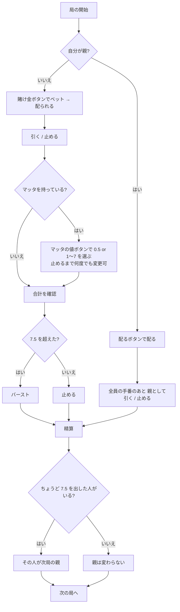

# セッテ・エ・メッツォ (Sette e Mezzo) — Web マニュアル

## ゲーム概要

**7 と 1/2** を目指すイタリアのバンキングゲーム。**40 枚**（8・9・10 なし）で遊び、人間 1 人 + CPU 2 人のうち 1 席が親を務めます。**絵札が 0.5 点**なのが最大の特徴です。

## 起動方法

1. `go run ./cmd/trumpcards web` でサーバーを起動する
2. ブラウザで `http://localhost:8080` を開く
3. ゲーム一覧または左サイドバーから「セッテ・エ・メッツォ」を選ぶ

## ルール

- **点数**: A = 1、2〜7 = 数どおり、**絵札 = 0.5**、**コインの K（マッタ）= 0.5 または 1〜7 のワイルド**
- マッタは**コインの K だけ**。他の K はただの 0.5 点札
- **マッタの値は止めるまで何度でも変えられる**
- 合計が **7.5 を超えたらバースト**
- **同点は親の勝ち**
- **ちょうど 7.5 を出したプレイヤーが次局の親**になる（毎局まわるのではない）

## ゲームの流れ

## 画面の操作方法

| 操作 | 説明 |
|------|------|
| 賭け金ボタン | 額を選んでベットし、その局を配る |
| 配るボタン | 自分が親の局を配る（賭け金は選ばない） |
| 引く | 1 枚引く |
| 止める | 引き止める |
| マッタの値ボタン | マッタを 0.5 / 1〜7 のどれとして数えるかを選ぶ（**持っているときだけ表示**） |
| 親として引く / 止める | 自分が親のとき、最後に引き止めを決める |
| 次の局へ | 精算後に次の局を始める |
| CLI トグル | 同じゲームをコマンド入力で操作するモードに切り替える |

キーボードショートカット: `h` 引く / `s` 止める / `r` 次の局。

## 画面構成

- **上部**: フェーズ、チップ残高、親が誰か
- **中央上段**: 親の手（局が終わるまで伏せ札。**サーバーが中身を送らない**）
- **中央**: 各席の手。合計と、マッタを持っていれば現在の割り当て値が併記される
- **下部**: 打てる宣言のボタン、結果表示、アクションログ

## 遊び方のコツ

- **絵札は 0.5 点なので 7 点から引いてもバーストしない**
- **マッタは止める直前に見直す。** 引くたびに最適値が変わる
- **7.5 を出せば次の局の親になる**
- **同点は親の勝ち**
