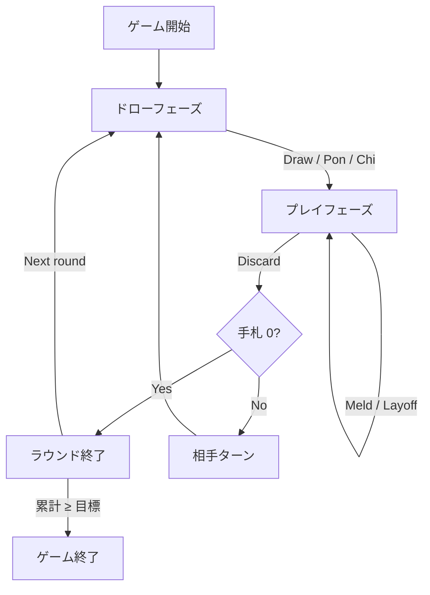

# セブンブリッジ（Web版）遊び方

## ゲーム概要

セブンブリッジは日本で親しまれているラミー系のカードゲームです。2 人用（人間 1 / CPU 1）。7 を起点にメルドを作り、先に 100 点に到達した方が勝利します。相手の捨て札を麻雀のように「ポン」「チー」で取得して攻めることができます。

## 起動方法

```sh
go run ./cmd/trumpcards web  # CLI経由でWebサーバーを起動
go run ./cmd/server          # 直接Webサーバーを起動
```

ブラウザで `http://localhost:8080` にアクセスし、以下の手順で開始します。ナビバーのJA/ENボタンで日本語・英語を切り替えられます。

1. ナビゲーションバーの **「ラミー」** カテゴリから **「セブンブリッジ」** を選ぶ
2. 設定パネルから CPU 難易度・目標スコアを調整（任意）
3. 手札が配られたらゲーム開始

## ルール

### 基本ルール

- 各プレイヤーに 7 枚配布。山札の最初の 7 を捨て札の起点に置く
- 1 ターンは「ドロー → プレイ」の 2 フェーズ
  - ドロー: 山札から 1 枚引くか、直前の捨て札を **ポン**（同ランク 2 枚と合わせて 3 枚のセット）または **チー**（同スートで連続する 2 枚と合わせて 3 枚のラン）で取得
  - プレイ: メルド、レイオフ（既存メルドに 1 枚追加）、ディスカードのいずれかを実行
- **捨て札制約**: 7 は常に合法。そうでなければ、捨て札トップと同ランクか ±1 のランクのみ捨てられる
- 手札が 0 になったプレイヤーがラウンド勝利

### 得点

- 勝者 = 敗者の手札ペナルティ合計
  - A=1, 2–9=数字通り, 10/J/Q/K=10, **7=50**
- 累計得点が目標に到達したプレイヤーが勝利

## ゲームの流れ



## 画面の操作方法

- **手札のカードをクリック** して選択／解除（複数選択可）
- 2 枚選んだ状態で **ポン／チー** をクリック
- 3 枚以上選んだ状態で **メルド** をクリック
- 1 枚選んだ状態で **ディスカード** または **レイオフ**（追加先プレイヤーとメルドを選択）
- 設定パネルで CPU 難易度／目標スコア／ヒントの ON/OFF を変更

## 画面構成

| 領域 | 内容 |
|------|------|
| 画面上部 | 現在のフェーズ・CLI トグル・マニュアル／チュートリアルボタン |
| 左ペイン | 捨て札トップと相手のメルド |
| 右ペイン | スコア表（各プレイヤーのラウンド／累計） |
| 下部 | 自分の手札、エラー表示、ヒント、操作ボタン |

## 遊び方のコツ

- 7 を引けたら終盤まで温存するのが基本。どんな捨て札制約下でも自分の逃げ道になる
- ポン／チーで手札を一気に 2 枚減らせるので、相手の捨て札を注視する
- メルドを早めに場に出すとレイオフで手札を減らしやすい
- ヒント機能は、ポン／チー／メルドの好機を自動検出してくれる
