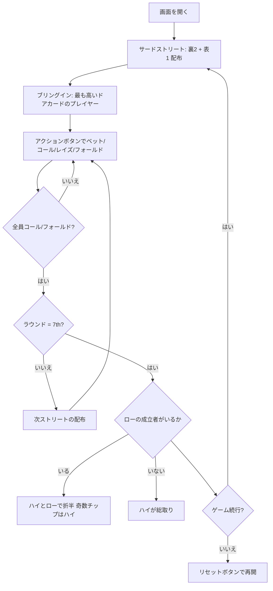

# セブンカードスタッド・ハイロー（Web版）遊び方

## ゲーム概要

セブンカードスタッド・ハイロー（8 or Better）は、セブンカード・スタッドのポット分割版です。**ハイ**の最強役とローの最強役でポットを折半します。

ローは **8 以下のランク 5 枚（重複なし）** が揃ったときだけ成立します（ストレートとフラッシュは無視、エースは常にロー）。最強のローは A-2-3-4-5（ホイール）です。

**ローが誰にも成立しなければ、ポットはハイの総取り**です。ここが 8 or Better の肝で、ローを狙って空振りすると半分どころか何も残りません。ハイとローの 5 枚は**同じ 7 枚から別々に選べます**。

## 起動方法

```sh
go run ./cmd/trumpcards web  # CLI経由でWebサーバーを起動
go run ./cmd/server          # 直接Webサーバーを起動
```

ブラウザで `http://localhost:8080` にアクセスし、ナビゲーションバーから「セブンカードスタッド・ハイロー」を選択します。
ナビバーのJA/ENボタンで日本語・英語を切り替えられます。

## ルール

### 基本ルール

- 52枚のトランプを使用
- コミュニティカードなし — 各プレイヤーに個別にカードが配られる
- 合計7枚（裏向き3枚 + 表向き4枚）から、**ハイの最強5枚**と**ローの最強5枚**を別々に選ぶ
- **ローの成立条件**: 5枚すべてが8以下、かつランクの重複なし
- ローの比較ではストレートとフラッシュは無視し、エースは常にロー（1）
- 最強のローハンド: A-2-3-4-5（ホイール）
- **ローの成立者がいなければハイがポットを総取り**
- ポットを折半するとき、**奇数チップはハイ側**に付く（ポーカー慣例）
- ブリングインは最も高いドアカードのプレイヤーが支払う

### ゲームの進行

1. **アンティ**: 全プレイヤーがアンティを支払う
2. **サードストリート**: 裏向き2枚 + 表向き1枚配布。最も高いドアカードのプレイヤーがブリングインを投入
3. **フォースストリート**: 表向き1枚追加。最弱の表向きハンドから開始
4. **フィフスストリート**: 表向き1枚追加。最弱の表向きハンドから開始
5. **シックスストリート**: 表向き1枚追加。最弱の表向きハンドから開始
6. **セブンスストリート**: 裏向き1枚追加。最後のベッティングラウンド
7. **ショーダウン**: ハイの最強者とロー（8 or Better）の最強者でポットを折半。ロー不成立ならハイの総取り

### ベッティングアクション

| アクション | 説明 |
|-----------|------|
| フォールド | 手札を捨ててラウンドから降りる |
| チェック | ベットせずにパスする（未ベット時のみ） |
| コール | 現在のベット額に合わせる |
| ベット | 新たにベットする（未ベット時のみ） |
| レイズ | 現在のベット額を上げる |
| オールイン | 全チップを賭ける |

## ゲームの流れ



## 画面の操作方法

### アクションの実行

自分の手番が来ると、画面下部にアクションボタンが表示されます。

**ベットが出ていない場合:**
- **「ベット」**: ベット額を入力してベットする
- **「チェック」**: パスする

**ベットが出ている場合:**
- **「コール」**: 現在のベット額に合わせる
- **「レイズ」**: ベット額を入力してレイズする

**常に選択可能:**
- **「フォールド」**: 降りる
- **「オールイン」**: 全チップを賭ける

### キーボードショートカット

| キー | アクション | 有効条件 |
|------|-----------|---------|
| `c` | コール | アクションフェーズ（ベットがある場合） |
| `r` | レイズ / ベット | アクションフェーズ |
| `k` | チェック | アクションフェーズ（ベットがない場合） |
| `f` | フォールド | アクションフェーズ |
| `a` | オールイン | アクションフェーズ |

## 画面構成

```
┌──────────────────────────────────────────────┐
│  フェーズ表示 / チュートリアル・マニュアル   │
├──────────────────────────────────────────────┤
│  CPUエリア（表向きドアカード + チップ）      │
│                                              │
│  ポット表示                                   │
│                                              │
│  あなたの手札（裏向き + 表向き）             │
├──────────────────────────────────────────────┤
│  [フォールド][チェック/コール][ベット/レイズ]│
│  [オールイン]          [リセット]            │
└──────────────────────────────────────────────┘
```

- 上部ポット表示で現在のポット額・アンティ・ブリングインを確認できます。
- 自分の裏向きホールカードは自分にのみ見えます。
- CPUのドアカードは全員に公開されます。

## 遊び方のコツ

- **スクープ（ハイとローの両取り）が最大の利益**です。A-2-3-4-5 のような手はストレートにもローにもなります
- サードストリートで3枚ともローカード（8以下）なら、ローの目とスクープの目が同時に立ちます
- **ローを狙うときは「8 以下が5種類」揃うかを数えましょう。**4種類で止まるとローは不成立で、賭けた分がそのままハイ側へ行きます
- ハイ一本で行くなら、相手のドアカードに 8 以下が並んでいないかを見ます。ローが不成立の卓ではハイが総取りです
- ペアはローを殺します。低い札でもペアになった時点でその2枚のうち1枚は数えられません
