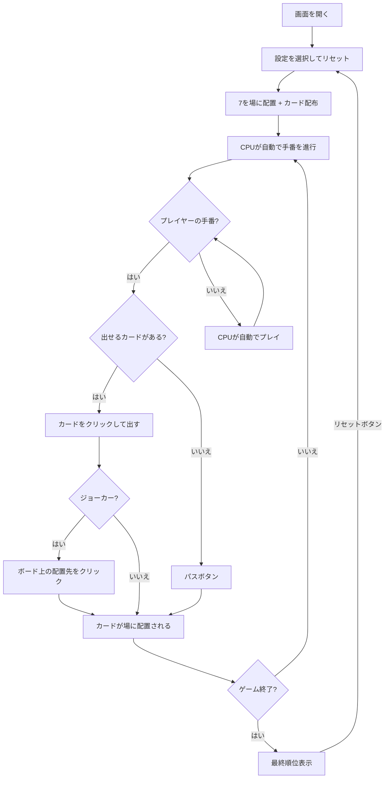

# 7並べ（Web版）遊び方

## ゲーム概要

4人（プレイヤー1人 + CPU 3人）で遊ぶカードゲームです。場の7を起点に、隣接する数字のカードを順番に並べていきます。手札を最初になくしたプレイヤーが1位です。

## 起動方法

```sh
go run ./cmd/cli web        # CLI経由でWebサーバーを起動
go run ./cmd/server         # 直接Webサーバーを起動
```

ブラウザで `http://localhost:8080` にアクセスし、ナビゲーションバーから「Sevens」を選択します。
ナビバーのJA/ENボタンで日本語・英語を切り替えられます。

## ルール

### 基本ルール

- 52枚のトランプを使用（オプションでジョーカー0〜2枚追加）
- 各スートの7が最初に場に置かれ、プレイヤーの手札から除去される
- 場に出ているカードの隣接値（±1）のカードのみ出せる
- カードが出せない場合はパス（デフォルト最大5回、設定で変更可能、0で無制限）
- パスを使い切り、出せるカードもない場合は失格（残りの手札が場に強制配置される）
- 最初に手札をなくしたプレイヤーが1位

### オプションルール

画面下部の設定パネルで設定を変更できます（リセット時に反映）。

| オプション | 説明 |
|------------|------|
| トンネル | AとKが循環して繋がる（A↔K） |
| トンネルスキップ | 通常の±1に加え、±N離れたカードからも繋げられる（2〜6、トンネル有効時は循環ラップ） |
| ジョーカー | ジョーカーを場の任意の有効位置に配置できる（0〜2枚） |
| CPU戦略 | CPUの思考モード。なし/戦略的/嫌がらせ特化の3段階から選択 |
| パス回数 | 最大パス回数を変更（デフォルト5回、0で無制限） |
| ジョーカー上がり禁止 | 最後のカードがジョーカーの場合、出せない（パスまたは失格） |
| ジョーカー回収 | ジョーカーが配置された位置に本物のカードを出すと、ジョーカーが手札に戻る |
| 片側ストップ | Aを置くと上側(8-K)がブロック、Kを置くと下側(A-6)がブロックされる |
| ジョーカー連続禁止 | 前の手番でジョーカーを出したプレイヤーは、次の手番でジョーカーを出せない（通常カードを出すかパスするとリセット） |

## ゲームの流れ



## 画面の操作方法

### ゲーム設定（画面下部の設定パネル）

| 設定 | UI |
|------|----|
| トンネル | チェックボックス |
| トンネルスキップ幅 | ドロップダウン（なし / 2 / 3 / 4 / 5 / 6） |
| CPU戦略 | ドロップダウン（なし / 戦略的 / 嫌がらせ特化） |
| ジョーカー | ドロップダウン（0 / 1 / 2） |
| パス回数 | ドロップダウン（3 / 5 / 10 / 無制限） |
| ジョーカー上がり禁止 | チェックボックス |
| ジョーカー回収 | チェックボックス |
| 片側ストップ | チェックボックス |
| ジョーカー連続禁止 | チェックボックス |

設定変更後 **「リセット」** ボタンをクリックすると新しい設定でゲームが開始されます。

### カードの出し方

1. 手札の中で出せるカードは緑色の枠で表示されます
2. 出せるカードをクリックすると場に配置されます
3. 出せないカードは薄く（半透明）表示され、クリックできません

### ジョーカーの使い方

1. 手札のジョーカーをクリックします
2. ボード上の配置可能な位置が青色に変わります
3. 青色のマスをクリックしてジョーカーを配置します
4. **「キャンセル」** ボタンで選択をやめることもできます

### パス

- **「パス」** ボタンをクリックしてパスします
- パス残回数が0の場合、ボタンは無効化されます

## 画面構成

```
┌────────────────────────────────────────────┐
│            CPU プレイヤーエリア             │
│ ┌──────────┐ ┌──────────┐ ┌──────────┐   │
│ │ CPU 1    │ │ CPU 2    │ │ CPU 3    │   │
│ │12枚      │ │13枚      │ │上がり    │   │
│ │パス: 1/5 │ │パス: 0/5 │ │1位       │   │
│ └──────────┘ └──────────┘ └──────────┘   │
├────────────────────────────────────────────┤
│              ボード (場札)                  │
│  ♠: [A][2][3][4][5][6][7][8][9][ ][ ][ ][ ]│
│  ♣:          [ ][ ][ ][7][ ][ ][ ][ ][ ]   │
│  ♥:          [ ][ ][ ][7][8][9][10][ ][ ]   │
│  ♦:    [ ][ ][4][5][6][7][ ][ ][ ][ ][ ]   │
│  (緑=配置済み, 橙=7, 青=ジョーカー配置可)   │
├────────────────────────────────────────────┤
│  [リセット] [パス] [キャンセル]             │
├────────────────────────────────────────────┤
│  設定: ☐トンネル CPU戦略:[なし▼] ジョーカー:[0▼] パス:[5▼] ☐ジョーカー上がり禁止 ☐片側ストップ ☐ジョーカー連続禁止│
├────────────────────────────────────────────┤
│  プレイヤーの手札 (パス: 0/5)              │
│  [♠2][♠3][♥10][♣K][JOKER] ...            │
│  (緑枠=出せる, 薄=出せない)                │
└────────────────────────────────────────────┘
```

- **ボード**: 4スート × 13値のグリッド表示
  - 緑色: 配置済みのカード
  - 橙色/金色: 7（初期配置）
  - 青色: ジョーカー選択モード時の配置可能位置
  - 暗い: 未配置
  - トンネル有効時: KとAの間に視覚的な「↔」コネクタが表示され、反対端（KまたはA）が配置済みの場合は黄色枠でハイライトされる
- **プレイヤーの手札**: 緑枠のカードが出せるカード、薄く表示されたカードは出せない
- **CPU パネル**: 手番のCPUは金色枠 + 「考え中...」バッジ
- **強制パス表示**: 出せるカードがない場合のパスは赤色背景 + `⚠ 出せるカードなし!` で強調表示

## 遊び方のコツ

- パスはデフォルト5回まで（設定で変更可能）なので、計画的に使いましょう
- 出せるカード（緑枠）を確認してからプレイしましょう
- ジョーカーは場の好きな有効位置に配置できるため、戦略的に使うと有利です
- トンネルルールを有効にすると、AとKが循環するため選択肢が広がります
