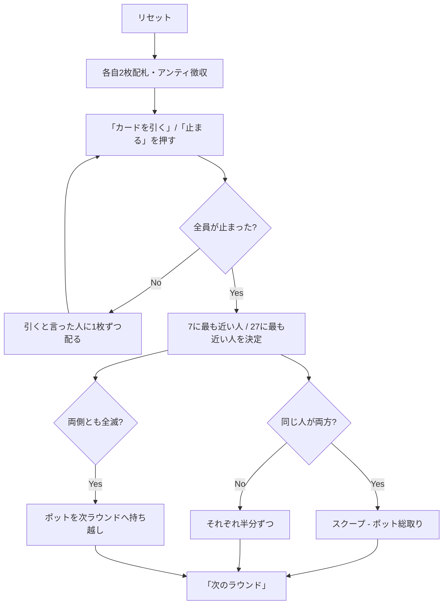

# セブン・トゥエンティセブン（Web版）遊び方

## ゲーム概要

セブン・トゥエンティセブンはアメリカの「dealer's choice」ホームゲームの定番です。**ポットは2つに割れます** —— **7 に最も近い（超えていない）手**と **27 に最も近い（超えていない）手**が半分ずつ取り、**同じ人が両方を制したら総取り（スクープ）** です。

**カードの点数がこのゲームの肝です。**

- **絵札（J・Q・K）= 0.5点**
- **エース = 1点 または 11点**（1枚ごとに好きなほうを選べます）
- それ以外は数字どおり

全員がアンティを払って2枚ずつ配られ、そこから「もう1枚引く」か「止まる」かを繰り返します。**止まったらそのラウンドはもう配られません。** 全員が止まった時点で勝負です。

**超えた側だけが失格になります。** 19点の手は7側では死んでいますが、27側ではまだ十分に生きています。両側とも超えた人ばかりになったら、ポットは次のラウンドへ持ち越されます。

## 起動方法

```sh
go run ./cmd/trumpcards web  # CLI経由でWebサーバーを起動
go run ./cmd/server          # 直接Webサーバーを起動
```

ブラウザで `http://localhost:8080` にアクセスし、ナビゲーションバーから「セブン・トゥエンティセブン」を選択します。
ナビバーの JA/EN ボタンで日本語・英語を切り替えられます。

## ルール

### 基本ルール

1. 全員がアンティを支払い、標準52枚デッキから各自2枚の手札が配られます。
2. 各巡、「カードを引く」か「止まる」かを選びます。CPU も同時に選びます。
3. **止まると、そのラウンドはもうカードが配られません。** 引くと宣言した人にだけ1枚ずつ配られます。
4. 全員が止まった時点でショーダウン。
5. **7 に最も近い（超えていない）人**と **27 に最も近い（超えていない）人**がポットを半分ずつ取ります。
6. **同じ人が両方を制したら総取り（スクープ）** です。
7. 片側に生存者がいなければ、もう片方が総取りします。
8. **両側とも生存者がいなければ**、ポットは丸ごと次のラウンドへ持ち越されます。
9. 同点は分け合います。

### カードの点数

| カード | 点数 |
|--------|------|
| A | **1 または 11**（1枚ごとに選択） |
| 2〜10 | 数字どおり |
| J・Q・K | **0.5** |

A-A-5 は **7 ちょうど**にも **27 ちょうど**にもできます。両取りを狙える、このゲームでいちばん美味しい形です。

### 停止条件

規定ラウンド数を消化するか、アンティを払えるプレイヤーが2人未満になるとゲーム終了。最終的にチップが最も多いプレイヤーが勝者です。

## ゲームの流れ



## 画面の操作方法

### カードを引く / 止まる

- **「カードを引く」** — もう1枚もらいます
- **「止まる」** — このラウンドはもう配られません。**押した時点で確定**で、以後この
  ラウンドに打つ手はありません（残りの CPU の引きはサーバが処理し、そのまま決着します）

止まったあとはボタンが消えます。押せるのに何も起きないボタンを残さないためです。

### 次のラウンド

決着したら **「次のラウンド」** で配り直します。チップはラウンドをまたいで持ち越されます。

### ヒント

設定パネルでヒントを有効にすると助言が出ます。**助言は狙っている側を言います** ——
「引け」だけでは 7 狙いか 27 狙いかで意味が正反対になるためです。

## 画面構成

```
┌────────────────────────────────────────────┐
│ ラウンド 1 | ポット 40 | アンティ 10        │
│ 目標は 7 と 27 の2つ。超えたらその側は失格。 │
│ 絵札=0.5点、A=1点または11点。               │
├────────────────────────────────────────────┤
│ プレイヤー                                  │
│ あなた — チップ 190 · 賭け 10 · [まだ引く]  │
│                                 · 4.5 / 4.5 │
│ CPU 1 — チップ 190 · 賭け 10 · [止まった]   │
│ CPU 2 — チップ 190 · 賭け 10 · [まだ引く]   │
├────────────────────────────────────────────┤
│ ラウンド結果                                │
│  7側: あなた（6）                           │
│  27側: CPU 2（27）                          │
├────────────────────────────────────────────┤
│ あなたの手札 — 7側 / 27側: 4.5 / 4.5        │
│  [♠4] [♥K]                                  │
│  [カードを引く] [止まる] [リセット]          │
└────────────────────────────────────────────┘
```

- **情報バー** — ラウンド・ポット・アンティ、そして **2つの目標とカードの点数**（常時表示）
- **プレイヤー一覧** — チップ、このラウンドの賭け、状態、そして **7側 / 27側の得点**
  - 状態は `まだ引く` / `止まった` / `脱落`、決着後は `7側を取得` / `27側を取得` / `両取り`
  - 得点の `-` は **その側が超過して失格** という意味です
  - 相手の得点はラウンドが決着するまで出ません（得点は手札そのものなので、隠すなら両方隠します）
- **ラウンド結果** — 両側の勝者を名指しします。総取りのときは専用の表示になります
- **フッター** — 自分の手札と両側の得点、行動ボタン

## 遊び方のコツ

- **絵札は0.5点。** K・Q・J ばかりの手は 7 側に非常に強く、しかも1枚引いても壊れにくい優秀な形です。
- **エースは両にらみ。** A-A-5 は 7 ちょうどにも 27 ちょうどにもできます。両取り（スクープ）を狙える最高の形です。
- **7 側は1枚で壊れます。** 6.5点まで来たら、引くのは絵札を期待するときだけ。止まる判断が効きます。
- **27 側は逆に引き続けます。** 20点あたりからが勝負どころ。ただし10を引けば一発で超えます。
- **片側が超えても諦めない。** 19点の手は 7 側では死んでいますが、27 側では十分に戦えます。表示の `-` はその側だけの話です。
- **全員が両側とも超えたらポットは持ち越し。** 膨らんだポットは、次のラウンドで手堅く 7 側を取るだけでも大きな利益になります。
