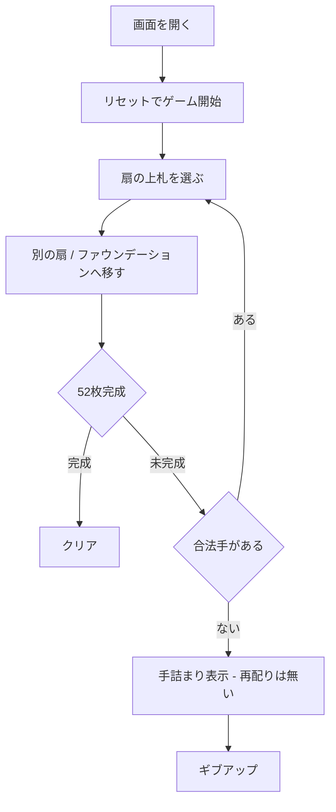

# シャムロックス（Web版）遊び方

## ゲーム概要

シャムロックス（Shamrocks）は、標準52枚デッキを **17 の 3 枚扇（fan）と 1 枚の孤立カード＝計 18 扇** に配る **ファン・ソリティア** です。各扇の **最上位カードだけ** を操作し、4 つの **ファウンデーション** に A から K まで積み上げます。同系統のラ・ベル・リュシーとは 2 点が決定的に違います。**扇の上では「スート不問・ランク 1 つ違い」でどちらの向きにも重ねられる**代わりに、**1 つの扇は 3 枚までしか持てず、再配り（リディール）は一度もできません**。

## 起動方法

```sh
go run ./cmd/trumpcards web  # CLI経由でWebサーバーを起動
go run ./cmd/server          # 直接Webサーバーを起動
```

ブラウザで `http://localhost:8080` にアクセスし、ナビゲーションバーから「シャムロックス」を選択します。
ナビバーのJA/ENボタンで日本語・英語を切り替えられます。

## ルール

1. **扇**: 各扇の最上位カードのみ操作できます。**スートは問わず**、移動先の扇の最上位カードと **ランクが 1 つ違い**（1 つ上でも 1 つ下でもよい）なら重ねられます。
2. **扇の上限**: 1 つの扇は **3 枚まで**。すでに 3 枚ある扇は移動先になりません。
3. **空の扇**: 空になった扇には **どのカードでも 1 枚置けます**。
4. **ファウンデーション**: 扇の最上位に A が来たらファウンデーションへ移し、以降は同スート昇順（A→K）で積み上げます。
5. **再配りはありません**: 合法手が尽きたらそれが詰みです。画面にも手詰まりが表示されます。
6. **勝敗**: 52 枚すべてファウンデーションに積み上げればクリア。動かせる手が無くなれば失敗です。

## ゲームの流れ



## 画面の操作方法

- 上部に **ファウンデーション**（4 つ）、その下に **扇** のグリッドが並びます。
- 動かす扇をクリックして選択し、移動先の扇かファウンデーションをクリックして移動します。同じ扇を再クリックで選択解除できます。
- フッターの「自動完成」「元に戻す」「ヒント」「ギブアップ」で操作します。**再配りボタンはありません。**

## 画面構成

上から順に、ページのコンポーネント構成そのままの並びです。

```
┌──────────────────────────────────────────────────┐
│  シャムロックス                                  │
│  手数: 8                                         │
├──────────────────────────────────────────────────┤
│  組札（4つ）                                     │
│  [♠A][ ][ ][ ]                                   │
├──────────────────────────────────────────────────┤
│  扇（18 個・3 枚ずつ、最後の1つは1枚）           │
│  [1] [2] [3] [4] [5] [6] [7] [8] [9]             │
│  [10][11][12][13][14][15][16][17][18]            │
├──────────────────────────────────────────────────┤
│  手詰まりバナー（合法手が尽きたときだけ）        │
├──────────────────────────────────────────────────┤
│  メッセージ / ヒント                             │
├──────────────────────────────────────────────────┤
│  設定パネル / 棋譜（アクションログ）             │
├──────────────────────────────────────────────────┤
│  [自動完成] [元に戻す] [ヒント] [ギブアップ]     │
│  [リセット]                                      │
└──────────────────────────────────────────────────┘
```

- **組札**: 4つ。A から K まで同スートで積み上げます
- **扇**: 52 枚を 3 枚ずつ配るので **18 個**（最後の1つだけ1枚）。各扇の**最上位カードだけ**が動かせ、**3 枚が上限**（`ShamrocksFanSize`）です
- **手詰まりバナー**: 合法手が 1 つも無くなると出ます。再配りが無いので、これが出たらギブアップ以外の道はありません
- **動かせる扇の細いリング**: いま動かせる扇（ファウンデーションか他の扇へ置ける）に常時付きます。ヒントの強調（太いリング＋点滅、4秒で消える）とは太さで区別できます
- **メッセージ / ヒント**: 直前の操作の結果と、ヒントボタンを押したときの推奨手
- **設定 / 棋譜**: 設定と、これまでの手の履歴（折りたたみ式）
- **リセット**: 新しいゲームを開始します

## 遊び方のコツ

- A・2 など低いカードを早めに掘り出してファウンデーションを伸ばしましょう。
- **3 枚の上限が効く**ので、深い扇へ積むより浅い扇を使うほうが手が続きます。
- 配り直せないぶん、**扇を 1 つ空にできると価値が高い**です。空の扇はどのカードでも受けられる自由枠になります。
- スートを無視してランク ±1 で繋げられるので、同スートに縛られるラ・ベル・リュシーの感覚のまま探すと、細いリングが付いている合法手を見落とします。
