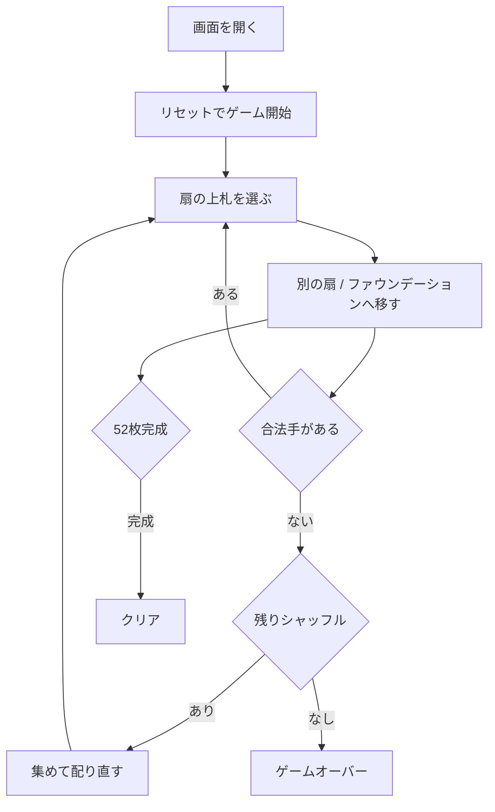

# シャムロックス（Web版）遊び方

## ゲーム概要

シャムロックス（Shamrocks）は、フランス由来の古典的な **ファン・ソリティア** です。標準52枚デッキを **17 の 3 枚扇（fan）と 1 枚の孤立カード** に配り、各扇の **最上位カードだけ** を操作して、4 つの **ファウンデーション** に A から K まで積み上げます。詰まったら残り札を集めてシャッフルし配り直せますが、その回数は **最大 3 回** までです。

## 起動方法

```sh
go run ./cmd/trumpcards web  # CLI経由でWebサーバーを起動
go run ./cmd/server          # 直接Webサーバーを起動
```

ブラウザで `http://localhost:8080` にアクセスし、ナビゲーションバーから「シャムロックス」を選択します。
ナビバーのJA/ENボタンで日本語・英語を切り替えられます。

## ルール

1. **扇**: 各扇の最上位カードのみ操作できます。同スートで 1 つ下のランクの扇の最上位カードへ重ねられます（同スート降順）。
2. **ファウンデーション**: 扇の最上位に A が来たらファウンデーションへ移し、以降は同スート昇順（A→K）で積み上げます。
3. **再配り（このゲームには**ありません**）**: 合法手がなくなったら、ファウンデーション以外のカードを集めてシャッフルし配り直せます（残り回数を表示、最大 3 回）。
4. **勝敗**: 52 枚すべてファウンデーションに積み上げればクリア。3 回の再配り（このゲームには**ありません**）後も詰んだら失敗です。

## ゲームの流れ



## 画面の操作方法

- 上部に **ファウンデーション**（4 つ）、その下に **扇** のグリッドが並びます。
- 動かす扇をクリックして選択し、移動先の扇かファウンデーションをクリックして移動します。同じ扇を再クリックで選択解除できます。
- フッターの「集めて配り直す」「自動完成」「元に戻す」「ヒント」「ギブアップ」で操作します。残りシャッフル回数が 0 になると「集めて配り直す」は押せません。

## 画面構成

上から順に、ページのコンポーネント構成そのままの並びです。

```
┌──────────────────────────────────────────────────┐
│  ラ・ベル・リュシー                                         │
│  手数: 8  残り補充回数: 3
├──────────────────────────────────────────────────┤
│  組札（4つ）                                     │
│  [♠A][ ][ ][ ]                                   │
├──────────────────────────────────────────────────┤
│  扇（18 個・3 枚ずつ、最後の1つは1枚）           │
│  [1] [2] [3] [4] [5] [6] [7] [8] [9]             │
│  [10][11][12][13][14][15][16][17][18]            │
├──────────────────────────────────────────────────┤
│  メッセージ / ヒント                             │
├──────────────────────────────────────────────────┤
│  設定パネル / 棋譜（アクションログ）             │
├──────────────────────────────────────────────────┤
│  [元に戻す] [ヒント] [補充] [ギブアップ]
│  [リセット]                                      │
└──────────────────────────────────────────────────┘
```

- **組札**: 4つ。A から K まで同スートで積み上げます
- **扇**: 52 枚を 3 枚ずつ配るので **18 個**（最後の1つだけ1枚）。各扇の**最上位カードだけ**が動かせます
- **補充**: 手詰まりになったら残りをシャッフルして配り直せます。**上限3回**（`ShamrocksMaxRedeals`）なので、残り回数がヘッダーに出ます
- **動かせる扇の細いリング**: いま動かせる扇（ファウンデーションか他の扇へ置ける）に常時付きます。ヒントの強調（太いリング＋点滅、4秒で消える）とは太さで区別できます
- **メッセージ / ヒント**: 直前の操作の結果と、ヒントボタンを押したときの推奨手
- **設定 / 棋譜**: 難易度などの設定と、これまでの手の履歴（折りたたみ式）
- **リセット**: 新しいゲームを開始します

## 遊び方のコツ

- A・2 など低いカードを早めに掘り出してファウンデーションを伸ばしましょう。
- 再配り（このゲームには**ありません**）は貴重です（3 回まで）。配り直す前に、扇間の移動で行き詰まりを解消できないかよく確認しましょう。
