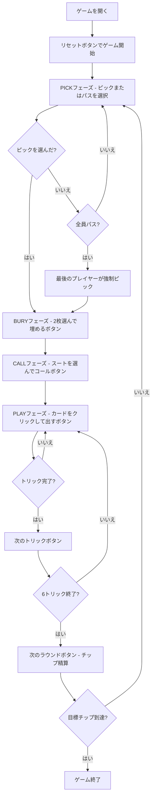

# シープスヘッド（Web版）遊び方

## ゲーム概要

Sheepshead（シープスヘッド）はアメリカ・ウィスコンシン州で生まれたドイツ系トリックテイキングゲームです。32枚デッキ（A,7,8,9,10,J,Q,K × 4スート）を5人（1人の人間 + 4人のCPU）でプレイし、各プレイヤーに6枚を配り残り2枚がブラインドになります。切り札が14枚と豊富で、ピッカーがパートナーを秘密裏に指名するチップ賭け形式です。ピッカーチームが120点満点中61点以上を獲得すれば勝利です。

## 起動方法

```sh
go run ./cmd/trumpcards web         # CLI経由でWebサーバーを起動
go run ./cmd/trumpcards web --open  # サーバー起動 + ブラウザを開く
go run ./cmd/server                 # 直接Webサーバーを起動
```

ブラウザで `http://localhost:8080` にアクセスし、ナビゲーションバーから「シープスヘッド」を選択します。
ナビバーのJA/ENボタンで日本語・英語を切り替えられます。

## ルール

### デッキと配布

- **デッキ**: 32枚（A,7,8,9,10,J,Q,K × ♠♣♥♦）
- **プレイヤー**: 5人（あなた = プレイヤー0、CPU1〜4）
- **配布**: 各プレイヤー6枚 + ブラインド2枚

### 固定切り札（14枚）

強い順: **Q♣ > Q♠ > Q♥ > Q♦ > J♣ > J♠ > J♥ > J♦ > A♦ > 10♦ > K♦ > 9♦ > 8♦ > 7♦**

Q・Jはスートに関わらずすべて切り札に含まれます。

### フェイルスート（♣♠♥）

Q・Jを除く6枚（A,10,K,9,8,7）で構成。強さ: **A > 10 > K > 9 > 8 > 7**

### カード点数と勝利条件

| カード | 点数 |
|--------|------|
| A | 11点 |
| 10 | 10点 |
| K | 4点 |
| Q | 3点 |
| J | 2点 |
| 9・8・7 | 0点 |

全カードの合計は120点。ピッカー＋パートナー＋埋め札の合計が **61点以上** でピッカーチームの勝利です。

### シュナイダー・シュバルツ

| 条件 | 効果 |
|------|------|
| 負けた側が30点以下（シュナイダー） | チップ賭け金 × 2 |
| 負けた側がトリックを1枚も取れない（シュバルツ） | チップ賭け金 × 3 |

## ゲームの流れ



## 画面の操作方法

### PICKフェーズ

- **「ピック」ボタン**: ブラインドを拾ってピッカーになります。自分の手番のみ有効です。
- **「パス」ボタン**: ブラインドをパスします。全員がパスすると最後のプレイヤーが強制的にピッカーになります。

### BURYフェーズ

- ブラインドが手元に加わります（合計8枚）。
- 埋めたいカードを2枚クリックして選択します。
- **「埋める」ボタン**: 選択した2枚をブラインドとして伏せます。埋め札の点数はピッカーチームの得点に含まれます。

### CALLフェーズ

- スート（♠ / ♣ / ♥）を選択します。
- **「コール」ボタン**: そのスートのAを持つプレイヤーが秘密のパートナーになります。

### PLAYフェーズ

- あなたの手番のとき、手札のカードをクリックして選択します。
- **「出す」ボタン**: 選択したカードをプレイします。リードスートに従う義務があります（切り札は切り札スート扱い）。
- **「次のトリック」ボタン**: トリックが解決したら次へ進みます。
- **「次のラウンド」ボタン**: 6トリック終了後にチップを精算して次のラウンドへ進みます。

> Web 版ではキーボードショートカットは提供していません。すべての操作はボタンとカードのクリックで行います。

## 画面構成

```
┌────────────────────────────────────────────┐
│  Sheepshead (シープスヘッド)  [JA/EN] [CLI] │
├────────────────────────────────────────────┤
│  ラウンド: 1  トリック: 1  フェーズ: PLAY   │
├──────────┬─────────────────────────────────┤
│  CPU1    │                                  │
│  CPU2    │     現在のトリック表示エリア      │
│  CPU3    │     （各プレイヤーの出したカード） │
│  CPU4    │                                  │
├──────────┼─────────────────────────────────┤
│  チップ表 │  メッセージ / 結果表示           │
│  各PL得点 │                                  │
├──────────┴─────────────────────────────────┤
│  あなたの手札（クリックで選択）              │
│  [Q♣] [J♦] [A♠] [10♥] [K♣] [7♦]         │
│  [出す] [次のトリック] [次のラウンド]        │
└────────────────────────────────────────────┘
```

- **ヘッダー**: ゲーム名・フェーズ表示・言語切り替えトグル・CLI切り替えトグル。
- **ラウンド／トリック表示**: 現在のラウンド番号とトリック番号。
- **プレイヤー表示エリア（左）**: CPU各プレイヤーの手札枚数・チップ残高・チームを表示。
- **トリック表示エリア（中央）**: 場に出ているカードと出したプレイヤー名。
- **チップ表（左下）**: 各プレイヤーのチップ残高。
- **メッセージボックス**: フェーズ・勝敗・シュナイダー/シュバルツ結果の案内。
- **フッター（手札エリア）**: あなたの手札と操作ボタン（ピック/パス/埋める/コール/出す/次へ）。

## 遊び方のコツ

- **ピック判断**: Q・Jが3枚以上あればピックに有利。A・10が多いほど点数を稼ぎやすくなります。
- **埋め方（BURY）**: 点数の低いカード（9・8・7）を埋めるのが基本ですが、高得点カード（A・10）を埋めて安全に確保するのも有力な戦術です。
- **コール（CALL）**: 自分が持っていないフェイルスートのAをコールしましょう。自分が持つAをコールすると実質一人チームになります。
- **切り札の温存**: 強いQ系・J系は高得点トリックの奪取やラストトリック狙いに取っておきましょう。
- **フェイルスートのリード**: 相手の切り札を消費させてからトランプを枯らすのが基本戦術です。
- **シュナイダー狙い**: 相手を30点以下に抑えるとチップが2倍になります。序盤から積極的に高得点カードを取りに行きましょう。
- **パートナーの把握**: コールされたスートのAが出た瞬間にパートナーが判明します。それまでは全員が敵の可能性があるため、連携の判断を慎重に行いましょう。
