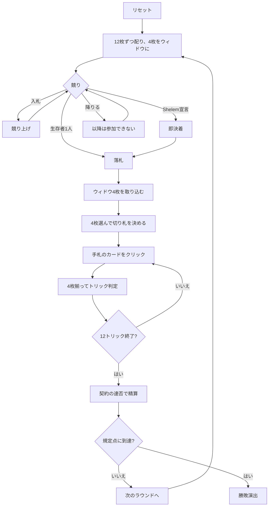

# シェレム（Web版）遊び方

## ゲーム概要

イランで遊ばれるコントラクトブリッジ系の競り型トリックテイキング。52枚を**12枚ずつ配り、余った4枚をウィドウ**として伏せます（12×4 + 4 = 52、トリックは**12回**）。**競るのはトリック数ではなく点数そのもの**です。

## 起動方法

```sh
go run ./cmd/trumpcards web  # CLI経由でWebサーバーを起動
go run ./cmd/server          # 直接Webサーバーを起動
```

ブラウザで `http://localhost:8080` にアクセスし、ナビゲーションバーから「シェレム」を選択します。
ナビバーのJA/ENボタンで日本語・英語を切り替えられます。

## ルール

- **52枚**、**4人2対2**（向かい合う席が味方）、**12枚ずつ + ウィドウ4枚**
- **点になるのは A・10・5 だけ**（A と 10 が10点、5 が5点）。1ラウンドの合計はちょうど**100点**
- **競りは55点から5刻み、上限100点**（＝1ラウンドの全カード点。それを超える契約は達成できません）。降りたら戻れず、**誰も入札しないまま最後の1人になったら降りられません**
- **Shelem** は点数の代わりに全トリック独占を宣言。どんな入札にも勝ち、その場で決着します
- 落札者は**ウィドウ4枚を手札に加え、4枚捨てて**切り札を決めます
- 得点: 通常契約は達成 **+n** / 未達 **-n**（相手は取ったカード点をそのまま得る）。Shelem は **±200**
- **Shelem は1トリック落とした時点で終了**します
- 先に規定点（既定500点）に達したチームの勝ち

## ゲームの流れ



## 画面の操作方法

| 操作 | 説明 |
|------|------|
| 入札ボタン（55〜100） | その点数で入札する。**上回れる額だけが表示されます** |
| Shelem宣言ボタン | 全トリック独占を宣言する |
| 降りるボタン | 競りを降りる（**降りられないときは表示されません**） |
| 手札のカードをクリック（整理中） | 捨て札に選ぶ／外す（オレンジ枠が付きます） |
| 切り札ボタン（♠♣♥♦） | **4枚選んだあと**に押すと、捨て札と切り札が確定します |
| 手札のカードをクリック（プレイ中） | そのカードを出す（出せる札だけ押せます） |
| 次のラウンドへボタン | ラウンド終了後、次のラウンドを配る |
| ヒントボタン | 入札額・捨て札・打つべき札を提示する |
| ギブアップボタン | 投了する |
| リセットボタン | 確認ダイアログのうえで最初からやり直す |
| CLI トグル | 同じゲームをコマンド入力で操作するモードに切り替える |

**サーバが必ず拒否する操作は出しません。** 上回れない入札額のボタンは作られず、捨て札の確定ボタンは**ちょうど4枚選ぶまで押せません**。

## 画面構成

- **上部**: ラウンド数、トリック数、目標点
- **点数帯**: 点になるのは A・10・5 だけ。盤面からは読めません
- **契約行**: 落札額と**宣言側が現在までに取ったカード点**、続けて**守備側の点**（`守備側 35点 / 全100点`）、決まっていれば切り札。合計は必ず 100 点なので、契約を阻止できているかがその場で読めます
- **中央上**: 各プレイヤーのチーム番号（**T0があなたの味方**）、競りでの立場、獲得トリック数
- **中央**: 現在のトリック
- **下部**: 自分の手札。プレイ中は**フォロー義務を満たす札だけ**に緑枠、整理中は選んだ札にオレンジ枠が付きます

## 遊び方のコツ

- **競り落とすのは「100点のうち何点を取るか」の約束**。手札の A・10・5 の枚数が見積もりになります
- **ウィドウで捨てるのは点にならない札から**。短いスートを空にできれば切り札が効きます
- **相手の落札は失点のチャンス**。届かせなければ相手が同額を失います
- **味方が勝っているトリックには点札を乗せる**
- **Shelem は12トリック全部**。1つ落とした瞬間に -200 が確定します
