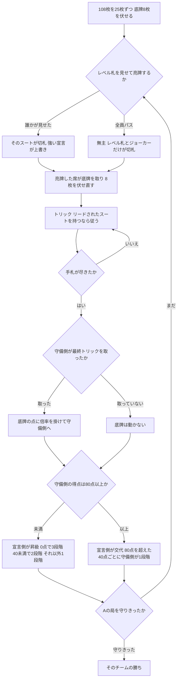
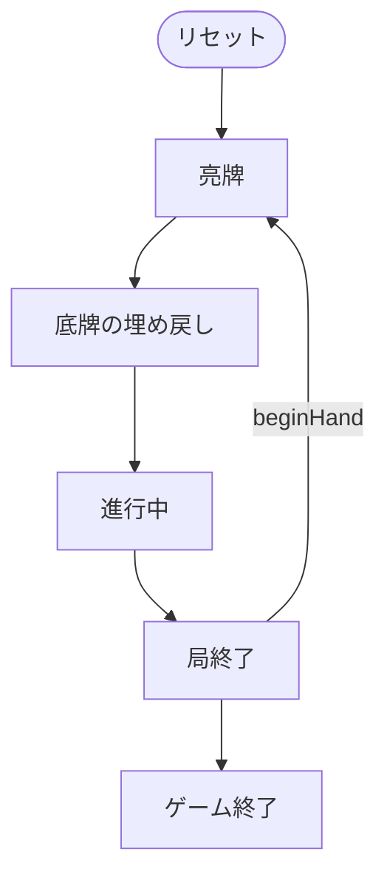

# 升级（Web版）遊び方

## ゲーム概要

中国全土で遊ばれる**2 デッキのポイントトリック**。**52 枚 × 2 + ジョーカー 4 枚 = 108 枚**を **4 人 2 対 2**（**パートナーは向かい合わせ**）で **25 枚ずつ**持ち、残り **8 枚を底牌（扣底）**として伏せます。トリック数ではなく **5・10・K の得点札**を争い、勝った側がレベルを **2 から A まで**上げていきます。

**このゲームの肝は「切札が切札スートだけではない」ことです。**その局のレベルと同じランクの札は、**全 4 スートぶんすべて切札**になります。さらにジョーカー 4 枚も切札です。

**もうひとつの肝は「点を集めるのは守備側」**という点です。宣言側は点を集めるのではなく、**守備側を 80 点未満に抑える**ことで勝ちます。

出典: [pagat.com: Sheng Ji](https://www.pagat.com/kt5/)

## 起動方法

```sh
go run ./cmd/trumpcards web  # CLI経由でWebサーバーを起動
go run ./cmd/server          # 直接Webサーバーを起動
```

ブラウザで `http://localhost:8080` にアクセスし、ナビゲーションバーから「升级」を選択します。
ナビバーのJA/ENボタンで日本語・英語を切り替えられます。

## ルール

### デッキと配り方

**52 枚 × 2 + ジョーカー 4 枚 = 108 枚**です。

**108 は 4 で割り切れますが、27 枚ずつ配ってはいけません。**

| 配分 | 枚数 |
|---|---|
| 各プレイヤー | 25 枚 × 4 人 = 100 枚 |
| 底牌（扣底） | **8 枚** |

底牌は飾りではありません。**守備側が最終トリックを取ると、底牌の得点札が倍率つきで守備側に入ります。**

### 亮牌（切札スートの宣言）

**数値を競るオークションはありません。**配ったあと、**その局のレベル札を場に見せる**ことで切札スートを宣言します。

| 見せかた | 強さ |
|---|---|
| レベル札 1 枚 | 1 |
| レベル札 2 枚（同スート） | 2 |

**強い宣言だけが弱い宣言を上書きできます。**同じ強さでは覆せません。**誰も宣言しなければ「無主」**になり、レベル札とジョーカーだけが切札です。

亮牌した席が**底牌を取り込み**、代わりに手札から **8 枚を伏せ直します**。

### 切札の範囲 — ここが肝

切札は「切札スート」だけではありません。

```
赤ジョーカー > 黒ジョーカー > 切札スートのレベル札 > 他スートのレベル札 > 切札スートの平札 > 非切札
```

- **他スートのレベル札どうしは同格**です。先に出したほうが勝ちます
- **レベル札はそのスートの平札から抜けます。**レベルが 5 のとき、♥4 と ♥6 は連続した札として扱われます

### 手の形

| 形 | 構成 |
|---|---|
| 単張 | 1 枚 |
| 対子 | **同一の札 2 枚**（2 デッキなので ♠K が 2 枚ある） |
| 拖拉機 | **同スートの連続する対子 2 組以上**（例: ♥7♥7 ♥8♥8） |

**対子は「同ランク 2 枚」ではありません。**♥7 と ♦7 は対子になりません。

### プレイ

**リードされたスートを持っているなら、そこから出さなければなりません。**切札群はひとつのスートとして扱います。持っていなければ何を出しても構いません（ただし勝てるのは切札の同形だけです）。

**形と枚数が一致しなければ勝てません。**単張には単張、対子には対子で応じます。切札は非切札を上回りますが、その場合も形と枚数は一致している必要があります。

### 得点

| 札 | 点 |
|---|---|
| 5 | 5 点 |
| 10 | 10 点 |
| K | 10 点 |

2 デッキなので各 8 枚、**合計 200 点**です。**80 点は総得点の 4 割**にあたります。

**点を集めるのは守備側だけです。**宣言側が取ったトリックの点はどこにも積まれません。

### 昇級

守備側の得点を P として:

| P | 結果 |
|---|---|
| **0 点** | 宣言側が **3 段階**昇級 |
| 0 < P < 40 | 宣言側が **2 段階**昇級 |
| 40 ≦ P < 80 | 宣言側が **1 段階**昇級 |
| **80 ≦ P < 120** | **守備側が宣言側になる**（昇級は 0） |
| 120 ≦ P | 守備側が宣言側になり、**40 点ごとに 1 段階**昇級 |

**A は飛び越えられません。**K から 3 段階でも A で止まり、**A の局を守りきって初めて勝ち**です（打 A）。



## ゲームの流れ

ゲームの進行は `internal/domain/ShengJi.go` のフェーズ機械そのものです。各ノードは同ファイルの `ShengJiPhase` 定数、矢印ラベルはその遷移を行うメソッド名です。



## 画面の操作方法

| 操作 | 説明 |
|------|------|
| **亮牌** ボタン | 見せられるスートだけがボタンとして並びます。強さ（x1 / x2）も表示されます |
| **パス** ボタン | 亮牌せずに手番を渡します。**宣言できる札が無くても押せます** |
| 手札のカードをクリック | 出す札／埋める札を選びます。**複数枚選べます**。もう一度押すと外れます |
| **底牌に埋める** ボタン | 選んだ **8 枚**を底牌へ戻します。ちょうど 8 枚選ぶまで押せません |
| **出す** ボタン | 選んだ札を 1 つの手として出します |
| **次の局へ** ボタン | 局の精算を確認してから次の局を配ります |
| **CLI** トグル | ターミナル風の操作に切り替えます |

## 画面構成

- **情報**: 局番号、この局のレベル、切札、両チームのレベル。**切札の範囲**と**守備側の得点・目標**もここに出ます
- **プレイヤー**: 各席のチームと、**宣言側か守備側か**。中身は誰のものも見えません
- **場**: リードされた形と、各席が出した札
- **局の精算**: 守備側が何点集めたか、どちらが何段階上がったか。**底牌に倍率が掛かった場合はその行**も出ます
- **アクションログ**: 進行を後から追えます

## 遊び方のコツ

- **底牌に得点札と切札を埋めないでください。**守備側が最終トリックを取ると、埋めた点が倍率つきで相手のものになります
- **守備側なら最終トリックを狙ってください。**底牌の倍率は単張で 2 倍、対子で 4 倍です
- **レベル札の位置を忘れないでください。**レベルが 5 のとき、♠5 は ♠A より強く、♥5 も切札です
- **他スートのレベル札は同格です。**先に出したほうが勝つので、切る順番が意味を持ちます
- **宣言側は 80 点を「渡さない」ゲームです。**点を取りにいくのではなく、得点札の乗ったトリックを相手に渡さないことを考えてください
