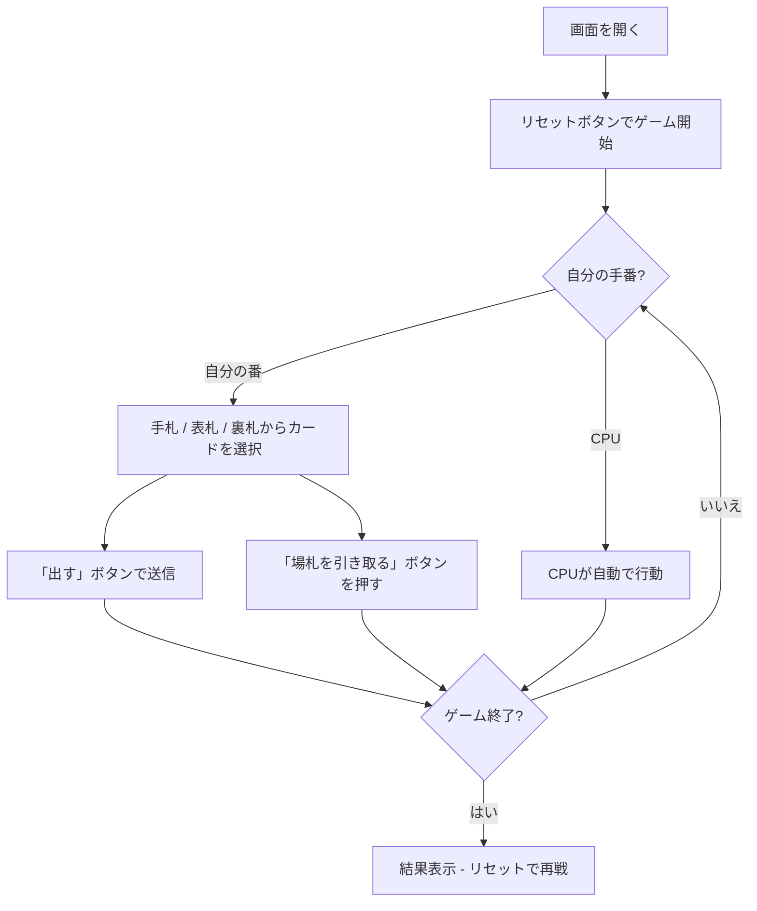

# シットヘッド（Web版）遊び方

## ゲーム概要

Shithead（別名: Karma, Palace）は、4人で遊ぶシェディング（手札を早くなくす）系のゲームです。各プレイヤーは「裏向きの場札3枚」「表向きの場札3枚」「手札3枚」の3層を持ち、手札 → 表札 → 裏札 の順に出し切ります。最後まで残った1人が Shithead（敗者）です。

## 起動方法

```sh
go run ./cmd/trumpcards web  # CLI経由でWebサーバーを起動
go run ./cmd/server          # 直接Webサーバーを起動
```

ブラウザで `http://localhost:8080` にアクセスし、ナビゲーションバーから「シットヘッド」を選択します。
ナビバーのJA/ENボタンで日本語・英語を切り替えられます。

## ルール

### 基本ルール

- 標準52枚のデッキ（ジョーカーなし）。
- 各プレイヤーに「裏向き3枚」「表向き3枚」「手札3枚」を配ります。
- 自分の番には場札の一番上以上の値のカード（同値も可）を1〜複数枚出します。
- 出した分だけ山札から手札を3枚まで補充します。
- 出せない場合は場札を全部引き取り、手番が次に進みます。
- 手札がなくなったら表札、表札がなくなったら裏札（ブラインド）を出します。

### マジックカード

| カード | 効果 |
|--------|------|
| 2 | リセット（次は何でも出せる） |
| 7 | 次は7以下のカードしか出せない |
| 8 | 次プレイヤーをスキップ |
| 10 | 場札を焼却（同じプレイヤーが続けて出す） |
| 同値4枚連続 | 場札を焼却 |

### ゲーム終了

- 全カードを出し切ったプレイヤーから上がり、順位がつきます。
- 最後に残った1人が Shithead（敗者）です。

## ゲームの流れ



## 画面の操作方法

### プレイフェーズ

1. CPUの手札枚数と裏/表札の状況を確認します。
2. 場札（discard pile）の一番上のカードを確認します。
3. 自分の番になったら、`出すソース` で示された層（hand/faceup/facedown）からカードをクリックして選択します。同じ値のカードは複数選べます。
4. 「出す」ボタンで送信、または「場札を引き取る」で場のカードを手札に加えます。
5. ゲーム終了まで繰り返します。

### キーボードショートカット

| キー | アクション | 有効条件 |
|------|-----------|---------|
| （未割当） | – | – |

## 画面構成

```
┌──────────────────────────────────────────┐
│ フェーズ表示 / TutorialButton / Manual    │
├──────────────────────────────────────────┤
│ CPU 1 / CPU 2 / CPU 3 状況               │
│ 場札 / 山札 / マジック効果インジケータ     │
│ あなたの手札（選択可）                    │
│   表札（手札がなくなったら出せる）        │
│   裏札（表札がなくなったら出せる）        │
│ アクションログ                            │
├──────────────────────────────────────────┤
│ リセット / 出す / 場札を引き取る ボタン    │
└──────────────────────────────────────────┘
```

## 遊び方のコツ

- 高い値のカードは表札・裏札に温存し、序盤は中位カードで凌ぎます。
- 10は焼却＋連続行動なので大きな場札が積み上がった時に切ると有利です。
- 7や8は次のプレイヤーを困らせる目的で活用します。
- 裏札はブラインドなので、その順番に並んでいる値次第で勝敗が決まります。
