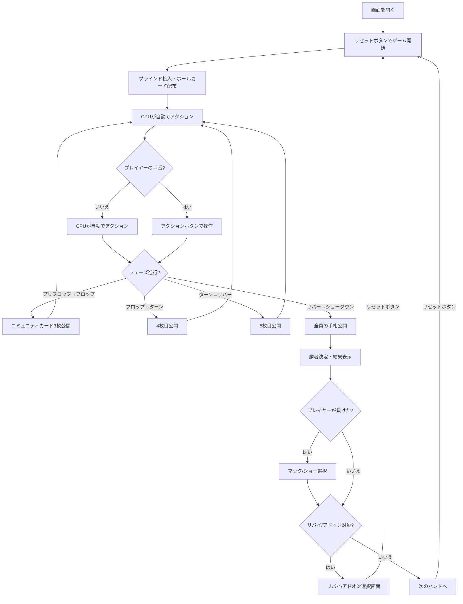

# ショートデック（Web版）遊び方

## ゲーム概要

ショートデック（6+ホールデム）は、テキサスホールデムの変種で、36枚のデッキ（各スートの2〜5を除去）を使用します。テーブルサイズは4-max（デフォルト、1人+CPU 3人）、6-max（1人+CPU 5人）、9-max（1人+CPU 8人）から選択できます。各CPUは異なるプレイスタイル（TAG/LAP/TAP/LAG/GTO）を持ち、ブラフを含む戦略的なプレイをします。GTOスタイルはボードテクスチャ分析に基づく混合戦略で意思決定します。サイドポットにも対応しています。

HUD統計（VPIP%/PFR%）が全プレイヤーに表示され、CPUのベットサイズはポット相対（半額〜全額）で決定されます。トーナメントモードでは、指定ハンド数ごとにブラインドが自動的に上昇します。リバイ（チップ再購入）とアドオン（一回限りのチップ追加購入）にも対応しています。

## 起動方法

```sh
go run ./cmd/trumpcards web  # CLI経由でWebサーバーを起動
go run ./cmd/server          # 直接Webサーバーを起動
```

ブラウザで `http://localhost:8080` にアクセスし、ナビゲーションバーから「ショートデック」を選択します。
ナビバーのJA/ENボタンで日本語・英語を切り替えられます。

## ルール

### 基本ルール

- **36枚**のトランプを使用（各スートの2・3・4・5を除去）
- 各プレイヤーに2枚のホールカード（手札）が配られる
- 場にコミュニティカード（共有カード）が最大5枚公開される
- ホールカード2枚 + コミュニティカード5枚の計7枚から、最強の5枚の組み合わせで役を作る
- 最も強い役を持つプレイヤーがポットを獲得する

### テキサスホールデムとの違い

| 項目 | テキサスホールデム | ショートデック |
|------|-------------------|---------------|
| デッキ枚数 | 52枚 | 36枚（2〜5除去） |
| フラッシュ vs フルハウス | フルハウス > フラッシュ | **フラッシュ > フルハウス** |
| 最低ストレート | A-2-3-4-5 | **A-6-7-8-9** |

### ゲームの進行

1. **ブラインド**: ディーラーの左隣がスモールブラインド（デフォルト5）、その左隣がビッグブラインド（デフォルト10）を強制ベット
2. **プリフロップ**: ホールカード2枚配布後、最初のベッティングラウンド
3. **フロップ**: コミュニティカード3枚公開後、ベッティングラウンド
4. **ターン**: コミュニティカード4枚目公開後、ベッティングラウンド
5. **リバー**: コミュニティカード5枚目公開後、最後のベッティングラウンド
6. **ショーダウン**: 残っているプレイヤーの手札を公開し、勝者を決定
7. **マック/ショー**: ショーダウンで負けた場合、手札をマック（伏せる）またはショー（公開）を選択
8. **リバイ/アドオン**: リバイ・アドオンが有効な場合、該当条件を満たすとチップの再購入・追加購入が可能

### ベッティングアクション

| アクション | 説明 |
|-----------|------|
| フォールド | 手札を捨ててラウンドから降りる |
| チェック | ベットせずにパスする（未ベット時のみ） |
| コール | 現在のベット額に合わせる |
| ベット | 新たにベットする（未ベット時のみ） |
| レイズ | 現在のベット額を上げる |
| オールイン | 全チップを賭ける |

### 役一覧（強い順）

| 役 | 説明 |
|----|------|
| Royal Flush | 同じスートの10・J・Q・K・A |
| Straight Flush | 同じスートの5枚連番 |
| Four of a Kind | 同じ数字4枚 |
| **Flush** | **同じスート5枚（通常のホールデムより上位）** |
| **Full House** | **同じ数字3枚 + 同じ数字2枚（通常のホールデムより下位）** |
| Straight | 5枚連番 |
| Three of a Kind | 同じ数字3枚 |
| Two Pair | ペア2組 |
| One Pair | ペア1組 |
| High Card | 上記に該当しない最も高いカード |

### CPUプレイスタイル

| スタイル | 略称 | 特徴 |
|---------|------|------|
| Tight-Aggressive | TAG | 強い手のみ参加し、積極的にレイズ。ブラフ率15% |
| Loose-Passive | LAP | 多くの手に参加するが、主にコール。ブラフ率5% |
| Tight-Passive | TAP | 厳選した手のみ参加し、主にコール。ブラフ率5% |
| Loose-Aggressive | LAG | 多くの手に参加し、頻繁にレイズ。ブラフ率30% |
| Game Theory Optimal | GTO | ハンド強度とボードテクスチャに基づく確率的混合戦略。ドライボードでは2/3ポット、ウェットボードでは3/4ポットのベットサイズ |

## ゲームの流れ



## 画面の操作方法

### アクションの実行

自分の手番が来ると、画面下部にアクションボタンが表示されます。

**ベットが出ていない場合:**
- **「ベット」**: ベット額を入力してベットする
- **「チェック」**: パスする

**ベットが出ている場合:**
- **「コール」**: 現在のベット額に合わせる
- **「レイズ」**: ベット額を入力してレイズする

**常に選択可能:**
- **「フォールド」**: 降りる
- **「オールイン」**: 全チップを賭ける

### ベット額の入力

アクションボタンの上にある「ベット額」入力欄で金額を指定します。ベットまたはレイズ時にこの金額が使用されます。

### キーボードショートカット

ゲーム中、以下のキーボードショートカットが使用できます。

| キー | アクション | 有効条件 |
|------|-----------|---------|
| `c` | コール | アクションフェーズ（ベットがある場合） |
| `r` | レイズ / ベット | アクションフェーズ |
| `k` | チェック | アクションフェーズ（ベットがない場合） |
| `f` | フォールド | アクションフェーズ |
| `a` | オールイン | アクションフェーズ |

※ テキスト入力欄にフォーカスがある場合、ショートカットは無効になります。

## 画面構成

```
┌────────────────────────────────────────────┐
│ フェーズ: フロップ  ポット: 60  SB/BB: 5/10  ディーラー: Player 0 │
├────────────────────────────────────────────┤
│           コミュニティカード                │
│      [♠7] [♣10] [♥9]                    │
├────────────────────────────────────────────┤
│           CPU プレイヤーエリア              │
│ CPU 1 (TAG) チップ:980 ベット:20           │
│ [🂠] [🂠]                                │
│ CPU 2 (LAP) チップ:990 [フォールド]         │
│ [🂠] [🂠]                                │
│ CPU 3 (GTO) チップ:960 ベット:10           │
│ [🂠] [🂠]                                │
├────────────────────────────────────────────┤
│             CPU行動ログ                    │
│  Player 1: コール                         │
│  Player 2: フォールド                      │
│  Player 3: チェック                        │
├────────────────────────────────────────────┤
│         フッター: あなたの手札               │
│  チップ:970 ベット:20                       │
│  [♠A] [♥K]                               │
│                                            │
│  メッセージエリア                           │
│                                            │
│  ベット額: [20 ▲▼]                         │
│  [コール] [レイズ] [フォールド] [オールイン]  │
│  [リセット]                                │
└────────────────────────────────────────────┘
```

- **情報バー（上部）**: 現在のフェーズ、ポット額、SB/BB額、ディーラー位置（トーナメントモード時はハンド数とレベルアップ情報も表示）
- **コミュニティカード**: 場に公開された共有カード（フェーズに応じて0/3/4/5枚）
- **CPUプレイヤーエリア**: 各CPUのプレイスタイル、チップ、ベット額、状態
  - ショーダウン時にはCPUのホールカードと役名が表示される
- **CPU行動ログ**: CPUが行ったアクションの記録
- **結果エリア**: ショーダウン後、各プレイヤーの役と獲得チップを表示
- **フッター（あなたの手札）**:
  - ホールカード2枚が表示される
  - フォールド/オールイン状態のバッジ
  - ショーダウン時には役名が表示される
- **メッセージエリア**: ゲームの状態メッセージ
- **アクションボタン**: 手番時のみ表示

## HUD統計

各プレイヤーにはHUD（ヘッズアップディスプレイ）統計が表示されます：

- **VPIP** (Voluntarily Put $ In Pot): プリフロップで自発的にチップを入れた割合（コール/ベット/レイズ/オールイン）
- **PFR** (Pre-Flop Raise): プリフロップでレイズした割合（ベット/レイズ/オールイン）

統計はハンド数が1以上のプレイヤーに対してのみ表示されます。

## トーナメントモード

トーナメントモードを有効にすると、指定ハンド数ごとにブラインドが自動的に上昇します。情報バーにハンド数とレベルアップ情報が追加表示されます。

API経由で以下のパラメータを指定できます：

- **tournamentMode**: `true` でトーナメントモードを有効化
- **blindLevelHands**: ブラインドレベルアップまでのハンド数（デフォルト10）
- **blindMultiplier**: ブラインド倍率（百分率、デフォルト200 = 2倍）
- **bettingLimit**: ベッティングリミット（0=Fixed, 1=PotLimit, 2=NoLimit、デフォルト0）
- **tableSize**: テーブルサイズ（4=4-max、6=6-max、9=9-max、デフォルト4）
- **rebuyEnabled**: `true` でリバイを有効化（デフォルト`false`）
- **rebuyMaxCount**: リバイの最大回数（デフォルト3）
- **rebuyChips**: リバイで得られるチップ数（デフォルト1000）
- **rebuyPeriodHands**: リバイ可能なハンド数（デフォルト10）
- **addonEnabled**: `true` でアドオンを有効化（デフォルト`false`）
- **addonChips**: アドオンで得られるチップ数（デフォルト1500）
- **addonAfterHand**: アドオン可能になるハンド番号（デフォルト10）
- **cpuMetaAI**: `true` でメタAIを有効化（CPUが人間のブラフ率・フォールド率・思考時間を学習して戦略を適応、デフォルト`false`）
- **humanPlayMs**: 人間のアクションにかかった時間（ミリ秒）。メタAI有効時にリクエストに含めて送信

### レスポンスのベッティングリミット関連フィールド

| フィールド | 型 | 説明 |
|------------|------|------|
| `bettingLimit` | int | 現在のベッティングリミット（0=Fixed, 1=PotLimit, 2=NoLimit） |
| `raiseCount` | int | 現在のベッティングラウンドでのレイズ回数 |
| `maxBetAmount` | int | 現在のベッティングリミットに基づく最大ベット額 |
| `tableSize` | int | 現在のテーブルサイズ（4/6/9） |
| `rebuyPhaseType` | int | リバイフェーズの種類（1=リバイ、2=アドオン） |
| `rebuyChips` | int | リバイで得られるチップ数 |
| `rebuyMaxCount` | int | リバイの最大回数 |
| `rebuyCounts` | int[] | 各プレイヤーのリバイ使用回数 |
| `addonChips` | int | アドオンで得られるチップ数 |
| `muckAvailable` | bool | マック選択が可能かどうか（ショーダウンで負けた場合にtrue） |

## マック/ショー

ショーダウンでプレイヤーが負けた場合、手札の公開/非公開を選択できます。

- **「マック」ボタン**: 手札を伏せて非公開にする
- **「ショー」ボタン**: 手札を公開する

マックした場合、結果表示で手札が非表示になります。

## リバイ/アドオン

### リバイ

リバイ期間内にチップが0になった場合、リバイ画面が表示されます。

- **「リバイ」ボタン**: チップを再購入して続行
- **「スキップ」ボタン**: リバイせずに続行

リバイの有効/無効はフッターの「リバイ有効」チェックボックスで切り替えます。

### アドオン

指定ハンド数経過後にアドオン画面が表示されます（1回のみ）。

- **「アドオン」ボタン**: チップを追加購入
- **「スキップ」ボタン**: アドオンせずに続行

アドオンの有効/無効はフッターの「アドオン有効」チェックボックスで切り替えます。

CPUプレイヤーはリバイ・アドオンを自動的に実行します。

## ラーニングモード

画面下部の「ラーニングモード」チェックボックスを有効にすると、リアルタイムのエクイティ（勝率）とポットオッズが表示されます。

### 表示内容

- **エクイティ**: モンテカルロシミュレーション（5000回）による勝率。緑色のバーで視覚的に表示されます
- **ポットオッズ**: コール額 / (ポット + コール額) × 100。コールに必要な勝率の目安です
- **+EV / -EV インジケーター**: エクイティがポットオッズを上回る場合は +EV（期待値プラス = コールが有利）、下回る場合は -EV（期待値マイナス = フォールドが有利）と表示されます
- **ハンドオッズ**: クリックで展開。現在の手札とコミュニティカードから、各ハンドランク（ワンペア、フラッシュ等）になる確率を表示します

### 使い方

エクイティとポットオッズを比較して判断します:
- エクイティ > ポットオッズ → コール/レイズが期待値的に有利
- エクイティ < ポットオッズ → フォールドが期待値的に有利

ラーニングモードはプリフロップからリバーまでのアクティブフェーズで利用できます。ショーダウン・終了フェーズでは表示されません。

## 遊び方のコツ

- ショートデックでは36枚のデッキのため、フラッシュがフルハウスより強いです（フラッシュが成立しにくいため）
- 最低ストレートはA-6-7-8-9です（2〜5が存在しないため）
- デッキが小さいため、ペアやセットが通常のホールデムより成立しやすいです
- ポジション（ディーラーからの距離）は重要です。後ろのポジションほど有利です
- 強い手（ペア、高いカード）はプリフロップでレイズして主導権を握りましょう
- LAGスタイルのCPUはブラフが多いので、良い手を持っているときはコールやレイズで対抗しましょう
- GTOスタイルのCPUは確率的な混合戦略を使うため、行動パターンが読みにくいです。ボードテクスチャに注意して対応しましょう
- TAGスタイルのCPUがレイズしてきたら、本当に強い手を持っている可能性が高いので注意しましょう
- HUD統計を活用して、CPUのプレイスタイルの傾向を把握しましょう
- トーナメントモードではブラインドが上がるため、早めにチップを稼ぐ戦略が重要です
- コミュニティカードとの組み合わせを常に確認し、フラッシュやストレートの可能性を見逃さないようにしましょう
- オールインは最後の手段として使いましょう。全チップを失うリスクがあります
