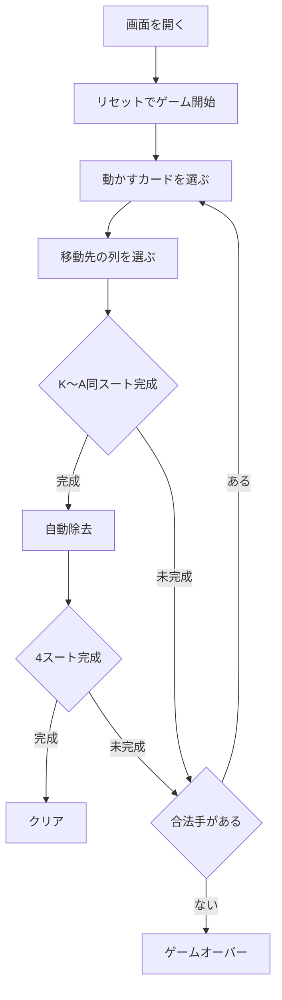

# シンプル・サイモン（Web版）遊び方

## ゲーム概要

シンプル・サイモン（Simple Simon）は、スパイダー系ソリティアの易しい版です。標準52枚デッキを **最初から全て表向きに 10 列** へ配り、**ストックもフリーセルもありません**。各列の最上位カード、または同スート降順の連番列を移動し、**同スートの K〜A 完全列** が揃うと自動的に除去されます。**4 スート全て除去でクリア**です。

## 起動方法

```sh
go run ./cmd/trumpcards web  # CLI経由でWebサーバーを起動
go run ./cmd/server          # 直接Webサーバーを起動
```

ブラウザで `http://localhost:8080` にアクセスし、ナビゲーションバーから「シンプル・サイモン」を選択します。
ナビバーのJA/ENボタンで日本語・英語を切り替えられます。

## ルール

1. **移動**: 列の最上位カード単体、または **同スート降順の連番列** をまとめて移動できます。
2. **配置**: カードは **スート不問** で 1 つ大きいランクのカードの上に置けます（例: 8♥ を 9♠ の上に）。ただし **まとめて動かせるのは同スート降順列のみ** です。
3. **空列**: どのカード・列でも置けます。
4. **完成**: 同スートで K〜A の完全な降順列が揃うと自動的に除去され、完成スートにカウントされます。
5. **勝敗**: 4 スート全て除去でクリア。合法手がなくなると失敗です（ストック補充なし）。

## ゲームの流れ



## 画面の操作方法

- 10 列のタブローが並びます。動かすカードをクリックして選択し（その位置以降が移動対象）、移動先の列をクリックして移動します。
- フッターの「元に戻す」「ヒント」「ギブアップ」で操作します。

## 遊び方のコツ

- 全カードが見えているので、除去までの手順を逆算して先読みしましょう。
- 空列は貴重な作業スペースです。安易に埋めず、長い列をほぐすために使いましょう。
