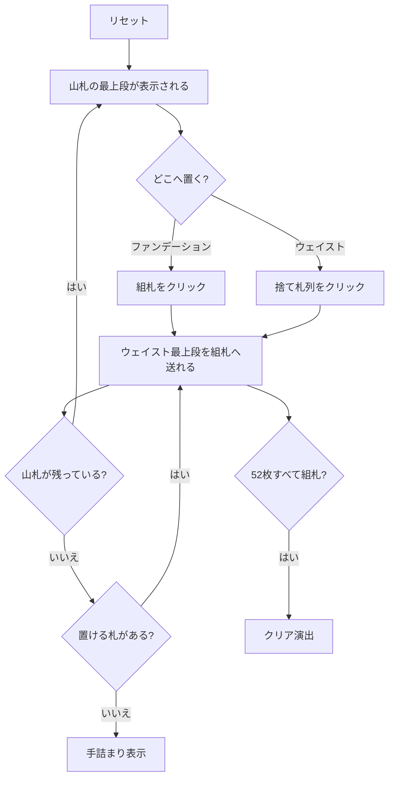

# サー・トミー（Web版）遊び方

## ゲーム概要

現存する記録の中で最古級とされるイギリス発祥の一人用ペイシェンス。「ソリティアの祖父」とも呼ばれる。山札を 1 枚ずつめくって 4 つのウェイスト（捨て札列）へ振り分けながら、4 つのファンデーション（組札）を A から K まで積み上げる。

**一度ウェイストに置いた札は最上段になるまで動かせない**ため、「どの列に捨てるか」の判断がそのまま勝率になる。

## 起動方法

```sh
go run ./cmd/trumpcards web  # CLI経由でWebサーバーを起動
go run ./cmd/server          # 直接Webサーバーを起動
```

ブラウザで `http://localhost:8080` にアクセスし、ナビゲーションバーから「サー・トミー」を選択します。
ナビバーのJA/ENボタンで日本語・英語を切り替えられます。

## ルール

- 52 枚 1 組。すべて山札に伏せて開始する
- 山札の最上段を、ファンデーション（A のときのみ新規に開ける／組札の次のランクのとき）かウェイストのいずれかに置く
- ファンデーションは**スートを問わず** A→K の順に 1 ずつ積み上げる
- ウェイストは**最上段のみ**ファンデーションへ移せる。列内の入れ替えとウェイスト同士の移動は不可
- 52 枚すべてを積み上げれば勝ち。山札を使い切って置ける札がなくなれば手詰まり

## ゲームの流れ



## 画面の操作方法

| 操作 | 説明 |
|------|------|
| 山札をクリック | 次に置くカードを確認する |
| ファンデーションをクリック | 山札またはウェイスト最上段の選択中カードを組札に置く |
| ウェイストをクリック | 山札のカードをその列に捨てる／その列の最上段を選択する |
| ヒントボタン | 置ける札を 1 つ提示する |
| 元に戻すボタン | 直前の 1 手を取り消す |
| リセットボタン | 確認ダイアログのうえで最初からやり直す |
| CLI トグル | 同じゲームをコマンド入力で操作するモードに切り替える |

## 画面構成

- **上部**: フェーズ表示（プレイ中 / 手詰まり / クリア）と手数
- **中央上段**: 4 つのファンデーション。積み上がった枚数を `n/13` で表示
- **中央下段**: 4 つのウェイスト。最上段だけが操作対象
- **右**: 山札の残り枚数と次のカード
- **下部**: アクションログ、設定、キーボードショートカット一覧

## 遊び方のコツ

- **ウェイストは降順に積む。** 大きいランクを下、小さいランクを上にすると、組札が伸びたときに素直に取り出せる
- 1 列を高ランク専用の「捨て場」に決めておくと、残り 3 列が機能しやすい
- 同じランクが続いたら列を分ける。重ねると下の 1 枚が長く塞がれる
- ヒントは置ける札を 1 つ示すだけで最善手ではない。行き詰まったら元に戻すで分岐をやり直す
