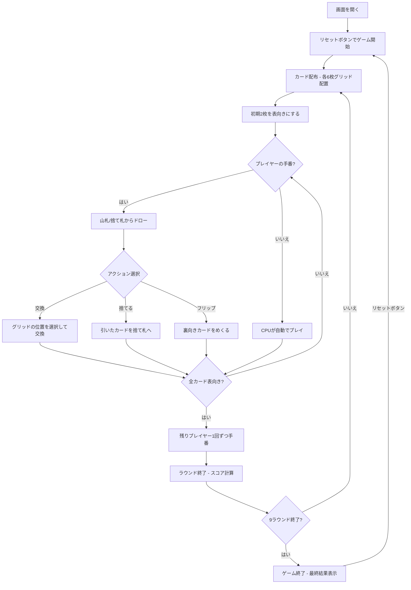

# シックスカードゴルフ（Web版）遊び方

## ゲーム概要

2〜4人（プレイヤー1人 + CPU 1〜3人）で遊ぶ記憶と交換のカードゲームです。各プレイヤーは3×2のグリッド（6枚）に裏向きのカードを持ち、山札や捨て札から引いたカードと交換して合計点を最小化します。同じ列（縦ペア）に同ランクが揃うと0点に相殺されます。9ラウンドの累計スコアが最も低いプレイヤーが勝利します。

## 起動方法

```sh
go run ./cmd/trumpcards web  # CLI経由でWebサーバーを起動
go run ./cmd/server          # 直接Webサーバーを起動
```

ブラウザで `http://localhost:8080` にアクセスし、ナビゲーションバーから「シックスカードゴルフ」を選択します。
ナビバーのJA/ENボタンで日本語・英語を切り替えられます。

## ルール

### 基本ルール

- 52枚の標準トランプを使用、2〜4人プレイ
- 各プレイヤーに6枚ずつ配り、3×2のグリッドに裏向きで並べる
- ゲーム開始時に2枚だけ表向きにする（下段から2枚）
- 残りは山札（ストック）、1枚を表向きにして捨て札の山を開始

### カードの点数

| カード | 点数 |
|--------|------|
| K | 0点 |
| A | 1点 |
| 2〜10 | 額面通り |
| J, Q | 10点 |

### 列マッチング（カラムペア）

- グリッドは3列×2行の配置（位置0〜5）
  - 列0 = 位置0（上）と位置3（下）
  - 列1 = 位置1（上）と位置4（下）
  - 列2 = 位置2（上）と位置5（下）
- 同じ列の上下が同ランクの場合、その2枚は0点に相殺される
- Kのペアも0点（K自体が0点のため、マッチしなくても損はない）

### 手番の進行

1. **ドロー**: 山札から1枚引く、または捨て札の山のトップを取る
2. **アクション**:
   - 引いたカードをグリッドの任意の位置と交換（入れ替えたカードは捨て札へ）
   - 山札から引いた場合のみ、引いたカードをそのまま捨てることも可能
   - 裏向きのカードをめくる（フリップ）こともできる

### ラウンド終了

- いずれかのプレイヤーの6枚がすべて表向きになったらトリガー
- 残りの全プレイヤーが1回ずつ手番を行い、ラウンド終了
- 全カードを公開し、各プレイヤーのスコアを計算（列マッチングによる相殺を適用）

### ゲーム終了

- 9ラウンド終了後、累計スコアが最も低いプレイヤーが勝利

## ゲームの流れ



## 画面の操作方法

### ドローフェーズ

1. **「山札から引く」** ボタンで山札のトップカードを引く
2. **「捨て札から引く」** ボタンで捨て札の山のトップカードを取る

### アクションフェーズ

1. **交換**: グリッド上のカード位置をクリックして、引いたカードと交換
2. **捨てる**: 山札から引いた場合、**「捨てる」** ボタンで引いたカードをそのまま捨て札へ
3. **フリップ**: 裏向きのカードをクリックしてめくる（山札から引いたカードは捨て札へ）

### ラウンド終了

1. スコアが表示される
2. **「次のラウンド」** ボタンで次のラウンドに進む

### 設定

設定パネルで人数 (2/3/4)、CPU 難易度、ラウンド数 (3/6/9/18) を選び、
**「この設定で開始」** で新しいゲームを始められます。進行中の局が黙って
消えないよう、選んだだけでは配り直しません。CUI の `sp` / `sd` / `sr` と
同じ設定です。

### キーボードショートカット

| キー | アクション | 有効条件 |
|------|-----------|---------|

## 画面構成

```
┌────────────────────────────────────────────┐
│  ラウンド 1/9  |  累計スコア表示            │
├────────────────────────────────────────────┤
│            CPU エリア                       │
│  [🂠][🂠][🂠]  CPU 1 (スコア: 0)            │
│  [🂠][🂠][🂠]                               │
├────────────────────────────────────────────┤
│         山札 / 捨て札 エリア                │
│    [山札🂠]    [捨て札♥7]                   │
│  [山札ドロー] [捨て札ドロー] [捨てる]        │
├────────────────────────────────────────────┤
│         あなたのグリッド (スコア: 0)         │
│  [🂠][♠K][🂠]  ← 上段 (位置0, 1, 2)       │
│  [♥3][🂠][♦5]  ← 下段 (位置3, 4, 5)       │
└────────────────────────────────────────────┘
```

- **ラウンド情報**: 現在のラウンド番号と累計スコア
- **CPUエリア**: CPUのグリッド（裏向きカードは非公開）
- **山札/捨て札エリア**: ドロー操作ボタン
- **あなたのグリッド**: 3×2配置のカード、クリックで交換/フリップ操作

## 遊び方のコツ

- **Kは0点** なので、Kはグリッドに残しておくのが有利
- **列マッチングを狙う**: 同じ列に同ランクを揃えれば0点になるため、高得点カード（J/Q=10点）でもペアにできれば有利
- **裏向きカードの記憶**: 序盤にめくったカードの位置を覚えておき、交換のタイミングを見計らう
- **捨て札を活用**: 必要なランクが捨て札にあれば積極的に取る
- **相手のグリッドを観察**: 相手が必要としているカードを捨てないよう注意する
- **ラウンド終了のタイミング**: 自分のスコアが低いときに全カードを表向きにして早めに終わらせる戦略も有効
