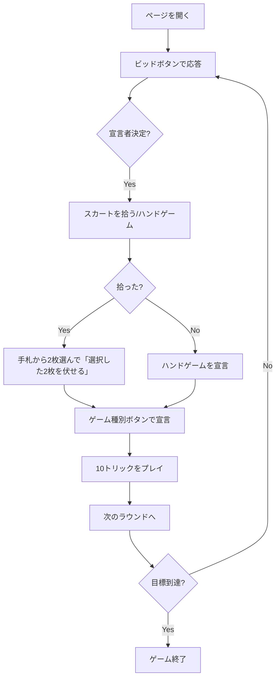

# スカート（Web版）遊び方

## ゲーム概要

3人で遊ぶドイツ発祥のトリックテイキングゲーム（プレイヤー1人 + CPU 2人）。32枚のカードと「スカート」と呼ばれる伏せ札2枚を使い、ビッド（競り）で宣言者を決め、宣言者は守備側2人を相手に61点以上のカードポイントを稼げば勝ち。先に目標スコアに到達したプレイヤーが勝者。

## 起動方法

```sh
go run ./cmd/trumpcards web
go run ./cmd/server
```

ブラウザで `http://localhost:8080` を開き、ナビバーの「スカート」を選択します。

## ルール

### 基本

- 32枚デッキ（7,8,9,T,J,Q,K,A × 4スート）。
- 各プレイヤーに10枚配り、残り2枚を場札（スカート）に置く。
- カードポイント: A=11、T=10、K=4、Q=3、J=2、9/8/7=0（合計120点）。

### ビッド

中央プレイヤー（middlehand）が先手プレイヤー（forehand）に対してビッドラダー（18, 20, 22, 24, 27, 30, 33, 36, 40, 44, 48, 50, 60, 72）を呼び上げる。受ける（accept）かパスを選び、両者がパスした時点で残った人が宣言者。

### ゲーム種別

- **Suit ゲーム**: 選んだスートと4枚のジャックが切り札（基本点 ♦9/♥10/♠11/♣12）。
- **Grand**: 4枚のジャックのみが切り札（基本点24）。
- **Null**: 切り札なし。宣言者は1トリックも取らないこと（基本点23）。

### スコア

ゲーム値 = 基本点 × (マタドール数 + 1 + ハンドボーナス + シュナイダー/シュヴァルツ)。  
宣言者勝利でその値が加点、敗北で2倍を失点。累計が目標スコア（既定500）に達した人が勝利。

## ゲームの流れ



## 画面の操作方法

### ビッドフェーズ

`「18でコールする」`／`「受ける ◯◯」`／`「パス」` ボタンで応答します。CPUの番では自動で進みます。

### スカート拾い

宣言者が `「スカートを拾う」` か `「ハンドゲーム」` を選びます。

### 捨て札（拾った場合）

手札から2枚をクリックで選択し、`「選択した2枚を伏せる」` ボタンで確定します。

### ゲーム宣言

切り札スートを選択ドロップダウンで選び、`「スートゲームを宣言」`／`「グランドを宣言」`／`「ヌルを宣言」` のいずれかを押します。

### プレイフェーズ

手札のカードをクリックして選択 → `「カードを出す」` ボタン。  
トリックが揃ったら `「次のトリック」`、ラウンド終了時は `「次のラウンド」`。

## 画面構成

```
┌────────────────────────────────────────────┐
│  ナビバー / フェーズ表示                    │
├────────────────────────────────────────────┤
│  ラウンド情報 / 宣言者 / ゲーム種別          │
│  メッセージボックス                         │
│  トリック表示エリア                         │
│  スカート（ラウンド終了時）                  │
│  手札                                       │
│  プレイヤー別スコア表                       │
├────────────────────────────────────────────┤
│  リセット / フェーズ別アクションボタン       │
└────────────────────────────────────────────┘
```

## 遊び方のコツ

- ジャックは最強の切り札。手札に3枚以上あればGrandを検討。
- 弱い手ではパスに徹し、無理にビッドしない。
- スートゲームでは最も枚数の多いスートを切り札に選ぶ。
- 守備側はAとTを温存し、宣言者の重要なトリックを奪うのが定石。
