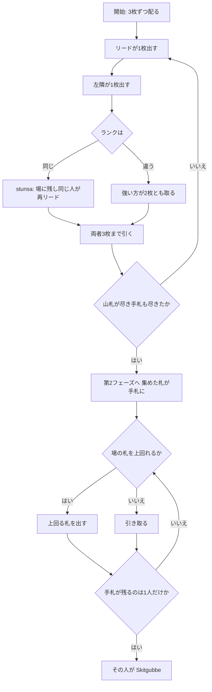

# シートグッベ（Web版）遊び方

## ゲーム概要

スウェーデンの 3 人用ゲーム。**性質のまるで違う 2 つのフェーズ**でできています。第1フェーズは一騎打ちで札を「集め」、第2フェーズはその集めた札を「出し切る」。最後まで手札が残った人が **Skitgubbe（汚いおっさん）** です。

集めた札がそのまま第2フェーズの手札になるので、**第1フェーズで勝ちすぎると第2フェーズが苦しくなります**。

## 起動方法

1. `go run ./cmd/trumpcards web` でサーバーを起動します
2. ブラウザで `http://localhost:8080` を開きます
3. ゲーム一覧から **シートグッベ** を選ぶか、`/skitgubbe` へ直接アクセスします

## ルール

- **デッキ**: 52 枚 / **3 人** / 手札 **3 枚**
- **強さ**: A > K > Q > J > 10 > … > 2

### 第1フェーズ（集める）

- **常に 2 人の一騎打ち**です。リードする人と、その**左隣**の 1 人だけが札を出します
- **スートは関係ありません。**単純に**強い方が 2 枚とも取り**、勝った人が次のリードになります
- **同ランクなら stunsa（バウンス）**: 2 枚は**場に残したまま**、両者が 1 枚引いて、**同じ人がもう一度リード**します。決着した時点で、たまった札を勝者が全部取ります
- 1 回の一騎打ちのあと、両者は**手札 3 枚まで山札から引きます**
- **山札から最後に引かれた札が切札**を決めます（第2フェーズで効きます）
- **終了**: 山札が尽き、次の一騎打ちのどちらかの手札が尽きたとき

### 第2フェーズ（出し切る）

- **集めた札＋手元に残っていた札**が、そのまま手札になります
- 場に出ている札を**上回る**札しか出せません。**同スートの上位**か、**切札**です
- **弱い札を出して逃げることはできません**（"It is never lawful to duck"）
- 上回れる札が **1 枚もないときだけ**、引き取りボタンで**場の札を全部引き取ります**（脱落ではありません）
- 場の枚数が残り人数に達したらそのトリックは流れ、次の人がリードします
- **最後まで手札が残った 1 人が Skitgubbe** で、その人の負けです

## ゲームの流れ

## 画面の操作方法

| 操作 | 説明 |
|------|------|
| 手札のカードをクリック | その札を出します（出せる札だけが選択可能になります） |
| **引き取る** ボタン | 場の札を引き取ります。**上回れる札が 1 枚もないときだけ**押せます |
| **ヒント** トグル | 推奨する手をハイライトします |
| **設定** パネル | CPU 難易度を変更してリセットします |
| **CLI** トグル | ターミナル風の操作に切り替えます |

## 画面構成

- **フェーズ表示**: 現在のフェーズ、山札の残り枚数、切札（山札が尽きるまでは「未定」）
- **ルール表示**: 2 つのフェーズの規則を常時表示します。フェーズごとに別のゲームになるためです
- **場**: 第1フェーズは一騎打ちの札（stunsa で積み上がります）、第2フェーズは上回るべき札
- **プレイヤー**: 手札の枚数と**集めた札の枚数**。集めすぎている人は第2フェーズが重くなります
- **手札**: 自分の手札。出せる札だけが選択可能です。CPU の手札は裏向きで枚数のみ表示されます
- **アクションログ**: 進行を後から追えます

## 遊び方のコツ

- **第1フェーズで勝ちすぎない。**取った札はそのまま自分の第2フェーズの手札になります。ただし勝った人が次のリードを握るので、まったく取らないのも損です
- **stunsa は場が育ちます。**同ランクでバウンスした後は 4 枚、6 枚と積み上がるので、決着させる 1 枚は慎重に選んでください
- **切札は最後に引かれた札で決まります。**山札が薄くなってきたら、そのスートを何枚持っているかを意識してください
- 第2フェーズでは**上回れる最も弱い札**を出すのが基本です。強い札を早く使うと、後半に上回れなくなって引き取る羽目になります
- **引き取りは負けではありません。**手札は増えますが、次のリードを取れます
