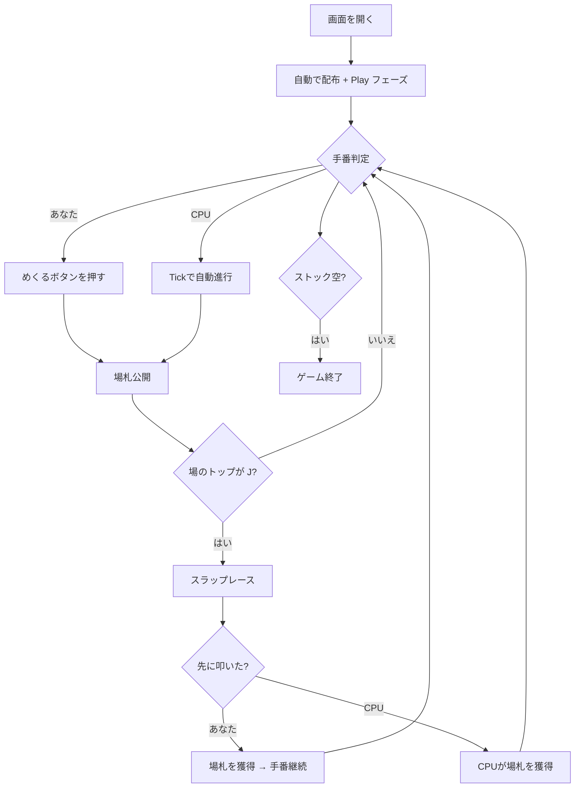

# スラップジャック（Web版）遊び方

## ゲーム概要

プレイヤー1人対CPU 1人で遊ぶ、反射神経を競うパーティゲーム。52枚のデッキを半分ずつに分け、お互いの山札のトップを順番に場に出していき、**Jが場のトップに出た瞬間に最も早く叩いた（スラップした）方が場の山札を全て獲得**します。J以外で叩くとペナルティとして1枚を相手に渡します。

## 起動方法

```sh
go run ./cmd/trumpcards web     # CLI経由でWebサーバーを起動
go run ./cmd/server             # 直接Webサーバーを起動
```

ブラウザで `http://localhost:8080` にアクセスし、ナビゲーションバーから「スラップジャック」を選択します。

## ルール

### 基本ルール

- 52枚のトランプ（ジョーカーなし）を使用
- シャッフル後、26枚ずつプレイヤーとCPUに配布
- 「めくる」(s) で現在の手番プレイヤーが自分のストックのトップを場に積む
- 場のトップカードが **J** なら、誰でも素早く「スラップ」できる
- 正解スラップ → 場の全カードを取得し、自分のストックの底に裏向きで戻す。手番もそのプレイヤーに移る
- 誤スラップ（J以外で叩く） → ストックの先頭1枚を相手のストックの底に渡すペナルティ
- 通常めくり後は手番が相手に移る

### CPUの反応時間

| 難易度 | 平均反応時間 | 標準偏差 |
|--------|------------|--------|
| Easy   | 1100ms     | 300ms |
| Normal | 600ms      | 200ms |
| Hard   | 300ms      | 120ms |

### ゲーム終了

- ストックが0枚になり、かつスラップで取り戻せない状態になると敗北
- 相手が脱落した場合、自分の勝利

## ゲームの流れ



## 画面の操作方法

- **めくる**: 自分のターンで自分のストックのトップを場に出す
- **スラップ**: 場札のトップを叩く。Jなら獲得、それ以外ならペナルティ
- **リセット**: 新しいゲームを開始

## 画面構成

- 上段: CPUのストック残枚数と裏向きカード
- 中央: 場のトップカードと総枚数（Jのときは黄色強調）
- 下段: あなたのストック残枚数と裏向きカード
- フッター: めくる / スラップ / リセット / 棋譜ボタン

## 遊び方のコツ

- Jが場に出た瞬間に素早くスラップ。Hardは平均300msなので、目視→クリックを高速化
- 誤スラップは確実に1枚損するので、緑色の「めくる」とJ以外のときの赤色「スラップ」を見間違えないよう冷静に
- 自分のストックが減ったらスラップ獲得を狙ってリスクを取る
