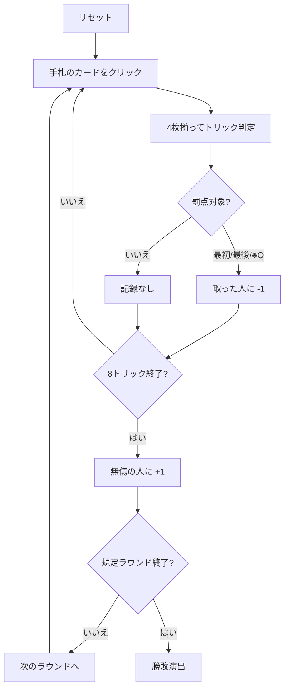

# スロバーハンネス（Web版）遊び方

## ゲーム概要

ドイツ・低地地方の**回避型**トリックテイキング。4人（あなた＋CPU3人）で、ピケット32枚を使って8トリックを戦う。狙いは取ることではなく**取らないこと**。最初のトリック・最後のトリック・♣Qを含むトリックを取ると失点し、3つとも避けきればボーナスが入る。

## 起動方法

```sh
go run ./cmd/trumpcards web  # CLI経由でWebサーバーを起動
go run ./cmd/server          # 直接Webサーバーを起動
```

ブラウザで `http://localhost:8080` にアクセスし、ナビゲーションバーから「スロバーハンネス」を選択します。
ナビバーのJA/ENボタンで日本語・英語を切り替えられます。

## ルール

- **ピケット32枚**（A・7・8・9・10・J・Q・K × 4スート）を4人に**8枚ずつ**
- **切り札なし。** リードのスートの最強札がトリックを取る（A > K > Q > J > 10 > 9 > 8 > 7）
- **リードのスートを持っていれば必ず出す**（フォロー義務）
- 罰点は各 **-1点**: **最初**のトリックを取る / **最後**のトリックを取る / **♣Qを含む**トリックを取る
- 3つとも避けたプレイヤーは **+1点**
- 罰は札を出した人ではなく、**トリックを取った人**に付く
- 既定4ラウンド（1〜12で変更可）。**合計が最も大きいプレイヤーが勝ち**

## ゲームの流れ



## 画面の操作方法

| 操作 | 説明 |
|------|------|
| 手札のカードをクリック | そのカードを出す（出せる札だけ押せます） |
| 次のラウンドへボタン | ラウンド終了後、次のラウンドを配る |
| ヒントボタン | 打つべき札と、その狙い（避ける / 処分する）を提示する |
| ギブアップボタン | 投了する |
| リセットボタン | 確認ダイアログのうえで最初からやり直す |
| CLI トグル | 同じゲームをコマンド入力で操作するモードに切り替える |

## 画面構成

- **上部**: ラウンド数、トリック数、フェーズ表示
- **警告帯**: **最初と最後のトリックでだけ**表示されます。中身に関係なく罰点対象であることの注意。**♣Q が場に出ている間**は専用の警告バナーも出ます（両方同時に出ることもあります）
- **中央上**: 各プレイヤーの得点と、そのラウンドで受けている罰の内訳（初 / 終 / ♣Q / 無傷）
- **中央**: 現在のトリック
- **下部**: 自分の手札。**フォロー義務を満たす札だけ**に印が付きます。手札の ♣Q には赤い縁が付きます

## 遊び方のコツ

- **最初のトリックは低い札で降りる。** 情報が無い1トリック目は安い札が安全
- **♣Qは早めに手放す。** 持ち続けるとフォロー義務で出さされ、しかも自分が取る場面が来ます
- **クラブのA・Kが危険。** ♣Qが出ているトリックを自分が取ってしまいます
- **最後のトリック用に低い札を1枚残す。** 高い札しか残らないと確実に取らされます
- **中間のトリックが高い札の処分どき。** 罰点の絡まないうちにA・Kを捨てる
- **+1は大きい。** 罰を1つ受けるだけでライバルとの差が2点開きます
