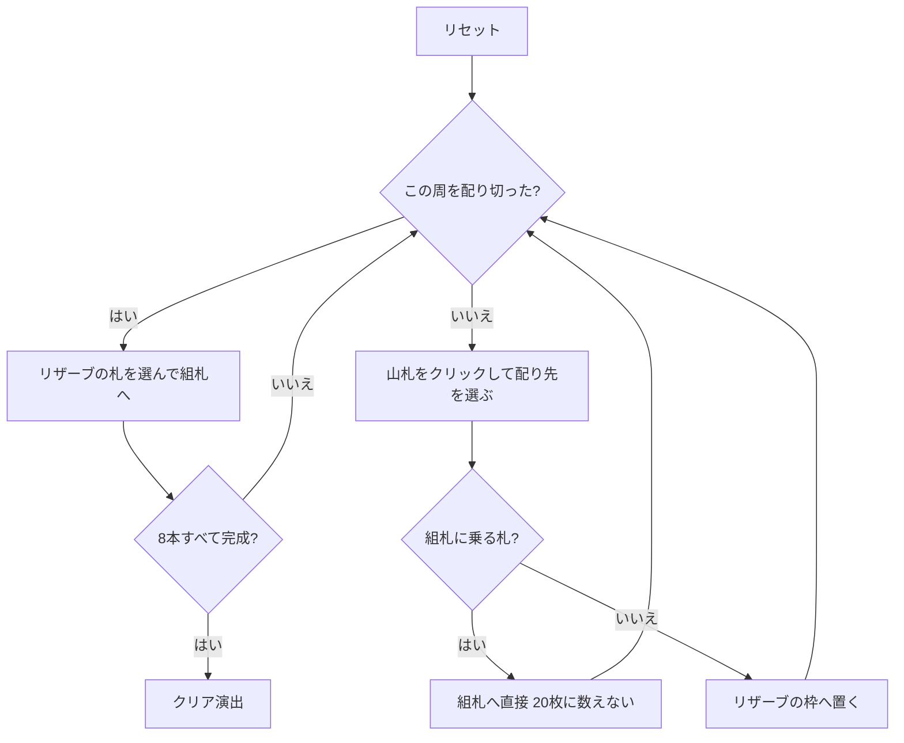

# スライ・フォックス（Web版）遊び方

## ゲーム概要

52 枚 2 組の 104 枚を、**20 枠のリザーブ**と 8 本の組札で捌く一人用ソリティア。

判断は実質ひとつ — **めくった札をどの枠に置くか**。置ける枠に制限は無いが、置けばその下の札は掘り出すまで使えない。そして **20 枚配り切るまで、リザーブから組札へは 1 枚も送れない**。置き場所を 20 回先に決めきってから収穫する、この一方通行が「ずる賢い狐」の駆け引きそのもの。

## 起動方法

```sh
go run ./cmd/trumpcards web  # CLI経由でWebサーバーを起動
go run ./cmd/server          # 直接Webサーバーを起動
```

ブラウザで `http://localhost:8080` にアクセスし、ナビゲーションバーから「スライ・フォックス」を選択します。
ナビバーのJA/ENボタンで日本語・英語を切り替えられます。

## ルール

- 52 枚 2 組（104 枚）。**20 枠のリザーブに 1 枚ずつ**配り、残り 84 枚が山札
- **組札は 8 本**。↑ の 4 本は各スート A から K への昇順、↓ の 4 本は各スート K から A への降順。8×13 = 104 枚がちょうど収まる。**最初は空**で、A や K が出てきたときにそこから始まる
- **捨て札は無い。**めくった札はその場で行き先を決める ── リザーブの好きな枠へ置くか、置ける組札があればそちらへ直接送る
- **20 枚配り切るまで、リザーブから組札へは送れない。**組札へ直接送った札は 20 枚に数えない（良い引きが罰にならないように）
- **リザーブの札は組札へしか送れない**。リザーブ同士の移動は無い
- **空いた枠は補充されない。**次に配るときの置き場所として使うだけ
- 山札が尽きたら制限は解け、残ったリザーブだけで詰めていく
- 8 本すべてが 13 枚になれば勝ち

> 補足: クローン元のコロラドとは 3 点異なる。両者は資料上しばしば混同され（Wikipedia は一方から他方へリダイレクトする）、PySolFC は別ゲームとして実装している。差は (1) コロラドは捨て札を挟む、(2) コロラドはいつでもリザーブから組札へ送れる、(3) コロラドは空き枠を山札から直接埋められる ── の 3 点。

## ゲームの流れ



## 画面の操作方法

| 操作 | 説明 |
|------|------|
| 山札をクリック | 次の 1 枚を配るモードに入る（配り先を選びます） |
| リザーブ枠をクリック（配るモード中に） | その枠へ配る。**この 1 枚が 20 枚のうちの 1 枚** |
| 組札をクリック（配るモード中に） | めくった札をそのまま組札へ。**20 枚に数えません** |
| リザーブ枠をクリック | 移動元として選択する（もう一度押すと解除）。**周を配り切るまで押せません** |
| 組札をクリック | 選択中のカードをその組札に置く |
| ヒントボタン | 打てる手を1つ提示する |
| 元に戻すボタン | 直前の1手を取り消す |
| オートコンプリートボタン | 送れるカードを自動で組札へ送る |
| リセットボタン | 確認ダイアログのうえで最初からやり直す |
| CLI トグル | 同じゲームをコマンド入力で操作するモードに切り替える |

## 画面構成

- **上部**: フェーズ表示（プレイ中 / クリア）、手数
- **中央上**: 8 本の組札。`↑F0`〜`↑F3` が昇順、`↓F4`〜`↓F7` が降順で、`n/13` と次に必要なランクを表示
- **中央**: 山札の残り枚数と、**この周の進み（あと何枚でリザーブが開くか）**
- **中央下**: 20 枠のリザーブ。各枠は最上段と `(n)` の枚数を表示。閉じている間は押せません
- **下部**: アクションログ、設定、操作ボタン

## 遊び方のコツ

- **20 枚は先に払う代金。**配り始めたら、その周のあいだは組札へ送れません。周が明けた直後に何を送れるかを見越して置き場所を選びます
- **組札へ直接送れる札は必ず送る。**20 枚に数えないので、実質ただで 1 枚減らせます
- **どこに埋めるかがすべて。**置く先の枠の一番上が「組札に必要になるまで一番遠い」枠を選びます。ヒントもこの基準です
- **同じ数字の札は 2 枚あります。**1 枚は昇順の組札へ、もう 1 枚は降順の組札へ入るので、置ける方に置いて構いません
- **空いた枠は補充されません。**次に配るときの置き場所として残ります
- 山札はめくり直しが無いので、周が明けたら送れるものは送っておく

