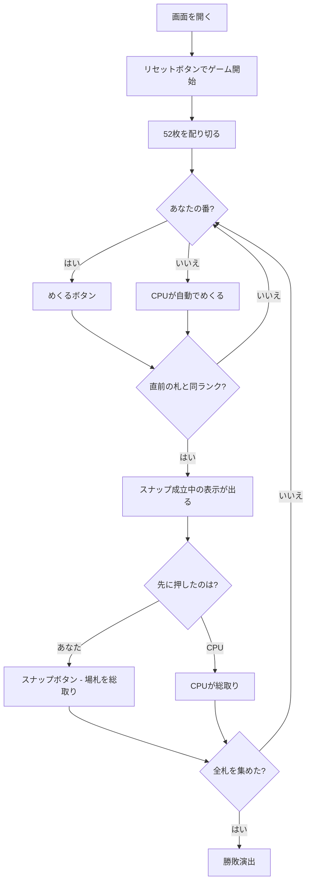

# スナップ（Web版）遊び方

## ゲーム概要

イギリス発祥の**反射ゲーム**。順番に1枚ずつめくり、**直前に出た札と同じランクが続いた瞬間**に宣言した人が場札を総取りします。**トリガーは固定ではありません**——常に「1つ前の札」との比較なので、場札が1枚のあいだは決して成立しません。全札を1人が集めたら勝ちです。2〜4人で遊べます。

## 起動方法

```sh
go run ./cmd/trumpcards web  # CLI経由でWebサーバーを起動
go run ./cmd/server          # 直接Webサーバーを起動
```

ブラウザで `http://localhost:8080` にアクセスし、ナビゲーションバーから「スナップ」を選択します。
ナビバーのJA/ENボタンで日本語・英語を切り替えられます。

## ルール

- **52枚**、**2〜4人**（既定2人）。配り切るので、**3人だと1枚多い席が出ます**（52 ÷ 3 は割り切れません）
- 手番の人がストックの先頭を1枚、場に表向きで出します
- **場札のいちばん上と、その1つ前が同じランク**になった瞬間、誰でも宣言できます。最初に宣言した人が**場札を総取り**し、その人が次にめくります
- **場札が1枚のあいだは決して成立しません**（比べる相手がいないため）。**見るのは上2枚だけ**です
- 成立していないのに宣言すると、**ペナルティとして自分のストックから1枚を場に差し出します**
- ストックが尽きた席は飛ばされ、**全札を1人が集めたら勝ち**
- CPU は反応時間つきで宣言を予約します。**期限より前に押せば人間の勝ち**。設定で速さを変えられます

## ゲームの流れ



## 画面の操作方法

| 操作 | 説明 |
|------|------|
| めくるボタン | ストックの先頭を1枚出す（**自分の番のときだけ押せます**） |
| スナップボタン | 宣言する。**いつでも押せます**——成立していなければペナルティです |
| 人数（設定） | 2〜4人。リセットすると反映されます |
| CPUの反応（設定） | 遅い / ふつう / 速い。CPU が宣言するまでの平均時間が変わります |
| ヒントボタン | いま宣言すべきかを提示する |
| ギブアップボタン | 投了する |
| リセットボタン | 確認ダイアログのうえで最初からやり直す |
| CLI トグル | 同じゲームをコマンド入力で操作するモードに切り替える |

**スナップボタンは無効化しません。** 成立していないときに押すとペナルティになりますが、それがこのゲームで賭けているものだからです。めくるボタンだけは、手番でないときサーバが必ず拒否するので押せなくしています。

**CPU は自動で動きます。** 予約された反応が期限に達すると発火します。

## 画面構成

```
┌────────────────────────────────────────────┐
│ 直前の札と同ランクが続いた瞬間に宣言する   │
├────────────────────────────────────────────┤
│              場札 3枚                       │
│              [ ♥7 ]                         │
│         スナップ成立中！                    │
├────────────────────────────────────────────┤
│  あなた（めくる番）: ストック 24枚          │
│  CPU1: ストック 25枚                        │
├────────────────────────────────────────────┤
│  CPU1 がめくりました                        │
├────────────────────────────────────────────┤
│  [めくる] [スナップ！] [リセット] [投了]    │
└────────────────────────────────────────────┘
```

- **規則帯**: このゲームのトリガーそのもの。**固定ではない**ことを常に出します
- **場札**: 積まれている枚数と、いちばん上の札
- **スナップ成立中**: 成立している瞬間だけ出ます。反射ゲームなので一目で分かる必要があります
- **席の行**: 各席のストック残数。**これが得点そのもの**です
- **イベント行**: 直前に何が起きたか。盤面だけでは、誰が取ったのか読めません

## 遊び方のコツ

- **1枚では絶対に成立しない。** 場が空のときや、めくった直後の1枚目では押さないこと
- **見るのは上2枚だけ。** 下に同ランクが埋まっていても関係ありません
- **誤宣言のコストは二重。** 自分のストックが減り、そのぶん場札が増えて相手の取り分になります
- **人数を増やすと荒れる。** 宣言できる相手が増えるので、同じ反応速度でも取られやすくなります
- **「速い」は本気で速い。** 平均500msなので、成立に気付いた瞬間に押す必要があります
