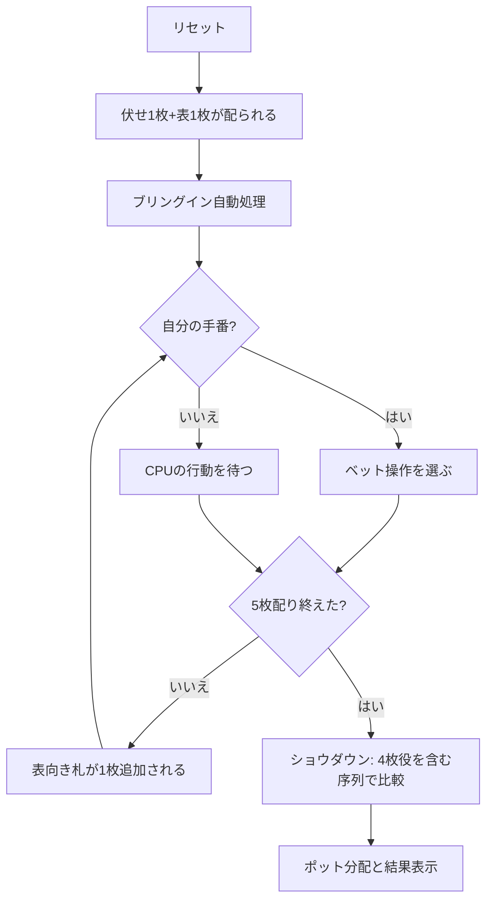

# ソッコ（Web版）遊び方

## ゲーム概要

フィンランドとカナダで遊ばれるファイブカード・スタッドの派生。カナディアン・スタッドとも呼ばれる。配り方・ブリングイン・ベットラウンドはファイブカード・スタッドとまったく同じで、**違うのはショウダウンの役序列だけ**。

通常の役に加えて「4枚ストレート」と「4枚フラッシュ」が認められ、どちらもワンペアより上・ツーペアより下に入る。5枚全部が揃わなくても中間的な役が成立するため、降りるしかない手が戦える手に変わる。

## 起動方法

```sh
go run ./cmd/trumpcards web  # CLI経由でWebサーバーを起動
go run ./cmd/server          # 直接Webサーバーを起動
```

ブラウザで `http://localhost:8080` にアクセスし、ナビゲーションバーから「ソッコ」を選択します。
ナビバーのJA/ENボタンで日本語・英語を切り替えられます。

## ルール

- 52 枚 1 組。1人（あなた）＋CPU 1〜5人
- アンティを支払い、伏せ札1枚＋表向き札1枚を配る。表向き札が最も低い人がブリングインを支払う
- 3rd / 4th / 5th ストリートで表向き札を1枚ずつ配り、各ストリートでベットラウンド（計5枚＝伏せ1枚＋表4枚）
- ベットの手番順は表向き札の見た目の強さで毎ストリート変わる
- ショウダウンで役を比較し、最も強い手がポットを獲得

### 役の序列（強い順）

| 役 | 備考 |
|----|------|
| ロイヤルフラッシュ 〜 スリーカード | 通常のポーカーと同じ |
| **ツーペア** | |
| **4枚フラッシュ** | ちょうど4枚が同じスート |
| **4枚ストレート** | ちょうど4枚が連続ランク（A-2-3-4 と J-Q-K-A の両方が有効） |
| **ワンペア** | |
| ハイカード | |

- 4枚役はワンペアと**同時に成立しうる**。その場合は上位の4枚役として扱う（例: ♠2 ♠5 ♠9 ♠K ♥K は4枚フラッシュ）
- 5枚同スートは本物のフラッシュ、5枚連続は本物のストレートで、4枚役より上

## ゲームの流れ



## 画面の操作方法

| 操作 | 説明 |
|------|------|
| コール／レイズ／チェック／フォールド／オールイン | 自分の手番に表示されるベット操作 |
| ベット額の入力 | レイズ・ベットの金額を指定する（最小レイズ額が既定値） |
| キーボード `c` / `r` / `k` / `f` / `a` | コール／レイズ／チェック／フォールド／オールインのショートカット |
| マック／ショー | ショウダウンで手を見せるか伏せたまま降りるかを選ぶ |
| リバイ／アドオン | チップが尽きたときに買い直す（設定で有効化） |
| ヒントボタン | 現在の手に対する助言を表示する |
| リセットボタン | 確認ダイアログのうえで最初からやり直す |
| CLI トグル | 同じゲームをコマンド入力で操作するモードに切り替える |

## 画面構成

- **上部**: フェーズ（ストリート）表示、ポット、アンティ／ブリングイン、ディーラー位置
- **中央**: CPU 各人の表向き札と伏せ札（伏せ札はショウダウンまで裏向き）、チップとベット額
- **下部**: 自分の伏せ札・表向き札と役名バッジ、メッセージ、ベット操作ボタン
- **役名バッジ**は Soko の序列で表示されるため、同じ5枚でもファイブカード・スタッドとは違う名前になることがあります
- **設定パネル**: アンティ、トーナメントモード、ヒント表示、CPU メタAI

## 遊び方のコツ

- **4枚フラッシュ狙いは降りにくくなる。** 同スートが3枚見えていれば、残り2枚のどちらかが同スートで役になる。ファイブカード・スタッドなら捨てる手が戦える
- 4枚ストレートは**内側の抜け（5-6-_-8）でも上下どちらかが埋まれば成立**するので、連続3枚が見えたら追う価値がある
- ただし**4枚役はツーペアに負ける**。相手の表向き札にペアが見えているときは、4枚役でも降り時
- 相手の表向き札に同スートが4枚見えたら、4枚フラッシュ以上が確定に近い
- ワンペア同士の勝負が減るぶんショウダウンまで進む頻度が上がるので、序盤のベットは控えめに
