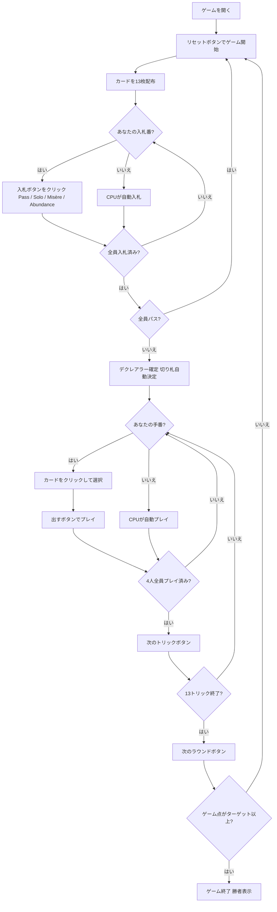

# ソロ・ホイスト（Web版）遊び方

## ゲーム概要

Solo Whist（ソロ・ホイスト）はイギリスで広く親しまれているトリックテイキングゲームです。52枚の標準デッキを4人でプレイします。各ラウンドの最初に**入札フェーズ**があり、最高入札者が**デクレアラー**（宣言者）として1人で3人の**ディフェンダー**と対戦します。デクレアラーがコントラクトを達成すればそのコントラクトの価値分のゲーム点を獲得し、失敗すれば各ディフェンダーが同じ点数を獲得します。先にターゲット（デフォルト21点）に達したプレイヤーがマッチ勝利です。あなたは席0としてプレイします。

## 起動方法

```sh
go run ./cmd/trumpcards web        # REST API + Web GUI サーバを起動
go run ./cmd/trumpcards web --open # 起動してブラウザを開く
```

ブラウザで `/solowhist` にアクセスします。

## ルール

### デッキと配布

- **デッキ**: 52枚（A,2-10,J,Q,K × 4スート）
- **プレイヤー**: 4人（あなた = 席0、CPU1〜3）
- **配布**: 各プレイヤー13枚、計13トリック
- **カードの強さ（高い順）**: A > K > Q > J > 10 > 9 > 8 > 7 > 6 > 5 > 4 > 3 > 2

### 入札フェーズ

ディーラーの左隣から時計回りに、各プレイヤーが1回だけ入札します。

| コントラクト | 値 | 内容 |
|--------------|-----|------|
| **Pass（パス）** | — | 入札をパスする |
| **Solo（ソロ）** | 2 | 単独で8トリック以上取ることを宣言 |
| **Misère（ミゼール）** | 3 | 単独で0トリックを取ることを宣言（切り札なし） |
| **Abundance（アバンダンス）** | 4 | 単独で9トリック以上取ることを宣言 |

- 先の入札より高いコントラクトのみ選択できます（Pass < Solo < Misère < Abundance）。
- 全員がパスした場合はそのラウンドは無効となり、再配布されます。
- 最高入札者が**デクレアラー**となり、他の3人が**ディフェンダー**として対戦します。
- 伝統的な「Prop & Cop」（2人同盟）は省略されており、デクレアラーは常に1対3で戦います。

### 切り札

- **Solo / Abundance**: デクレアラーの手札で最も枚数の多いスートが自動的に切り札スートになります（簡易実装）。
- **Misère**: 切り札はありません。

### トリック・テイキング

- **スートフォロー義務**: リードされたスートのカードを持っている場合は必ず出さなければなりません。
- 持っていない場合は任意のカードを出せます（切り札でも他スートでも可）。
- **トリックの勝者**:
  - 切り札スートのカードが場にあれば、最も強い切り札カードが勝ちます。
  - 切り札がなければ、リードスートの最も強いカードが勝ちます。
- トリックの勝者が次のトリックをリードします。

### 勝利条件

| 結果 | 得点 |
|------|------|
| デクレアラーがコントラクト達成 | デクレアラーがコントラクト値（Solo=2, Misère=3, Abundance=4）を獲得 |
| デクレアラーがコントラクト失敗 | **各**ディフェンダーがコントラクト値を獲得 |

**マッチ勝利**: 先にターゲット（デフォルト **21** ゲーム点）に達したプレイヤーが勝利。

## ゲームの流れ



## 画面の操作方法

### BIDフェーズ（入札フェーズ）

あなたの入札番になると、手札の下に入札ボタンが表示されます。

- **「Pass」ボタン**: 入札をパスします。
- **「Solo」ボタン**: Solo（8トリック以上）を宣言します。先行入札がSolo以上の場合はグレーアウトして選択できません。
- **「Misère」ボタン**: Misère（0トリック）を宣言します。先行入札がMisère以上の場合は選択できません。
- **「Abundance」ボタン**: Abundance（9トリック以上）を宣言します。先行入札がAbundance以上の場合は選択できません。

### PLAYフェーズ（トリックフェーズ）

- あなたの手番のとき、手札のカードをクリックして選択します。
- **「出す」ボタン**: 選択したカードをプレイします。スートフォロー義務に従う必要があります（義務に反するカードは選択できません）。
- **「次のトリック」ボタン**: トリックが解決したら次へ進みます。
- **「次のラウンド」ボタン**: 13トリック終了後にスコアを集計して次のラウンドへ進みます。

## 画面構成

```
┌─────────────────────────────────────────────────────┐
│  Solo Whist (ソロ・ホイスト) [JA/EN] [CLI]          │
├─────────────────────────────────────────────────────┤
│  ラウンド: 1  トリック: 0  フェーズ: BID             │
│  切り札: -  デクレアラー: -  コントラクト: -         │
│  ゲーム点: あなた=0  CPU1=0  CPU2=0  CPU3=0          │
├──────────┬──────────────────────────────────────────┤
│  CPU1    │                                           │
│  (役割)  │     現在のトリック表示エリア               │
│  CPU2    │     （各プレイヤーの出したカード）          │
│  (役割)  │                                           │
│  CPU3    │                                           │
│  (役割)  │                                           │
├──────────┼──────────────────────────────────────────┤
│  入札状況│  メッセージ / 結果表示                    │
│  CPU1=?  │  ラウンド結果・スコア情報                  │
│  CPU2=?  │                                           │
│  CPU3=?  │                                           │
├──────────┴──────────────────────────────────────────┤
│  あなたの手札（クリックで選択）                       │
│  [A♥][K♥][Q♠][J♦][10♣][9♠]...                     │
│  [Pass] [Solo] [Misère] [Abundance]  ← BIDフェーズ  │
│  [出す] [次のトリック] [次のラウンド] ← PLAYフェーズ │
└─────────────────────────────────────────────────────┘
```

- **ヘッダー**: ゲーム名・フェーズ表示・言語切り替えトグル・CLI切り替えトグル。
- **ラウンド／トリック表示**: 現在のラウンド番号・トリック番号・フェーズ・切り札スート・デクレアラーとコントラクト表示。
- **ゲーム点**: 各プレイヤーの累積ゲーム点をリアルタイムで表示。
- **プレイヤー表示エリア（左）**: CPU各プレイヤーの手札枚数・役割（デクレアラー or ディフェンダー）を表示。
- **入札状況（左）**: 各プレイヤーの入札内容（入札フェーズ中）。
- **トリック表示エリア（中央）**: 場に出ているカードと出したプレイヤー名。
- **メッセージボックス**: フェーズ・ラウンド結果（トリック数・ゲーム点）・勝敗の案内。
- **フッター（手札エリア）**: あなたの手札と操作ボタン（BIDフェーズは入札ボタン4種、PLAYフェーズは出す／次のトリック／次のラウンド）。

## 遊び方のコツ

- **入札の判断**: Solo（8トリック以上）は手札のA・Kが4枚以上あれば検討できます。Abundance（9トリック以上）は強いカードが多数ある場合のみ宣言しましょう。Misèreは弱いカードで揃っていること（2〜5が多く、Aが少ない）が条件です。
- **デクレアラーは切り札を引き出せ**: Solo / Abundance では、デクレアラーの最長スートが切り札になります。序盤に切り札リードを繰り返してディフェンダーの切り札を消費させると、後半の高得点スートで安全にトリックを取れます。
- **ディフェンダーは連携して阻止**: 3人のディフェンダーは互いに協力します。デクレアラーが強いスートでリードしてきたら、他のディフェンダーの高いカードが勝てるよう低いカードを捨ててサポートしましょう。
- **Misèreはボイドを活用**: Misèreのデクレアラーは切り札なしで0トリックを目指します。手札の強いカードを早めに捨てるため、ボイド（そのスートを持たない）状態を意図的に作ることが重要です。ディフェンダーはデクレアラーが強いカードを捨てられないよう、そのスートをリードし続けましょう。
- **コントラクト価値を意識**: Abundanceは失敗すると各ディフェンダーが4点ずつ（合計12点）獲得します。リスクとリターンを考慮し、手札が確実でなければSoloに留めましょう。
- **グレーアウトボタンを確認**: 入札フェーズで既に高いコントラクトが出ている場合、それ以下のボタンはグレーアウトされます。残りの選択肢を確認してから入札しましょう。
- **得点管理**: ゲーム点は誰が勝っても常に変動します。上位者が宣言者になりやすい状況では、ディフェンダーに回るチャンスを活かして複数人で点数を分散させましょう。
