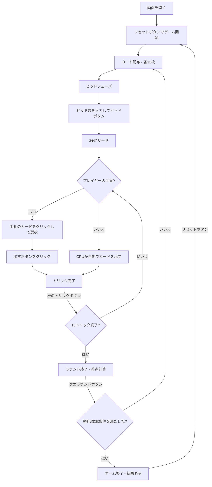

# スペード（Web版）遊び方

## ゲーム概要

4人（プレイヤー1人 + CPU 3人）で遊ぶトリックテイキング型カードゲームです。スペードが常にトランプ（切り札）で、各ラウンド開始時にビッド（獲得予想トリック数）を宣言します。先に500点に到達したプレイヤーが勝者です。

## 起動方法

```sh
go run ./cmd/cli web        # CLI経由でWebサーバーを起動
go run ./cmd/server         # 直接Webサーバーを起動
```

ブラウザで `http://localhost:8080` にアクセスし、ナビゲーションバーから「スペード」を選択します。
ナビバーのJA/ENボタンで日本語・英語を切り替えられます。

## ルール

### 基本ルール

- 52枚のトランプを4人に配布（1人13枚）
- **スペードが常にトランプ（切り札）**
- 各ラウンド開始時にビッド（0〜13）を宣言
- ビッド0 = ニル（高リスク・高リターン）
- 2♣を持つプレイヤーが最初のトリックをリード
- リードスートに従う（フォロースート）。スペードはブレイクされるまでリードできない
- トリックの勝者: スペード（トランプ）が出ていれば最高のスペード、なければリードスートの最高値

### 得点

- **ビッド成功**: ビッド×10 + オーバートリック（バッグ）
- **ビッド失敗**: -ビッド×10
- **ニル成功**: +100点
- **ニル失敗**: -100点
- **バッグペナルティ**: 累積10バッグごとに-100点

### ゲーム終了

- **勝利条件**: 先に500点に到達
- **敗北条件**: -200点以下

### CPU難易度

- **Easy**: ランダムにカードを出す
- **Normal**: 基本的なトリック戦略（デフォルト）
- **Hard**: 戦略的なプレイ（カウンティング等）

## ゲームの流れ



## 画面の操作方法

### ビッドフェーズ

1. 数値入力欄にビッド数（0〜13）を入力します
2. **「ビッド」** ボタンで確定します
3. 0を入力するとニルビッドになります

### カードのプレイ（プレイフェーズ）

1. 手札のカードをクリックして選択します
2. フォロー必須のルールに従い、出せないカードは選択できません
3. **「カードを出す」** ボタンをクリックしてカードを場に出します

### トリック・ラウンドの進行

1. トリックが完了すると結果が表示されます
2. **「次のトリック」** ボタンで次のトリックに進みます
3. ラウンドが完了すると得点が表示されます
4. **「次のラウンド」** ボタンで次のラウンドに進みます

### キーボードショートカット

| キー | アクション | 有効条件 |
|------|-----------|---------|
| `1`〜`9`, `0` | カード選択/解除（1=1枚目, ..., 9=9枚目, 0=10枚目） | プレイヤーの手番 |
| `Enter` | カードを出す / ビッド確定 | プレイヤーの手番 / ビッドフェーズ |
| `Escape` | 選択クリア | プレイヤーの手番 |

※ テキスト入力欄にフォーカスがある場合、ショートカットは無効になります。

## 画面構成

```
┌────────────────────────────────────────────┐
│  ▶ 設定 (クリックで展開)                   │
│    CPU難易度:    [Normal▼]                 │
│    目標スコア:   [500▼]                    │
├────────────────────────────────────────────┤
│           CPU プレイヤーエリア              │
│ ┌──────────┐ ┌──────────┐ ┌──────────┐    │
│ │ CPU 1    │ │ CPU 2    │ │ CPU 3    │    │
│ │ 80点     │ │ 150点    │ │ 60点     │    │
│ │ B:3 W:2  │ │ B:5 W:5  │ │ B:0(Nil) │    │
│ └──────────┘ └──────────┘ └──────────┘    │
├────────────────────────────────────────────┤
│              ゲーム情報                     │
│  ラウンド 2 / トリック 5                    │
│  スペードブレイク: はい                     │
├────────────────────────────────────────────┤
│           現在のトリック                    │
│  CPU 1: ♣10   CPU 2: ♣K                  │
├────────────────────────────────────────────┤
│     フッター: あなた (120点, B:4 W:3)       │
│  [♠5][♣8][♥K][♦3]...                     │
│  [リセット] [カードを出す] [次のトリック]    │
└────────────────────────────────────────────┘
```

- **設定パネル（▶ 設定）**:
  - 「CPU難易度」セレクト: Easy / Normal / Hard から選択
  - 「目標スコア」: 200 / 300 / 500 / 750 / 1000 から選択
  - 次のリセット時に設定が適用される
- **CPU プレイヤーエリア**: 各 CPU の累計得点、ビッド数、獲得トリック数を表示
  - 手番の CPU は金色枠
- **ゲーム情報**: 現在のラウンド、トリック番号、スペードブレイク状態
- **現在のトリック**: トリックに出されたカード
- **フッター（あなたの手札）**:
  - クリックで選択（緑枠 + 上に浮き上がる）
  - フォロー必須のカードのみ選択可能
- **スコアテーブル**: 各プレイヤーのビッド、獲得トリック数、バッグ数、ラウンドスコア、累積スコア

## 遊び方のコツ

- スペードの高いカード（A♠、K♠）を持っている場合はビッドを多めに設定しましょう
- ニルビッドは手札に高いカードが少ない場合のみ狙いましょう
- バッグ（オーバートリック）が累積10に近い場合は、トリックを取りすぎないよう注意しましょう
- 特定のスートをボイド（手札からなくす）にして、スペードで切る戦略が有効です
- 他のプレイヤーのビッドと獲得トリック数を把握し、戦略を調整しましょう
