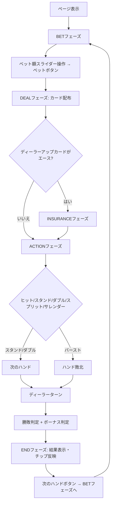

# スパニッシュ21（Web版）遊び方

## ゲーム概要

Spanish 21（スパニッシュ21）は、ブラックジャックのバリアントです。10のカード（10のみ、J/Q/Kは残す）を抜いた48枚×4スートのSpanishデッキを使用し、プレイヤーの21は常に勝利します（ディーラーも21でも勝ち）。さらに、5枚以上で21を作る、6-7-8や7-7-7のトリオを作るなどの特殊ハンドにボーナス配当が付きます。基本のプレイ操作はブラックジャックページと共通で、配当表にSpanish 21固有のボーナスが追加表示されます。

## 起動方法

```sh
cd frontend && bun run dev   # 開発モード
go run ./cmd/trumpcards web  # Goサーバー経由
```

ブラウザで `http://localhost:5173/spanish21` を開く。NavBarからは「テーブルゲーム」カテゴリの「🇪🇸 スパニッシュ21」を選択。

## ルール

### Spanishデッキ

- 各スートから値10のカード（10のみ）を除外、J/Q/K（10点扱い）は残す
- 1組48枚 × 4スート = 192枚、本実装はデフォルト1デッキ（1〜8デッキ可変）

### ブラックジャックとの違い

| 項目 | ブラックジャック | Spanish 21 |
|------|------------------|------------|
| デッキ | 52枚 | 48枚（10を除く） |
| プレイヤー21 vs ディーラー21 | プッシュ（引き分け） | プレイヤー勝利 |
| プレイヤーBJ vs ディーラーBJ | プッシュ（引き分け） | プレイヤー勝利 |
| ボーナス配当 | なし | 5/6/7+枚21、6-7-8、7-7-7（後述） |

### ボーナス配当

ボーナスは「ダブルダウンしていない」勝利ハンドにのみ適用されます。ナチュラルブラックジャック（最初の2枚で21）はBJ配当（3:2）が優先され、ボーナスは付与されません。

| 種類 | 配当 |
|------|------|
| 5枚で21 | 3:2 |
| 6枚で21 | 2:1 |
| 7枚以上で21 | 3:1 |
| 6-7-8 異なるスート | 3:2 |
| 6-7-8 同一スート | 2:1 |
| 6-7-8 全スペード | 3:1 |
| 7-7-7 異なるスート | 3:2 |
| 7-7-7 同一スート | 2:1 |
| 7-7-7 全スペード | 3:1 |

その他のルール（ヒット、スタンド、ダブルダウン、スプリット、インシュランス、サレンダー、サイドベット、CPUプレイヤー、カウンティング、デッキペネトレーションなど）はブラックジャックと共通です。詳細は [`docs/manual/web/blackjack.md`](blackjack.md) を参照してください。

## ゲームの流れ



## 画面の操作方法

ブラックジャックページと同一の操作系を使用します。Spanish 21固有の差分のみ記載：

- **配当表ドロワー**: BETフェーズの「配当表 (Spanish 21 ボーナス)」を展開すると、5/6/7+枚21、6-7-8、7-7-7のボーナス倍率が表示されます。
- **アクションログ**: ボーナスが適用された場合、ENDフェーズのアクションログに `bonus: spanish21.bonus.<key>` 形式で記録されます。

その他の操作（ベット額スライダー、ヒント、サイドベット、CPUプレイヤー設定、デッキ数設定、サレンダールール、ペネトレーション、自動進行など）はブラックジャックページと共通です。

### ヒントはスパニッシュ21専用の戦略表を使う

ヒントが出す推奨手は、標準デッキ用の基本戦略ではなく**48枚デッキ用に解き直した専用の表**です（[#4705](https://github.com/yuta-yoshinaga/go_trumpcards/issues/4705)）。10 が抜けているぶんバストしにくいので、標準ブラックジャックとは主に次の点が変わります。

| 局面 | 標準ブラックジャック | スパニッシュ21 |
|------|--------------------|---------------|
| ハード 12・13 | 2〜6 に対してスタンド | **常にヒット** |
| ハード 14 | 2〜6 に対してスタンド | 4・5・6 に対してだけスタンド |
| ハード 10・11 | 9 に対してもダブル | 9 以上にはダブルしない |
| ハード 17 vs A | スタンド | **サレンダー** |
| 4,4 | 5・6 に対してスプリット | スプリットしない |
| 6,6 | 2・3 に対してもスプリット | 4・5・6 に対してだけスプリット |

表は出典から写したものではなく、**このゲームの規則（48枚デッキ・ディーラーはソフト17でスタンド・プレイヤーの21は常に勝ち・ボーナス配当・2枚のときだけダブル可）から期待値を解いて生成**しています。生成手順と検証は `internal/domain/BlackJackSpanish21Strategy.go` のコメントを参照してください。

## 画面構成

- ヘッダー: `Spanish 21` タイトル、フェーズインジケーター、CLI切替・チュートリアル・マニュアルボタン
- メイン: ディーラー手札（伏せカード/表カード）、CPU席、プレイヤー手札（スコア・ステータスバッジ表示）
- フッター: フェーズ別アクションボタン（ベット/ヒット/スタンド/ダブル/スプリット/サレンダー）
- BETフェーズ: ベット額スライダー、サイドベット入力、設定パネル、配当表ドロワー

## 遊び方のコツ

- 10のカードがデッキに無いため、ヒットでバーストしにくい一方、ディーラーがブレイクしにくい
- 5枚以上の21を狙えるシチュエーションでは積極的にヒットして良い場合がある（ボーナス3:2〜3:1）
- ダブルダウンするとボーナス対象外になるので、ボーナスが狙える手では基本ヒットを優先
- 7-7-7（特に全スペード）は希少だが配当が大きい
