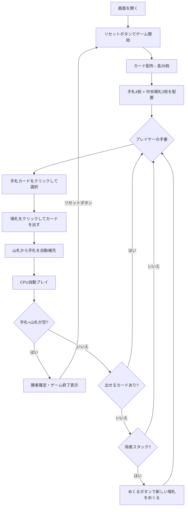

# スピード（Web版）遊び方

## ゲーム概要

2人（プレイヤー1人 + CPU 1人）で遊ぶスピード系カードゲームです。中央の2つの場札に対して、ランクが±1のカードを素早く出していき、先に手札と山札をすべてなくしたプレイヤーが勝者です。

## 起動方法

```sh
go run ./cmd/cli web        # CLI経由でWebサーバーを起動
go run ./cmd/server         # 直接Webサーバーを起動
```

ブラウザで `http://localhost:8080` にアクセスし、ナビゲーションバーから「スピード」を選択します。
ナビバーのJA/ENボタンで日本語・英語を切り替えられます。

## ルール

### 基本ルール

- 52枚のトランプを2人に26枚ずつ配布
- 各プレイヤーは手札（最大4枚）と山札を持つ
- 中央に2つの場札がある
- 場札のランク±1のカードを手札から出せる（K→Aのラップあり）
- カードを出したら山札から手札を補充する
- 先に手札と山札をすべてなくしたプレイヤーが勝利

### スタック（行き詰まり）

- 両プレイヤーが出せるカードがない場合、スタック状態になる
- スタック時は「めくる」ボタンで中央の場札に新しいカードをめくる
- 山札がない場合はゲーム終了

## ゲームの流れ



## 画面の操作方法

### カードの出し方（プレイフェーズ）

1. 画面下部の手札エリアに自分のカードが表示されます
2. 出したいカードをクリックして選択します（緑枠でハイライト）
3. 中央の場札（左または右）をクリックしてカードを出します
4. 場札のランク±1でないカードは出せません

### スタック時の操作

1. 両プレイヤーが出せるカードがない場合、「スタック」状態になります
2. **「めくる」** ボタンをクリックして中央の場札に新しいカードをめくります

### キーボードショートカット

| キー | アクション | 有効条件 |
|------|-----------|---------|
| `1`〜`4` | 手札カード選択（1=1枚目, ..., 4=4枚目） | プレイフェーズ |
| `←` / `→` | 左/右の場札にカードを出す | カード選択中 |
| `Enter` | めくる | スタックフェーズ |

## 画面構成

```
┌────────────────────────────────────────────┐
│           CPU プレイヤーエリア              │
│  手札: 4枚  山札: 18枚                     │
│  [?][?][?][?]                              │
├────────────────────────────────────────────┤
│             中央場札エリア                  │
│       [♥7]           [♠10]                │
│     (場札 0)        (場札 1)               │
├────────────────────────────────────────────┤
│         フッター: あなた                    │
│  手札: 4枚  山札: 18枚                     │
│  [♣6][♦8][♥3][♠Q]                       │
│  [リセット] [ヒント] [めくる]              │
└────────────────────────────────────────────┘
```

- **CPU プレイヤーエリア**: CPUの手札枚数と山札残り枚数を表示（カードは裏向き）
- **中央場札エリア**: 2つの場札の表面を表示。クリックしてカードを出す先を選択
- **フッター（あなたの手札）**:
  - 手札カードをクリックで選択（緑枠ハイライト）
  - 「リセット」ボタン: ゲームを最初からやり直す
  - 「ヒント」ボタン: 出せるカードの候補を表示
  - 「めくる」ボタン: スタック時に新しい場札をめくる（スタック時のみ有効）

## CPU難易度

設定でCPUの強さを3段階から選べます。

| レベル | 名称 | 戦略 |
|--------|------|------|
| 0 | Easy | ランダムに1枚だけ出す |
| 1 | Normal | 貪欲に複数枚を連続で出す |
| 2 | Hard | ブロッキング（相手の手を封じる出し方）とコンボ（連鎖プレイ）を考慮して戦略的に出す |

## 遊び方のコツ

- 場札の±1に合うカードを素早く見つけて出しましょう
- K と A はラップするので、K の場には A を、A の場には K を出せます
- 両方の場札に出せるカードがある場合は、戦略的にどちらに出すか考えましょう
- スタックが頻発する場合は、めくりで流れが変わることがあります
- ヒントボタンで迷ったときに出せるカードを確認できます
