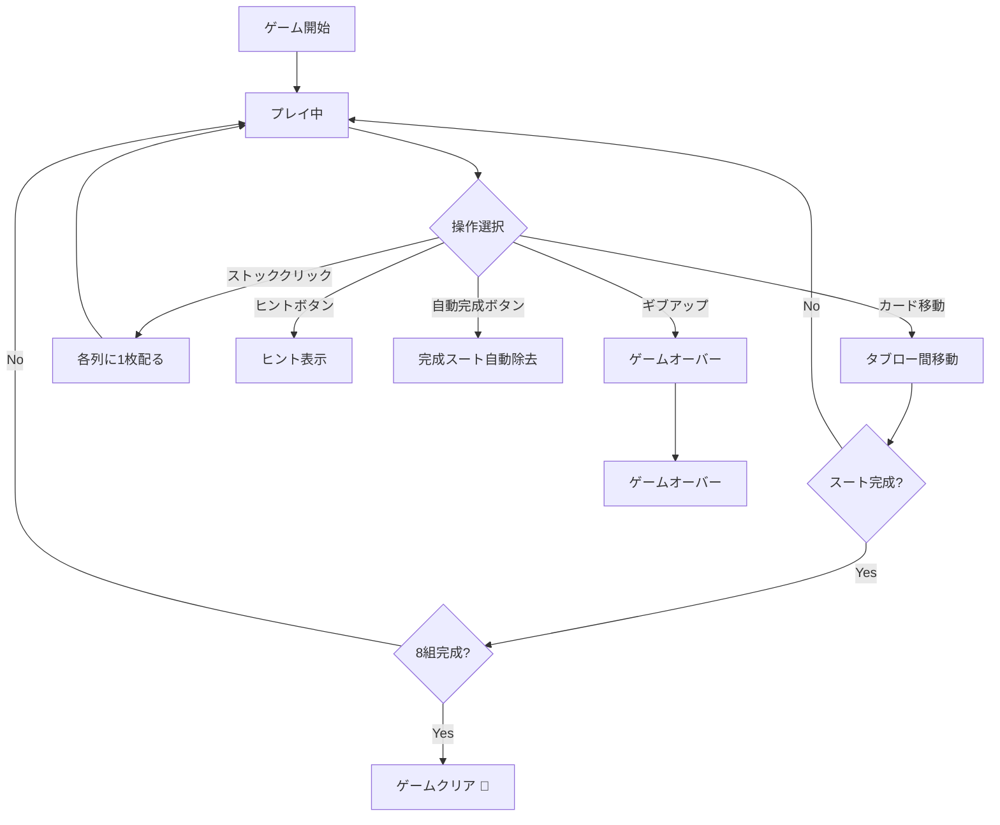

# スパイダーソリティア（Web版）遊び方

## ゲーム概要

1人用のソリティアゲーム。2デッキ（104枚）を使い、10列のタブローで同スート降順のシーケンスを完成させ、K〜Aの13枚を8組すべて除去すれば勝利です。難易度は1/2/4スートから選択できます。

## アクセス方法

```sh
go run ./cmd/trumpcards web
# ブラウザで http://localhost:8080/#/spider にアクセス
```

## ルール

### 基本ルール
- 2デッキ104枚を使用
- 10列のタブローに配る（最初の4列は6枚、残り6列は5枚、各列の最後の1枚だけ表向き）
- 残り50枚はストック（5回に分けて10枚ずつ配る）
- タブロー間でカードを移動する。値が1つ大きいカードの上に置ける（スート不問）
- 同スート降順の連続シーケンスのみグループ移動可能
- K〜Aの同スート13枚が揃うと自動的に除去される
- 8組すべて除去でゲームクリア

### 難易度
- **1スート（初級）**: スペードのみの104枚
- **2スート（中級）**: スペートとハートの104枚
- **4スート（上級）**: 全4スートの104枚（2デッキ分）

### 得点
- 開始時: 500点
- 移動/配り: -1点
- スート完成: +100点

## 画面構成

### ヘッダー
- フェーズ表示（プレイ中 / ゲームクリア / ゲームオーバー）
- 手数、スコア、完成スート数

### メインエリア
- **ストック**: クリックで各列に1枚ずつ配る（残り回数表示）
- **タブロー（10列）**: カードをクリックで選択→移動先をクリック

### フッター
- 配る、元に戻す、ヒント、自動完成、ギブアップボタン
- 難易度セレクター
- リセットボタン

## 操作方法

### マウス操作
1. 移動元のカードをクリックして選択（黄色の枠で強調）
2. 移動先の列をクリックして移動
3. ストックのカード裏面をクリックで配る

### キーボードショートカット
| キー | 操作 |
|------|------|
| `d` | ストックから配る |
| `h` | ヒントを表示 |
| `a` | 自動完成 |
| `g` | ギブアップ |
| `z` | 元に戻す |

## ゲームの流れ



## 遊び方のコツ

- まず1スート（初級）で慣れましょう
- 裏カードを開けることを優先する
- 空列を作ると移動の自由度が上がる
- ストックを配る前に空列をなくすこと（空列があるとストックから配れない）
- 同スートの降順シーケンスを意識して組み立てる
- ヒント機能を活用して有効な手を見つける
- 元に戻す機能で試行錯誤する
