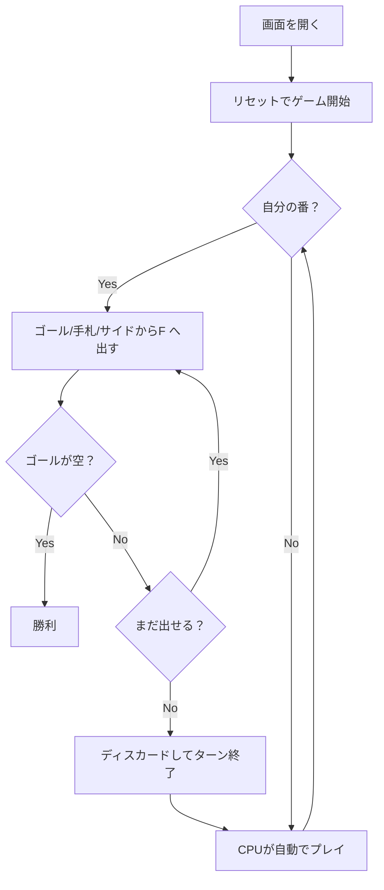

# スパイト・アンド・マリス（Web版）遊び方

## ゲーム概要

2人対戦型（人間 vs CPU）のレース系カードゲームです（市販ゲーム「Skip-Bo」の原型）。各プレイヤーに割り当てられた「ゴールパイル（自分の山札）」を、中央の共有ファウンデーションに A から Q まで順に積み上げていき、先に自分のゴールパイルをすべて出し切ったプレイヤーが勝利となります。K はワイルドカードで、任意の値として使えます。

## 起動方法

```sh
go run ./cmd/trumpcards web        # CLI経由でWebサーバーを起動
go run ./cmd/server                # 直接Webサーバーを起動
```

ブラウザで `http://localhost:8080` にアクセスし、ナビゲーションバーから「スパイト・アンド・マリス」を選択します。
ナビバーのJA/ENボタンで日本語・英語を切り替えられます。

## ルール

- 2デッキ計104枚を使用。シャッフル後、各プレイヤーにゴールパイル20枚ずつ、手札5枚ずつを配る。残りはストック。
- 各ターン、自分は次のいずれかを行える:
  1. **手札** からファウンデーションに出す
  2. **ゴールパイルのトップ** をファウンデーションに出す（出せた次のカードがめくれる）
  3. **サイドパイルのトップ** をファウンデーションに出す
  4. **ディスカード**（手札1枚を自分のサイドパイルに置いてターン終了）
- ファウンデーションは A から始め、A → 2 → 3 → ... → Q の順に積む。Q に達したら完成し、シャッフルされてストックに戻る。
- K はワイルドで、ファウンデーションのどの位置にも置ける（次に置く値はその位置を踏襲する）。
- 手札が0枚になったら自動的に5枚まで補充される（ストックが空ならディスカード経由でリフィルが走る）。
- 自分のゴールパイルをすべて出し切ったプレイヤーが勝者。

## ゲームの流れ



## 画面の操作方法

### プレイ中

1. **出すカードを選択**: 画面下部の手札カード、または自分のゴールパイル、サイドパイルのトップをクリックすると、緑のリングでハイライトされる（選択状態）。
2. **ファウンデーションをクリック**: 値が合えば積み上がる。手札選択中は4つのサイドパイルがディスカード可能ボタンとして使える。
3. **キャンセル**: 同じ場所をもう一度クリックすれば選択解除。

### ボタン

- **ディスカード（各サイドパイル下）**: 手札を1枚選んだ状態で押すと、そのサイドパイルに捨ててターン終了。
- **ヒント切替**: 「今出せる最良の手」または「ディスカード推奨」を青いリングで表示。
- **リセット**: 新しいゲームを開始（確認ダイアログ）。
- **CLI 切替**: コマンド入力モードへ切り替え。

## 画面構成

```
┌────────────────────────────────────────────┐
│ NavBar: スパイト・アンド・マリス (JA/EN切替)  │
├────────────────────────────────────────────┤
│ PhaseIndicator: あなたの番 / CPU の番 / 終了 │
├────────────────────────────────────────────┤
│ [CPU summary] hand=N goal top=...           │
│                                            │
│ [Foundations] [F1][F2][F3][F4]              │
│                                            │
│ [Stock: N] [Completed: N]                   │
│                                            │
│ [Goal pile]                                 │
│ [Hand cards (5)]                            │
│ [Side1][Side2][Side3][Side4]                │
│  Discard ボタン (各サイド下)                 │
├────────────────────────────────────────────┤
│ メッセージ / アクションログ                  │
├────────────────────────────────────────────┤
│ [Reset] [Show action log]                   │
└────────────────────────────────────────────┘
```

## 遊び方のコツ

- 「ゴールパイルの top をファウンデーションに乗せる」が最優先。乗せられない場合は手札からファウンデーションを伸ばし、ゴール top の値に近づける。
- K はワイルドだが万能札なので、温存しすぎず「次の Q を抜く」or「相手のゴール top をブロックする」狙いで早めに使うのも有効。
- ディスカードはサイドパイルの「将来引き出しやすい組み立て」を意識する。同じ値や昇順を1パイルに固めると後続のターンで連続してファウンデーションに出せる。
- 相手 CPU のゴール top と同じ値の手札はサイドに捨てる前にファウンデーション経由で消費する。CPU の進行を遅らせやすい。
