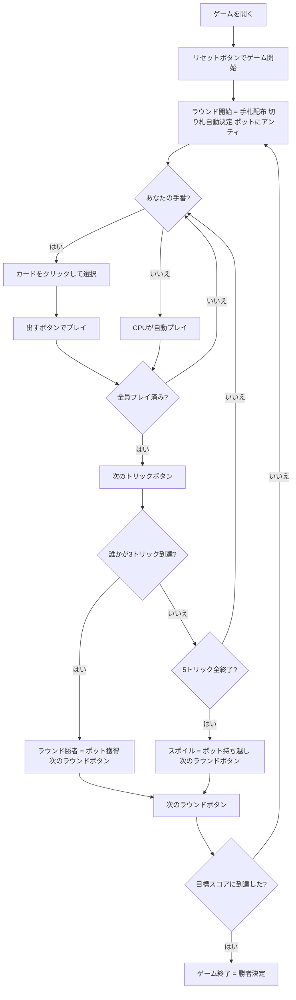

# スポイル・ファイブ（Web版）遊び方

## ゲーム概要

Spoil Five（スポイル・ファイブ）はアイルランド伝統のトリックテイキングゲームです。52枚の標準デッキを5人（あなた = 席0、CPU1〜4）でプレイします。各ラウンドで **最初に3トリックを取ったプレイヤーがポットを獲得** し、誰も3トリックを取れなかった場合は **流局（スポイル）** となりポットが次のラウンドへ積み上がります。目標スコア（デフォルト30点）に最初に到達したプレイヤーが勝利します。

## 起動方法

```sh
go run ./cmd/trumpcards web        # REST API + Web GUI サーバを起動
go run ./cmd/trumpcards web --open # 起動してブラウザを開く
```

ブラウザで `/spoilfive` にアクセスします。

## ルール

### デッキと配布

- **デッキ**: 52枚（標準デッキ）
- **プレイヤー**: 5人（あなた = 席0、CPU1〜4）
- **手札枚数**: 1人5枚
- **トリック数**: 1ラウンド5トリック
- **切り札**: 残りのデッキからめくった1枚のスートが自動的に切り札になります

### トップトランプ（固定上位切り札）

以下の3枚は常にゲーム最強のカードです（順番固定）：

1. **切り札の5（Five Fingers）** — 最強
2. **切り札のJ（Knave of Trump）**
3. **♥A（ハートのエース）** — 切り札スートがハートでなくても常にトップトランプ

残りの切り札は通常の強さ順（A → K → Q → 10 → … → 2）です。

### リネギング（Reneging）

トップトランプ3枚（切り札5、切り札J、♥A）は **特別免除** があります。切り札がリードされた場合でも、これらのカードは温存（プレイしないこと）が許可されます。

### マスト・フォロー

- リードスートを持っていれば必ずそのスートを出す（トップトランプ免除を除く）
- 切り札リードの場合は切り札を出す（トップトランプは温存可）
- リードスートも切り札もなければ任意のカードを出せる

出せないカードはグレーアウトされます。

### ポットとスコア

- 各ラウンド開始時、全プレイヤーがポットにアンティを入れます
- **ラウンド勝利**: 最初に3トリックを取ったプレイヤーがポットを全額獲得
- **スポイル（流局）**: 誰も3トリックに到達しなければポット持ち越し（次ラウンドで増加）
- **マッチ勝利**: 目標スコア（デフォルト **30** 点）に最初に到達したプレイヤーが勝利

### 注意（簡略化）

以下のルールは省略されています：
- 伝統的な赤/黒スートの強弱逆転（均一10ハイで処理）
- Jink（全5トリック獲得）ボーナス

## ゲームの流れ



## 画面の操作方法

### PLAYフェーズ

- あなたの手番のとき、手札のカードをクリックして選択します。
- **「出す」ボタン**: 選択したカードをプレイします。マスト・フォロー（およびリネギング免除）が適用されるため、出せないカードはグレーアウトされます。
- **「次のトリック」ボタン**: トリックが解決したら次へ進みます。誰がトリックを取ったか、3トリック到達者がいるかを確認してから進みましょう。
- **「次のラウンド」ボタン**: ラウンド勝者決定後（または全5トリック消化後のスポイル時）に次のラウンドへ進みます。ポットの移動やスポイル情報が表示されます。

### キーボードショートカット

このゲームではキーボードショートカットはありません。すべての操作はボタンまたはカードのクリックで行います。

## 画面構成

```
┌─────────────────────────────────────────────────┐
│  Spoil Five [JA/EN] [CLI]                        │
├─────────────────────────────────────────────────┤
│  ラウンド: 2  トリック: 3/5  切り札: ♣           │
│  ポット: 15                                       │
├──────────┬──────────────────────────────────────┤
│  CPU1    │                                       │
│  スコア  │     現在のトリック表示エリア            │
│  CPU2    │     （各プレイヤーの出したカード）      │
│  CPU3    │                                       │
│  CPU4    │                                       │
├──────────┼──────────────────────────────────────┤
│  あなた  │  メッセージ / ラウンド結果             │
│  スコア  │  スポイル通知 / 勝利メッセージ          │
├──────────┴──────────────────────────────────────┤
│  あなたの手札（クリックで選択）                   │
│  [5♣][A♥][Q♦][8♠][2♣]                         │
│  [出す] [次のトリック] [次のラウンド]             │
└─────────────────────────────────────────────────┘
```

- **ヘッダー**: ゲーム名・言語切り替えトグル・CLI切り替えトグル。
- **ラウンド／トリック表示**: 現在のラウンド番号・トリック番号・切り札スート（♠/♣/♥/♦）。
- **ポット表示**: 現在のポット総額。スポイルが続くほど増加します。
- **プレイヤー表示エリア（左）**: 各プレイヤーのスコアと今ラウンドのトリック数を表示。3トリックに到達したプレイヤーはハイライト表示。
- **トリック表示エリア（中央）**: 場に出ているカードと出したプレイヤー名。切り札カードはハイライト表示。トップトランプ（5、J、♥A）は特別表示。
- **メッセージボックス**: フェーズ案内・ラウンド結果（勝者・ポット獲得額・スポイル通知）・勝利メッセージ。
- **フッター（手札エリア）**: あなたの手札と操作ボタン。出せないカードはグレーアウトされます。

## 遊び方のコツ

- **3トリックが目標**: 全5トリックを取る必要はありません。3トリックを先取することだけを考えて強いカードを絞りましょう。
- **切り札5（Five Fingers）は最強**: この1枚があれば確実にトリックを取れます。重要な場面まで温存しましょう。
- **♥Aは常にトップトランプ**: 切り札スートに関わらず♥Aはゲームで3番目に強いカードです。ハートのトリックでも切り札として機能します。
- **リネギングを活用する**: 切り札5・切り札J・♥Aはトランプリードでも温存できます。より重要なトリックまで温存することで逆転の芽を残せます。
- **スポイルを狙う戦略**: 積み上がったポットが狙いの場合、自分が勝てなくても他の全員に3トリックを取らせなければポットが次ラウンドまで積み上がります。
- **大きなポットを狙う**: スポイルが続いた局面でラウンドを制すれば一気にスコアが伸びます。積み上がったポットのラウンドで強いカードを惜しまず使いましょう。
- **プレイヤーのスコアを確認する**: 他のプレイヤーが目標スコアに近づいている場合は、そのプレイヤーのラウンド勝利を妨害する立ち回りも必要です。
