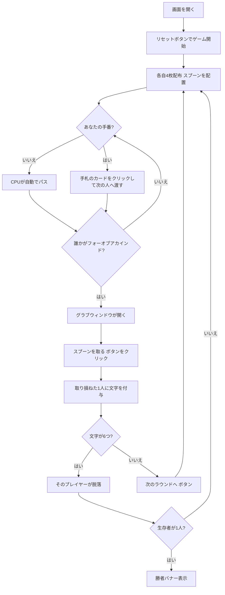

# スプーン（Web版）遊び方

## ゲーム概要

Spoons（スプーン）はアメリカ生まれの4人用パーティー・スピードゲームです。**52枚のデッキ**から各自4枚ずつ配り、次々に1枚ずつ隣のプレイヤーへカードを回します。誰かが**同じランク4枚（フォーオブアカインド）**を揃えてスプーンを取った瞬間、全員が残りのスプーン（人数より1本少ない）を奪い合います。取り損ねたプレイヤーは **S-P-O-O-N-S** の文字を1つ獲得し、6文字で脱落。最後まで生き残ったプレイヤーが勝者です。

## 起動方法

```sh
go run ./cmd/trumpcards web  # CLI経由でWebサーバーを起動
go run ./cmd/server          # 直接Webサーバーを起動
```

ブラウザで `http://localhost:8080` にアクセスし、ナビゲーションバーから「スプーン」を選択します。
ナビバーのJA/ENボタンで日本語・英語を切り替えられます。

## ルール

### デッキと配布

- **デッキ**: 52枚（標準デッキ）
- **プレイヤー**: 4人（あなた + CPU3人）
- **スプーン**: プレイヤー数より1本少ない本数（4人なら3本）を場に置きます。
- **配布**: 各プレイヤー4枚。

### パスとグラブ

- **パスフェーズ**: 手番では手札4枚のうち1枚を選び、次のプレイヤーへ渡します。フォーオブアカインドを揃えるのが目標です。
- **グラブフェーズ**: 誰かがフォーオブアカインドを揃えてスプーンを取ると、グラブウィンドウが開きます。全員が我先にとスプーンを奪い合い、1人だけ取り損ねます。

### 文字と脱落・勝利

- スプーンを取り損ねたプレイヤーは **S → P → O → O → N → S** の順に文字を1つ獲得します。
- **6文字そろうと脱落**し、以降のラウンドには参加しません。
- **最後の1人になったプレイヤーが勝者**です。

### CPU難易度

- **Easy（0）**: 反応が鈍くグラブに乗り遅れやすい。
- **Normal（1）**: 標準的な反応。
- **Hard（2）**: 反応が速くグラブに乗り遅れにくい。

## ゲームの流れ



## 画面の操作方法

### パスフェーズ

- あなたの手番になると、フッターに表示された**手札4枚がクリック可能なボタン**になります。
- 次のプレイヤーへ渡したいカードを**1枚クリック**するとパスが実行されます。

### グラブフェーズ

- 誰かがフォーオブアカインドを揃えると、フッターに**「スプーンを取る！」ボタン**が現れます。
- できるだけ素早くこのボタンをクリックしてスプーンを確保してください。残りスプーン数も表示されます。

### ラウンド終了・結果

- ラウンドが終わると「次のラウンドへ」ボタンが表示されます。取り損ねたプレイヤーと付与された文字を確認して進めます。
- 生存者が1人になるとゲーム終了。勝者バナーが表示されます。

### キーボードショートカット

| キー | アクション | 有効条件 |
|------|-----------|---------|
| （なし） | マウス／タップ操作のみ | — |

## 画面構成

```
┌────────────────────────────────────────────┐
│  スプーン            [フェーズ] [CLI切替]   │
├────────────────────────────────────────────┤
│  ラウンド 1   残りスプーン: 3   山札: 36     │
│                                            │
│  プレイヤー                                 │
│   あなた — 文字: · · · · · ·                │
│   CPU 1 — 文字: S · · · · ·                 │
│   CPU 2 — 文字: · · · · · ·  [脱落]         │
│   CPU 3 — 文字: · · · · · ·  [スプーン獲得] │
├────────────────────────────────────────────┤
│  あなたの手札（クリックで次の人へ渡す）      │
│   [A♠] [A♥] [3♣] [9♦]                      │
│  [スプーンを取る！] [次のラウンドへ] [リセット]│
└────────────────────────────────────────────┘
```

- **上部バー**: ゲーム名・現在のフェーズ・CLIモード切替。
- **情報行**: ラウンド数・残りスプーン数・山札の残り枚数。
- **プレイヤー一覧**: 各プレイヤーの S-P-O-O-N-S 文字進捗と、脱落・スプーン獲得・親（feeder）の状態。
- **フッター**: あなたの手札（パスフェーズでクリック可能）と、グラブ／次のラウンド／リセットの各ボタン。

## 遊び方のコツ

- **ペアを残す**: フォーオブアカインドを狙うなら、揃いかけているランクを残し、不要なカードから渡しましょう。
- **他人の動きに反応**: 自分の手札に関係なく、誰かがスプーンを取った瞬間に「スプーンを取る！」を押せれば文字は付きません。観察と反応速度が肝心です。
- **難易度で調整**: Hard のCPUは反応が速いので、慣れないうちは Easy で練習しましょう。
