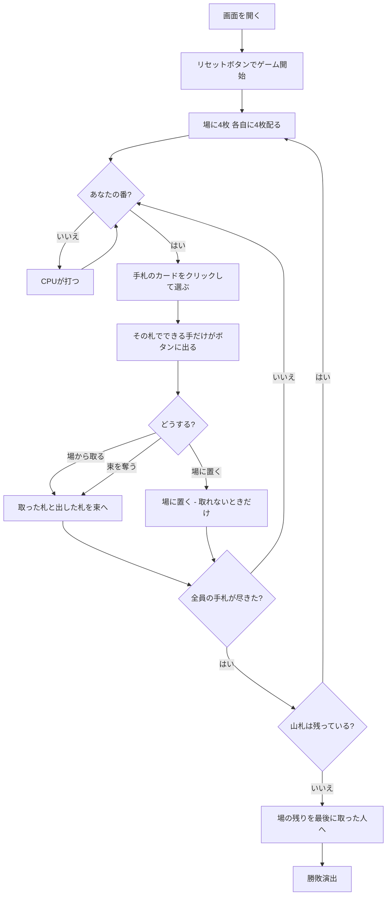

# スティーリングバンドル（Web版）遊び方

## ゲーム概要

アメリカの子供向け**フィッシングゲーム**。場の同じランクの札を取るのが基本ですが、**相手が獲得した束は「一番上のランク」が弱点**で、そこに同じランクを出すと**束ごと丸ごと奪えます**。すでに得点した札を直接ねらえるのがこのゲームの特徴です。2〜4人で遊べます。

## 起動方法

```sh
go run ./cmd/trumpcards web  # CLI経由でWebサーバーを起動
go run ./cmd/server          # 直接Webサーバーを起動
```

ブラウザで `http://localhost:8080` にアクセスし、ナビゲーションバーから「スティーリングバンドル」を選択します。
ナビバーのJA/ENボタンで日本語・英語を切り替えられます。

## ルール

- 標準52枚。**場に4枚公開し、各自に4枚ずつ**配ります。残りが山札です
- **どの人数でも割り切れます**: 2人は40枚を8枚ずつ5回、3人は36枚を12枚ずつ3回、4人は32枚を16枚ずつ2回
- 手札から1枚出して、**場にある同じランクの札を取ります**。複数あればまとめて取れます
- **相手の束は「一番上のランク」が弱点。** そこに同じランクを出すと**束ごと丸ごと**奪えます
- 束の中身は関係なく、**見えている一番上だけ**が的です
- **取れる手があるときは場に置けません。** どちらもできないときだけ置けます
- 取った札と出した札は自分の束の一番上に積まれるので、**次はそこが狙われます**
- 山札が尽きたら終わり。**場に残った札は最後に取った人**が受け取り、いちばん多く集めた人の勝ち

## ゲームの流れ



## 画面の操作方法

| 操作 | 説明 |
|------|------|
| 手札のカードをクリック | その札を選ぶ（**まだ盤面は動きません**） |
| 場から取るボタン | 選んだ札で場の同ランクを取る |
| ○○の束を奪うボタン | 選んだ札でその席の束を丸ごと奪う。奪える相手ごとにボタンが出ます |
| 場に置くボタン | 選んだ札を場に置く。**取れる手が無いときだけ出ます** |
| 選び直すボタン | 札の選択を取り消す |
| 人数（設定） | 2〜4人。リセットすると反映されます |
| ヒントボタン | 出すべき札を提示する |
| ギブアップボタン | 投了する |
| リセットボタン | 確認ダイアログのうえで最初からやり直す |
| CLI トグル | 同じゲームをコマンド入力で操作するモードに切り替える |

**札を選んでから手を決める2段階です。** 同じ札で「場から取る」と「複数の相手から奪う」が同時に成立することがあり、クリック1回ではどれを選んだのか表せないためです。

## 画面構成

```
┌────────────────────────────────────────────┐
│ 手数 7                  山札 残り24枚       │
├────────────────────────────────────────────┤
│ 相手の束は一番上のランクが弱点。            │
│ 同じランクを出すと束ごと奪える              │
├────────────────────────────────────────────┤
│  場: ♥7 ♣3                                 │
├────────────────────────────────────────────┤
│  あなた: 手札4枚 / 束6枚 / 一番上: ♠9      │
│  CPU1: 手札4枚 / 束12枚 / 一番上: ♦9       │
│  CPU2: 手札4枚 / 束0枚 / 一番上: なし      │
│ CPU3[直前に あなた の束を盗んだ]: 4枚/束2枚│
├────────────────────────────────────────────┤
│ 取れる手があります。場に置くことはできません │
├────────────────────────────────────────────┤
│  あなたの手札（使える札に緑の枠）           │
│  [場から取る] [CPU1の束を奪う] [選び直す]   │
└────────────────────────────────────────────┘
```

- **上部**: 手数と山札の残り
- **規則帯**: このゲームの核心。**束の一番上が弱点**であることを常に出します
- **場**: 取れる札の一覧。空のときは「（なし）」と出ます
- **席の行**: 手札の枚数、束の枚数（＝得点）、**束の一番上**。一番上は**全員分が見えます**
- **`[直前に場から取った]` / `[直前に ◯◯ の束を盗んだ]`**: 場に残った札を最後に受け取る席。**盗みは相手の束を丸ごと消す**別の出来事なので、どちらだったかと被害者の席まで出します。盤面には痕跡が残りません
- **下部**: 自分の手札。**その札で何かできるものに緑の枠**が付き、選ぶと使える手だけがボタンに出ます

## 遊び方のコツ

- **自分の一番上を意識する。** 取った直後は、**出したばかりの札のランク**が狙われます
- **大きい束から狙う。** 奪える枚数がそのまま得点差になるので、場の1枚を取るより効きます
- **相手が大きい束を持ったら、そのランクを手札に残す。** いつでも奪える構えが最大の牽制です
- **置くしかないときは、場に同じランクが少ない札を選ぶ。** 次の人に取られにくくなります
- **最後の1手は重い。** 場に残った札は最後に取った人のものなので、終盤の1回が二重に効きます
