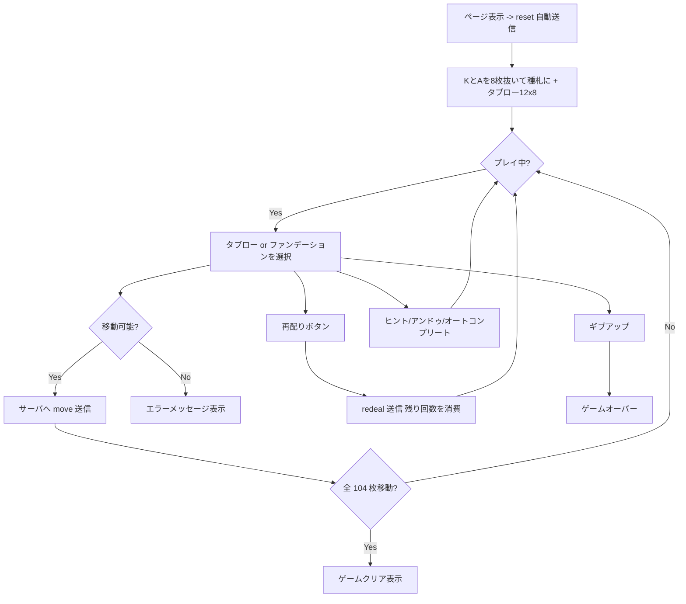

# セント・ヘレナ（Web版）遊び方

## ゲーム概要

52 枚 2 組（104 枚）で遊ぶソリティアです。各スートの **K と A を 1 枚ずつ抜いて 8 つのファンデーションの種札**にし、残り 96 枚を **12 列 × 8 枚**のタブローに配ります。タブローはファンデーションを囲む輪として並び、**列の位置がそのまま規則になります**。

K の段は降順、A の段は昇順に同じスートで積み、104 枚すべてを片付ければクリアです。行き詰まったら **最大 2 回の再配り**が使えます。

## 起動方法

```sh
go run ./cmd/trumpcards web         # CLI経由でWebサーバーを起動
go run ./cmd/trumpcards web --open  # サーバー起動 + ブラウザを開く
go run ./cmd/server                 # 直接Webサーバーを起動
```

ブラウザで `http://localhost:8080` にアクセスし、ナビゲーションバーから「セント・ヘレナ・ソリティア」を選択します。
ナビバーのJA/ENボタンで日本語・英語を切り替えられます。

## ルール

### 基本ルール

- 2 デッキ 104 枚で遊びます。
- 開始時に各スートの A と K が 1 枚ずつ自動的にファンデーションへ配られます。
- 残り 96 枚は **12 列 × 8 枚**のタブローへ表向きで配られます。
- タブロー間移動は **最上段 1 枚のみ**、**スートは問わず値差 ±1**。**K と A は繋がりません**。
- **空になったタブロー列には二度とカードを置けません。**

### 送り先の制限（初回の配りの間だけ）

| 列 | 帯 | 送れるファンデーション |
|----|----|------------------------|
| 0〜3 | 上 | **降順（K からの段）のみ** |
| 6〜9 | 下 | **昇順（A からの段）のみ** |
| 4, 5, 10, 11 | 横 | どちらでも |

輪に並べたとき、それぞれの列が隣り合っている段しか使えない、という規則です。**1 回目の再配りで解けます。** 画面では列が「上・横・下」の 3 帯に分かれて並び、送れないファンデーションは押せません。

### ファンデーション配置

- 上段: 昇順ファンデーション 4 列（♠ ♣ ♥ ♦、A → K）
- 下段: 降順ファンデーション 4 列（♠ ♣ ♥ ♦、K → A）

### 再配り

- 「再配り (X 残)」ボタンで実行します（**最大 2 回**）。
- **最後の列から順に集め、シャッフルせずに配り直します。**列をまたいで並びが変わるので、その場で反転させるのとは違って新しい手が生まれます。
- **1 回目の再配りで、上表の送り先制限が解けます。**
- アンドゥで取り消せます（制限の状態も一緒に巻き戻ります）。

### ゲーム終了

- すべてのカードをファンデーションへ移せばクリアです。
- 再配り 0 回かつ合法手が無いと手詰まり扱いになります。アンドゥ脱出ボタンが表示されます。

## ゲームの流れ



## 画面の操作方法

- **タブロー山の最上段カードをクリック** すると選択状態（黄色の枠）になります。
- 続けて移動先のタブロー山やファンデーションをクリックすると移動します。
- ドラッグ＆ドロップでも移動できます。
- フッターのボタンで「再配り」「ヒント」「オートコンプリート」「戻す」「ギブアップ」を実行できます。
- 手詰まり時には「アンドゥして脱出」ボタンが表示されます。

## 画面構成

- ヘッダー: 手数・残り再配り回数・CLI モード切り替え。
- 中央: 4×2 のファンデーション盤（上段が昇順、下段が降順）。
- **タブローは「上の4列 / 横の4列 / 下の4列」の 3 帯**に分かれて並びます。帯の見出しがそのまま送り先の制限を表しており、制限が解けると全帯がどちらの段へも送れるようになります。
- ヒント表示エリア（ヒント実行後に矢印で案内）。
- フッター: 操作ボタン群。

## 遊び方のコツ

- **スートは関係ありません。**±1 でさえあれば重ねられるので、同スート系のソリティアのつもりで探すと手を見落とします。
- **K と A は繋がりません。**A の上に置けるのは 2 だけ、K の上に置けるのは Q だけです。
- **序盤は横の 4 列（4, 5, 10, 11）が最も自由**です。上下の列は行き先が半分しかないので、横の列を起点に組み立てましょう。
- **1 回目の再配りは制限を外す一手。**「手が無くなったから」ではなく「上下の列を解放したいから」使うと考えると読みやすくなります。
- **空けた列は戻りません。**空列は詰みに近づく操作なので、狙って作るものではありません。
- アンドゥとオートコンプリートを併用すると、昇順と降順のファンデーションを同時に伸ばす戦略も狙えます。
