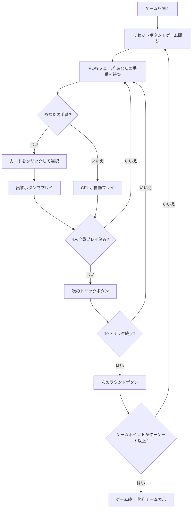

# スエカ（Web版）遊び方

## ゲーム概要

Sueca（スエカ）はポルトガル・ブラジルで広く親しまれているトリックテイキングゲームです。40枚のラテンデッキを4人（2チーム制、席0&2 対 席1&3）でプレイします。切り札スートは配布時に決まり、マスト・フォロー制で10トリックを争います。ラウンドで獲得したカード点数に応じてゲームポイントが加算され、先にターゲット（デフォルト4ゲームポイント）に達したチームが勝ちます。あなたは席0（チームA）としてプレイします。

## 起動方法

```sh
go run ./cmd/trumpcards web         # CLI経由でWebサーバーを起動
go run ./cmd/trumpcards web --open  # サーバー起動 + ブラウザを開く
go run ./cmd/server                 # 直接Webサーバーを起動
```

ブラウザで `http://localhost:8080` にアクセスし、ナビゲーションバーから「スエカ」を選択します。
ナビバーのJA/ENボタンで日本語・英語を切り替えられます。

## ルール

### デッキと配布

- **デッキ**: 40枚（A, 2〜7, Sota（J相当）, Caballo（Q相当）, Rei（K相当）× 4スート）
- **プレイヤー**: 4人（あなた = 席0、CPU1〜3）
- **チーム**: 席0&2（あなたのチーム）対 席1&3
- **配布**: 各プレイヤー10枚
- **切り札**: 最後に配られたカードのスートが切り札スートとなる

### カードの強さと点数

同スート内の強さ（強い順）: **A > 7 > Rei(K) > Valete/Sota(J) > Dama/Caballo(Q) > 6 > 5 > 4 > 3 > 2**

カード点数: **A=11点、7=10点、Rei=4点、Valete/Sota=3点、Dama/Caballo=2点、その他=0点**（合計120点）

### マスト・フォロー

リードされたスートが手札にある場合は必ずそのスートを出さなければなりません。持っていない場合は任意のカードを出せます。

### 得点計算とゲームポイント

ラウンド終了時に各チームのカード点数を集計し、ゲームポイントを付与します:

- **61〜90点**: 1ゲームポイント
- **91〜119点**: 2ゲームポイント
- **120点（全取り）**: 4ゲームポイント
- **60〜60点（引き分け）**: 0ゲームポイント（どちらにも加算なし）

### 勝利条件

ゲームポイントが先にターゲット（デフォルト **4** ゲームポイント）に達したチームがマッチ勝利となります。

## ゲームの流れ



## 画面の操作方法

### PLAYフェーズ

- あなたの手番のとき、手札のカードをクリックして選択します。
- **「出す」ボタン**: 選択したカードをプレイします。リードスートに従う義務があります（マスト・フォロー）。
- **「次のトリック」ボタン**: トリックが解決したら次へ進みます。
- **「次のラウンド」ボタン**: 10トリック終了後にゲームポイントを集計して次のラウンドへ進みます。

### キーボードショートカット

このゲームではキーボードショートカットはありません。すべての操作はボタンまたはカードのクリックで行います。

## 画面構成

```
┌─────────────────────────────────────────────┐
│  Sueca (スエカ) [JA/EN] [CLI]              │
├─────────────────────────────────────────────┤
│  ラウンド: 1  トリック: 1  フェーズ: PLAY   │
│  切り札: ♥  チームGP: あなた=0 相手=0       │
├──────────┬──────────────────────────────────┤
│  CPU1    │                                   │
│  CPU2    │     現在のトリック表示エリア       │
│  CPU3    │     （各プレイヤーの出したカード）  │
│          │                                   │
├──────────┼──────────────────────────────────┤
│  チームA │  メッセージ / 結果表示            │
│  チームB │  ラウンド結果・ゲームポイント情報  │
├──────────┴──────────────────────────────────┤
│  あなたの手札（クリックで選択）               │
│  [A♠][7♠][Rei♥][Sota♠][Caballo♣]...       │
│  [出す] [次のトリック] [次のラウンド]         │
└─────────────────────────────────────────────┘
```

- **ヘッダー**: ゲーム名・フェーズ表示・言語切り替えトグル・CLI切り替えトグル。
- **ラウンド／トリック表示**: 現在のラウンド番号・トリック番号・切り札スート。
- **チームGP（ゲームポイント）**: 各チームの累積ゲームポイントをリアルタイムで表示。
- **プレイヤー表示エリア（左）**: CPU各プレイヤーの手札枚数・取得トリック数・チームを表示。
- **トリック表示エリア（中央）**: 場に出ているカードと出したプレイヤー名。
- **カード得点の早見表**: A=11点 / 7=10点 / K=4点 / J=3点 / Q=2点 / その他=0点 の折りたたみパネル（既定は閉じた状態）。
- **メッセージボックス**: フェーズ・ラウンド結果（カード点数・ゲームポイント）・勝敗の案内。
- **フッター（手札エリア）**: あなたの手札と操作ボタン（出す／次のトリック／次のラウンド）。

## 遊び方のコツ

- **切り札の温存**: 切り札のAや7は最も強力です。高得点カードを含むトリックを取るために温存しましょう。
- **7の価値**: Suecaではカード強さが A > 7 > K > J > Q の順で、7が2番目に強い特徴があります。7は強いが点数も10点と高いため、攻守に活用できます。
- **A（11点）と7（10点）が最重要**: この2枚で合計21点あります。これらを含むトリックをいかに取るかが勝敗の鍵です。
- **チームプレイ**: 席0&2が同じチームです。パートナーが高得点トリックを取る局面では低いカードで協力しましょう。
- **ゲームポイントの計算**: 61点以上でゲームポイントを獲得できます。91点以上で2ポイント、120点（全取り）で4ポイントと大差勝利が狙えます。
- **引き分け回避**: 60点対60点では誰もゲームポイントを得られません。1点でも追加で取ることで相手に0点を与えられます。
- **マスト・フォローの活用**: 相手にスートを持たせないよう、少ないスートから先に消費させましょう。スートが切れると自由に切り札を使われてしまいます。
- **ラウンド点数管理**: 早い段階で点数差をつけると91点以上（2ゲームポイント）圏内を目指しやすくなります。
