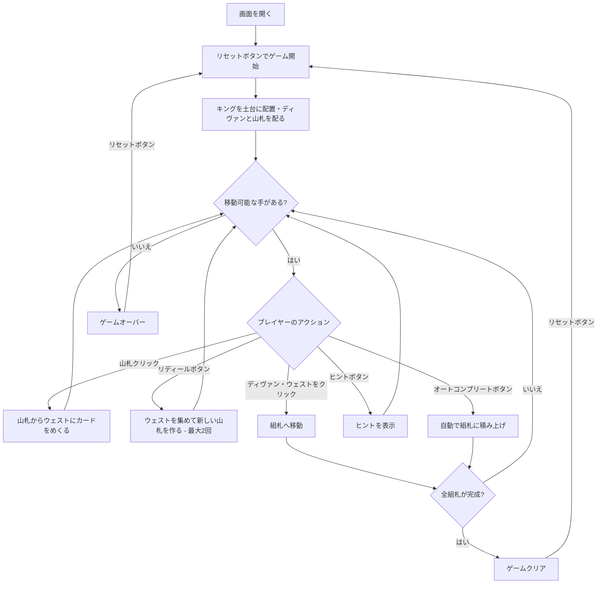

# スルタン（Web版）遊び方

## ゲーム概要

1人用のソリティアカードゲームです。2デッキ（104枚）を使い、8枚のキングを土台とした8つの組札、8スロットのディヴァン（リザーブ）、山札、ウェストで構成されます。各組札にキングの上から同スートで A→2→…→10→J→Q の順に積み上げ、すべての組札をクイーンで完成させればクリアです。山札を使い切った後、ウェストを最大2回まで集めて新しい山札を作れる（リディール）のが特徴です。

## 起動方法

```sh
go run ./cmd/trumpcards web  # CLI経由でWebサーバーを起動
go run ./cmd/server          # 直接Webサーバーを起動
```

ブラウザで `http://localhost:8080` にアクセスし、ナビゲーションバーから「スルタン」を選択します。
ナビバーのJA/ENボタンで日本語・英語を切り替えられます。

## ルール

### 基本ルール

- 2デッキ（104枚、ジョーカーなし）を使用
- 8枚のキング（各スート2枚）を組札の土台として最初に配置
- 残り96枚のうち8枚を表向きでディヴァン（8スロットのリザーブ）に配る
- 残り88枚は山札（ストック）に裏向きで置く
- 組札はキングの上から同スートで A→2→…→10→J→Q の順に積み上げる
- ディヴァンのカードはいつでも組札へ移せる。移したスロットは山札の一番上から自動補充される（山札が空ならスロットは空のまま）
- 山札から1枚ずつウェストにめくり、ウェストの一番上のカードを組札へ移せる

### リディール（再構築）

- 山札を使い切った後、**「リディール」** ボタンでウェストを集めて新しい山札を作れます
- リディールはゲーム全体で **最大2回**（合計3パス）

### ゲームクリア

- 8つの組札すべてをクイーンまで完成させる（各13枚 = キング+A〜Q）とゲームクリア

### ゲームオーバー

- これ以上移動可能な手がなく、リディールもできない場合はゲームオーバー

## ゲームの流れ



## 画面の操作方法

### カードを移動する

1. ディヴァンのカード、またはウェストの一番上のカードをクリックします
2. 置けるスート・ランクの組札へ自動的に移動します
3. ディヴァンから移したスロットは山札から自動補充されます

### 山札をめくる・リディール

1. 山札エリアをクリックしてカードをウェストにめくります（1枚ずつ）
2. 山札が空になったら、**「リディール」** ボタンでウェストを集めて新しい山札を作れます（最大2回）

### アンドゥ（元に戻す）

**「元に戻す」** ボタンまたは `z` キーで直前の操作を取り消せます。何度でも元に戻せます。

### ヒント・オートコンプリート

1. **「ヒント」** ボタンをクリックすると、次に可能な手を提案します
2. **「オートコンプリート」** ボタンをクリックすると、組札に安全に移動できるカードを自動で移動します

### キーボードショートカット

ゲーム中、以下のキーボードショートカットが使用できます。

| キー | アクション | 有効条件 |
|------|-----------|---------|
| `d` | カードをめくる（ドロー） | プレイ中 |
| `z` | 元に戻す（アンドゥ） | プレイ中 |
| `h` | ヒント | プレイ中 |
| `a` | オートコンプリート | プレイ中 |
| `g` | ギブアップ | プレイ中 |

※ テキスト入力欄にフォーカスがある場合、ショートカットは無効になります。

## 画面構成

```
┌────────────────────────────────────────────┐
│              ゲーム情報                     │
│  手数: 15  リディール残: 2回                │
├────────────────────────────────────────────┤
│              組札エリア (8つ)               │
│  [♠K][♠K][♣K][♣K][♥K][♥K][♦K][♦K]          │
├────────────────────────────────────────────┤
│              ディヴァン (8スロット)         │
│  [♠5][♥A][♣9][♦7][♠Q][♥3][♣6][♦2]          │
├────────────────────────────────────────────┤
│  山札・ウェストエリア                       │
│  [山札] [♠5]                                │
├────────────────────────────────────────────┤
│  [引く] [リディール] [元に戻す] [ヒント]    │
│  [オートコンプリート] [ギブアップ] [リセット]│
└────────────────────────────────────────────┘
```

- **組札エリア**: 8つの組札（キングの上に A→Q の順、同スート・2デッキ分）
- **ディヴァンエリア**: 8スロットのリザーブ（クリックで組札へ移動、移すと自動補充）
- **山札エリア**: クリックでカードをめくる（残りカード数表示）
- **ウェストエリア**: めくられたカードが表示される（クリックで組札へ移動）
- **ボタン**:
  - 「引く」: 山札からカードをめくる
  - 「リディール」: 山札が空のとき、ウェストを集めて新しい山札を作る（最大2回）
  - 「元に戻す」: 直前の操作を取り消す
  - 「ヒント」: 次の一手を提案
  - 「オートコンプリート」: 自動で組札へ移動
  - 「ギブアップ」: 現在のゲームを終了
  - 「リセット」: 新しいゲームを開始

## 遊び方のコツ

- まず各スートのエース（A）を組札へ。エースが出ないと積み上げが始まりません
- ディヴァンは移すたびに山札から補充されるので、積極的に消化して新しいカードを呼び込みましょう
- 山札はウェストにめくって組札の候補を探します。リディールは最大2回なので、無駄打ちに注意
- 同じスートの組札は2つあるので、ランクが合うほうへ柔軟に振り分けられます
- ヒントボタンで詰まった時のアドバイスを得られます
