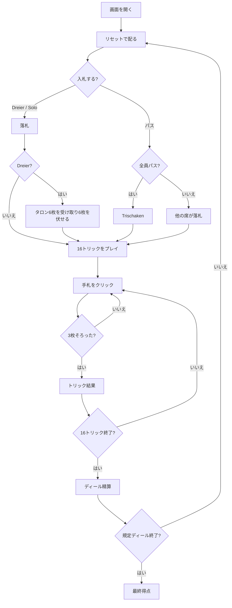

# タップ・タロック（Web版）遊び方

## ゲーム概要

タップ・タロック（Tapp Tarock）は、54枚のタロックデッキで遊ぶオーストリアの伝統的な3人用トリックテイキングです。落札者は相棒を呼ばず、最初から残り2人と1対2で戦います。

## 起動方法

```sh
go run ./cmd/trumpcards web
go run ./cmd/server
```

ブラウザで `http://localhost:8080` にアクセスし、ナビゲーションバーから「タップ・タロック」を選択します。ナビバーのJA/ENボタンで日本語・英語を切り替えられます。

## ルール

### デッキと配布

- 54枚のタロックデッキを使い、3人に16枚ずつ配り、6枚を伏せたタロン（tapp）にします。
- 4人用の Zwanzigerrufen と異なり、3人固定で、相棒を呼ばない1対2です。

### 入札と得点

- `Dreier` はタロンを受け取って6枚を伏せる契約、`Solo` はタロン交換なしの契約です。最高入札者が落札者になります。
- 全員がパスした場合は `Trischaken` となり、最多カード点の席が -3、他の席が +1です。
- カード点は Königrufen と共通です。Pagat / Mond / Skus の Trull 完成には、このリポジトリのハウスルールで +3点を加えます。
- 通常契約の基本点は10に点差を加え、Soloは2倍します。契約表と精算方法は**本リポジトリのハウスルール**であり、史実の細部を断定しません。

### プレイ

16トリックをマストフォローで行います。リードスートがなければタロックを出し、タロックは常時切り札です。契約達成後、既定4（1〜12に設定可能）ディールの通算得点で勝者を決めます。

## ゲームの流れ



## 画面の操作方法

### 入札フェーズ

1. `Dreier`、`Solo`、または `パス`をクリックします。
2. `Solo` の後など、現在の最高入札を上回れないボタンは選べません。

### タロン交換フェーズ

1. 手札から6枚をクリックして選びます。
2. 6枚選ぶと有効になる「伏せる」操作をクリックします。キングやTrullの札は伏せられません。

### プレイフェーズ

手札をクリックしてカードを出します。合法なカードは `playableIndices` に従って選べます。3枚そろうとトリック結果が表示され、「次のトリック」で進みます。

### キーボードショートカット

| キー | アクション | 有効条件 |
|------|-----------|---------|
| Tab | 次の札へフォーカス移動 | 常時 |
| Enter / Space | フォーカス中の札を出す／選ぶ | 自分の手番 |

## 画面構成

```
┌────────────────────────────────────────────┐
│  タップ・タロック                           │
│  ディール 1/4  トリック 3  契約: Dreier     │
├────────────────────────────────────────────┤
│ あなた（落札者）       CPU1       CPU2       │
│ 手札13枚 今局25点       …          …         │
├────────────────────────────────────────────┤
│              現在のトリック                  │
│                 [札] [札]                    │
├────────────────────────────────────────────┤
│            あなたの手札（13枚）              │
│  [札] [札] [札] [札] [札] [札] ...            │
├────────────────────────────────────────────┤
│  [次のトリック]              [リセット]      │
└────────────────────────────────────────────┘
```

- 上段は3席の状態、中央は現在のトリック、下段は人間の手札です。
- 手札枚数、カード点、契約、タロン枚数を確認しながら操作します。
