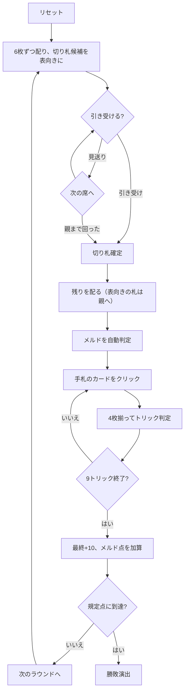

# タラビッシュ（Web版）遊び方

## ゲーム概要

カナダ・ケープブレトン島のレバノン系移民の間で育った**ジャス系**トリックテイキング。36枚を4人に9枚ずつ配る**2対2のパートナー戦**で、向かい合う席が味方。**切り札のJ（Jass）と9（Menel）がAより強い**のがこの系統の特徴。手札のラン（連続3枚以上）とベラ（切り札のK+Q）が申告点になる。

## 起動方法

```sh
go run ./cmd/trumpcards web  # CLI経由でWebサーバーを起動
go run ./cmd/server          # 直接Webサーバーを起動
```

ブラウザで `http://localhost:8080` にアクセスし、ナビゲーションバーから「タラビッシュ」を選択します。
ナビバーのJA/ENボタンで日本語・英語を切り替えられます。

## ルール

- **36枚**（A,6〜K × 4スート）、**4人2対2**（向かい合う席が味方）
- **配りは2段構え**: 6枚ずつ配り、25枚目を表向きにして切り札を決め、残りを配る。**表向きの札は親の手札に入り**、全員9枚になる
- 順に「引き受ける／見送る」を選ぶ。**親は見送れません**
- **切り札**: J(Jass)=20 > 9(Menel)=14 > A=11 > 10=10 > K=4 > Q=3 > 8,7,6=0
- **非切り札**: A=11 > K=4 > Q=3 > J=2 > 10=10 > 9,8,7,6=0
- カード点は合計**152点**、**最終トリックに+10点**
- **メルド**（配り札から自動判定）: ラン3枚=20点 / ラン4枚以上=50点 / ベラ（切り札K+Q）=20点
- 規定点（既定500点）に先に達したチームの勝ち

## ゲームの流れ



## 画面の操作方法

| 操作 | 説明 |
|------|------|
| 引き受けるボタン | 表向きの札のスートを切り札にする（入札中のみ） |
| 見送るボタン | 切り札を見送る（**親のときは表示されません**） |
| 手札のカードをクリック | そのカードを出す（出せる札だけ押せます） |
| 次のラウンドへボタン | ラウンド終了後、次のラウンドを配る |
| ヒントボタン | 引き受け可否、または打つべき札を提示する |
| ギブアップボタン | 投了する |
| リセットボタン | 確認ダイアログのうえで最初からやり直す |
| CLI トグル | 同じゲームをコマンド入力で操作するモードに切り替える |

## 画面構成

- **上部**: ラウンド数、トリック数、目標点、チーム得点
- **序列帯**: 切り札のJ/9がAより強いことの明示。盤面からは読み取れません
- **切り札欄**: 入札前は候補の1枚、決まったあとは切り札スートと引き受けた人
- **中央上**: 各プレイヤーのチーム番号（**T0があなたの味方**）とメルドの内訳
- **中央**: 現在のトリック
- **下部**: 自分の手札。**フォロー義務を満たす札だけ**に印が付きます。切り札が決まると各カードの右上に**その札の点数**が出ます（切り札の J は 20、9 は 14。入札中は点が定まらないので出ません）

## 遊び方のコツ

- **切り札のJと9を数える。** この2枚で34点、1ラウンドの2割強
- **引き受けるかは「そのスートにJ・9・Aがあるか」で決める**
- **自分が親なら見送れない。** 弱い手でも受けることになります
- **味方が勝っているトリックには点を乗せる。** A(11)や10(10)を投げ込む
- **ランは配り札で決まる。** 4枚で50点は大きい
- **ベラは切り札のK+Qだけ**
