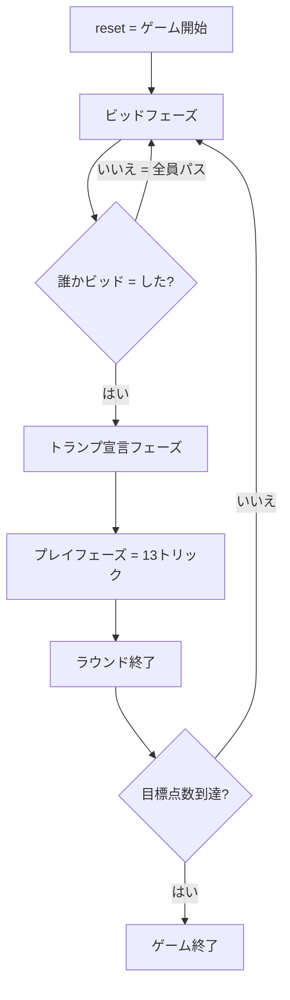

# ターニーブ（Web版）遊び方

## ゲーム概要

中東発祥の 2vs2 パートナーシップ・トリックテイキングゲーム。4 人 (人間 1 + CPU 3) で対戦し、ビッド勝者がトランプスートを選び、宣言したトリック数を取れるかチームで競います。

## 起動方法

```sh
go run ./cmd/trumpcards web  # CLI経由でWebサーバーを起動
go run ./cmd/server          # 直接Webサーバーを起動
```

ブラウザで `http://localhost:8080` にアクセスし、ナビゲーションバーから「ターニーブ」を選択します。
ナビバーのJA/ENボタンで日本語・英語を切り替えられます。

## ルール

### パートナーシップとデッキ

- 4 人 (idx 0 + 2 vs idx 1 + 3) のチーム戦。
- 52 枚デッキを各プレイヤーに 13 枚ずつ配布します。

### ビッドフェーズ

- ディーラーの左隣から 1 人 1 回ずつビッドします。
- 有効な値は **7〜13、または 0（パス）**。
- 2 人目以降のビッドは現在の最高ビッドより厳密に大きくする必要があります。
- 全員がパスした場合は再配布してビッドラウンドをやり直します。

### トランプ宣言

- 最高ビッド者が、画面上のスートボタン (♠/♣/♥/♦) から 1 つ選びます。

### プレイフェーズ

- 最高ビッド者がリードプレイヤーとなり、13 トリックを進行します。
- リードスートに従ってカードを出すのが基本ルール。ボイドならトランプで切るか捨て札を出すかを選べます。
- トランプが出ていればトランプ最高値、そうでなければリードスート最高値が勝ち。

### 得点

| チーム | 達成条件 | 加算 |
|--------|----------|------|
| ビッドチーム | 取得トリック ≥ ビッド | + 取得トリック数 |
| ビッドチーム | 取得トリック < ビッド | − ビッド数 |
| 防衛チーム | （常時） | + 取得トリック数 |

先に目標点数（デフォルト 31）に到達したチームの勝利。同点はビッドチーム優先。

## ゲームの流れ



## 画面の操作方法

| 操作 | 効果 |
|------|------|
| ビッド入力 + 「ビッド」ボタン | 7〜13 の値で入札 |
| 「パス」ボタン | ビッドを見送り |
| トランプスートボタン (♠/♣/♥/♦) | トランプを宣言 |
| 手札カードクリック | カードを選択／選択解除 |
| 「出す」ボタン | 選択カードをプレイ |
| 「次のトリック」ボタン | トリック解決後に次へ進む |
| 「次のラウンド」ボタン | ラウンド終了後にスコアを確定し次ラウンドへ |
| 「ヒント」ボタン | 推奨のビッド／トランプ／プレイを表示 |
| 設定 | CPU 難易度、目標点数、最低ビッド、フロントエンドヒントの有無 |

キーボード操作（プレイフェーズ中）:

- `←` / `→`: カード選択を移動
- `Space` / `Enter`: 選択カードを確定 (出す)
- `Esc`: 選択をクリア

## 画面構成

```
+-------------------------------------------------+
| Tarneeb  (フェーズ: ビッド)         [CLI] [⚙]  |
+-------------------------------------------------+
| Round 1   Trick 1   Trump: ♠   高ビッド: 8       |
+-------------------------------------------------+
|   [現在のトリック]      |   CPU 1 (T1): 13 枚    |
|                         |   CPU 2 (T0): 13 枚    |
|                         |   CPU 3 (T1): 13 枚    |
|                         |  チームスコア          |
|                         |    Team 0:  8          |
|                         |    Team 1:  5          |
+-------------------------------------------------+
| メッセージ: ビッドを宣言してください             |
+-------------------------------------------------+
| [手札: ♠2 ♠5 ♣3 ♣K ♥A ...]                       |
| [ビッド入力] [ビッド] [パス] [ヒント] [リセット] |
+-------------------------------------------------+
```

## 遊び方のコツ

- **ビッドはチーム戦**: 自分のトリックだけで判断せず、パートナーが取れる分も含めて 7〜13 を宣言しましょう。
- **トランプは最長スートが基本**: 一番長く持っているスートをトランプにすると勝てるトリックが増えます。
- **高札は早めにキャッシュ**: A・K はトランプで切られる前に出すと確実なトリックになります。
- **パートナーが勝っていれば低い札で逃げる**: 二重に勝ちに行く必要はありません。
- **目標点数までは長い試合**: 1 ラウンドで全部を決めようとせず、安全に取れるトリック数だけ宣言しましょう。
