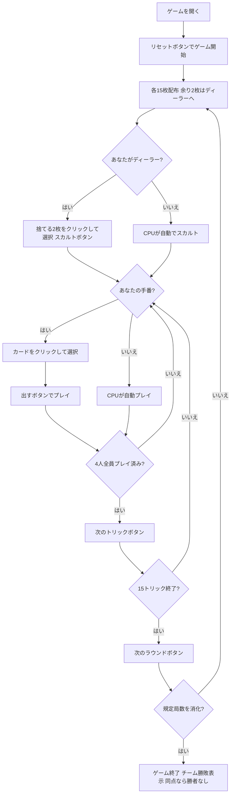

# タロッキーニ（Web版）遊び方

## ゲーム概要

Tarocchini（タロッキーニ、別名オットチェント）はイタリア・ボローニャの62枚タロット札「タロッコ・ボロニェーゼ」を使う4人用トリックテイキングゲームです。**対面同士が固定パートナー**となる2対2のチーム戦で、あなたは席0でプレイします。

このゲームを他のトリックテイカーと分けているのは **同格の「パパ」4枚は、後から出した方が勝つ** という点です。他の多くのトリックテイカーは「より強い札が出たときだけ勝者が変わる」ので、その感覚のままだと**先にパパを出した側が勝つ**と誤解します。

## 起動方法

```sh
go run ./cmd/trumpcards web         # CLI経由でWebサーバーを起動
go run ./cmd/trumpcards web --open  # サーバー起動 + ブラウザを開く
go run ./cmd/server                 # 直接Webサーバーを起動
```

ブラウザで `http://localhost:8080` にアクセスし、ナビゲーションバーから「タロッキーニ」を選択します。
ナビバーのJA/ENボタンで日本語・英語を切り替えられます。

## ルール

### デッキ（62枚）

| 種別 | 枚数 | 内訳 |
|------|------|------|
| スート札 | 40 | 4スート × 10枚（**2〜5のピップは抜かれています**）: 1, 6, 7, 8, 9, 10, F, C, R, Re |
| 切札（タロッコ） | 21 | 1〜21 |
| マット（Matto / 愚者） | 1 | — |

62枚のタロット札には専用の絵札画像が無いため、記号と番号で手続き的に描画されます。**パパは番号ではなく「Papa」と、色も通常の切札と変えて描かれます** —— 番号のままだと「2が3より弱い」と読まれてしまうためです。

### 配札とスカルト

- 各プレイヤーに **15枚**ずつ配ります。
- **62は4で割り切りません。**余った **2枚**はディーラーが受け取り、同じ2枚を伏せて捨てます（**スカルト**）。
- 伏せた2枚は**ディーラー側チームの得点になります**。そのため **切札とマットは捨てられません**。

### パパ（同格の4枚）

- 切札のうち4枚は**互いに順位が等しい「パパ」**です。
- 同じトリックに複数出た場合、**後から出した方が勝ちます**。
- **中位の同格札であって最強札ではありません。**より上位の通常の切札には負けます。

> **この4枚の同定について**: タロッコ・ボロニェーゼの切札は「ベガート → 同格のパパ4枚 → 番号付きの中位 → 最上位4枚」という構成で、"同格4枚" と "最上位4枚" は別のグループです。本実装ではベガートの直上4枚をパパとして扱っています（issue #4409 参照）。

### トリック・テイキング

- **マストフォロー**: リードされたスートを持っていれば必ず従います。
- **持っていなければ切札を出す義務**があります。
- **マットは例外**でいつでも出せますが、トリックは取れません。
- 出せないカードは選択できないよう抑止されます。

### 勝利条件

| 項目 | 得点 |
|------|------|
| トリック | 1トリックにつき1点（席の属するチームへ） |
| 最終トリックボーナス | 最後のトリックを取ったチームへ2点 |
| スカルト | 伏せた2枚がディーラー側チームへ2点 |

規定局数（設定で **4 / 8 / 12** から選択、デフォルト4局）を終えた時点で合計点の多いチームが勝ちです。**同点なら勝者なし**となります。

## ゲームの流れ



## 画面の操作方法

### 設定パネル

- **CPU難易度**: Easy / Normal / Hard。変更するとゲームがリセットされます。
- **ラウンド数**: 4 / 8 / 12。ディーラーが一巡するようプレイヤー数の倍数に限られます。
- **ヒント表示**: フロントエンドのヒントツールチップの有効・無効。

### スカルトフェーズ

あなたがディーラーのとき、手札から**2枚**を選んで捨てます。切札とマットは選択できません。

### プレイフェーズ

- 手札のカードをクリックして選択し、**「出す」ボタン**でプレイします。
- **「ヒント」ボタン**: スカルト／プレイのフェーズで押すと、サーバーが今の局面での推奨手（同格のパパ 4 枚の使い分けを含む）を返します。押したときだけ表示されます。
- **「次のトリック」ボタン**: トリックが解決したら次へ進みます。
- **「次のラウンド」ボタン**: 15トリック終了後にスコアを集計して次のラウンドへ進みます。

入札フェーズは存在しないため、入札ボタンは表示されません。

## 画面構成

```
┌─────────────────────────────────────────────────────┐
│  Tarocchini (タロッキーニ) [JA/EN] [CLI]             │
├─────────────────────────────────────────────────────┤
│  ラウンド: 1  トリック: 1  全4ラウンド                │
│  パパ4枚は同格 —— 後から出した方が勝ちます            │
├──────────┬──────────────────────────────────────────┤
│          │  得点  チーム0: 0   チーム1: 0            │
│  現在の  │                                           │
│  トリック│  あなた(T0)[親] / CPU1(T1) /              │
│  表示    │  CPU2(T0) / CPU3(T1)                      │
│  エリア  │  手札枚数・獲得トリック数                  │
├──────────┴──────────────────────────────────────────┤
│  メッセージ / 結果表示                                │
├─────────────────────────────────────────────────────┤
│  あなたの手札（クリックで選択）                       │
│  [♠1][♠7][✦12][Papa][★Matto] ...          15枚      │
│  [出す] [次のトリック] [次のラウンド] [リセット]       │
└─────────────────────────────────────────────────────┘
```

- **パパの行**: 後出し優先のルールを常時表示します。**これが無いとパパ4枚の使いどころが判断できません。**
- **得点**: チーム単位の累計点。個人戦ではありません。
- **プレイヤー情報**: 所属チーム、手札枚数、このラウンドで取ったトリック数、ディーラー表示。
- **手札**: パパは「Papa」と表示され、通常の切札とは色が異なります。出せないカードは選択できません。

## 遊び方のコツ

- **パパは最後に出す**: 後出し優先なので、誰かが先にパパを切っていれば上書きできます。自分から先に出すと上書きされます。
- **パパは万能札ではない**: 中位の同格札です。上位の通常切札には負けるので、「パパ＝最強」と思い込むと刈り取られます。
- **味方のトリックは奪わない**: 対面が既に勝っているトリックに強い札を重ねるのは無駄です。
- **ディーラーのスカルトは得点になる**: 伏せた2枚はそのままチームの点です。切札とマット以外で最も使いにくい札を選びましょう。
- **マットは逃げ札**: トリックは取れませんが、フォロー義務と切札義務の両方を免れます。
- **最終トリックは2点**: 通常の倍の価値があります。終盤に切札を1枚残しておくと確実に取れます。
