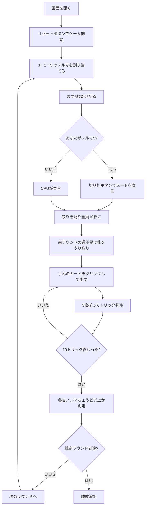

# 3-2-5（Web版）遊び方

## ゲーム概要

インド北部で遊ばれる**3人専用**のトリックテイキング。30枚を10枚ずつ配り、10トリックを打ちます。**ノルマは宣言するものではなく、最初から割り当てられています**——3人がそれぞれ **3・2・5** という別々のトリック数を負い、役割はラウンドごとに回ります。**多く取っても得点は増えません。**

## 起動方法

```sh
go run ./cmd/trumpcards web  # CLI経由でWebサーバーを起動
go run ./cmd/server          # 直接Webサーバーを起動
```

ブラウザで `http://localhost:8080` にアクセスし、ナビゲーションバーから「3-2-5」を選択します。
ナビバーのJA/ENボタンで日本語・英語を切り替えられます。

## ルール

- **30枚**（8〜A の28枚 + **7♠ + 7♥**）、**3人専用**、10枚ずつ。3人 × 10枚でちょうど配り切れます（28枚では2枚足りません）
- 強さは **A > K > Q > J > 10 > 9 > 8 > 7**。フォロー義務あり、切り札 > リードのスート > その他
- **ノルマは割り当て。** 切り札を決める席が **5**、その左隣が **3**、さらに左隣が **2**。3 + 2 + 5 = 10 でちょうど
- **まず5枚だけ配り、ノルマ5の席がその5枚だけを見て切り札を宣言**してから残りを配ります
- ラウンド終了時、**ノルマちょうど以上なら達成**。届かなければ未達成
- **多く取っても得点は増えません。** 超過ぶんは次のラウンドで、**届かなかった人の良い札を召し上げる権利**になります（自分の弱い札と交換）
- **ノルマ5の席はラウンドごとに移り**、3ラウンドで全員が3種類を一度ずつ引き受けます
- 規定ラウンド（既定3）を終えた時点で、**ノルマ達成回数がいちばん多い人の勝ち**。同点なら引き分け

## ゲームの流れ



## 画面の操作方法

| 操作 | 説明 |
|------|------|
| 切り札ボタン（♠♣♥♦の4つ） | 切り札スートを宣言する（**あなたがノルマ5のときだけ表示**） |
| 手札のカードをクリック | そのカードを出す（出せる札には緑の枠が付きます） |
| 次のラウンドへボタン | ラウンド終了後、次のラウンドを配る |
| ヒントボタン | 宣言すべきスート、または打つべき札を提示する |
| ギブアップボタン | 投了する |
| リセットボタン | 確認ダイアログのうえで最初からやり直す |
| CLI トグル | 同じゲームをコマンド入力で操作するモードに切り替える |

**ノルマを宣言するボタンはありません。** 3・2・5 は割り当てで、選ぶ余地がありません。

### キーボードショートカット

| キー | アクション | 有効条件 |
|------|-----------|---------|

（このゲーム固有のキーボードショートカットはありません）

## 画面構成

```
┌────────────────────────────────────────────┐
│  ラウンド 2/3          切り札: ♥            │
├────────────────────────────────────────────┤
│ ノルマは宣言ではなく割り当てです（3・2・5）  │
│ 前ラウンドの過不足で 2 枚が動きました        │
├────────────────────────────────────────────┤
│  あなた: ノルマ3 / 獲得1   達成1回          │
│  CPU1 [切り札決定]: ノルマ5 / 獲得2 達成0回 │
│  CPU2: ノルマ2 / 獲得1     達成1回          │
├────────────────────────────────────────────┤
│              現在のトリック                 │
├────────────────────────────────────────────┤
│  あなたの手札（出せる札に緑の枠）            │
└────────────────────────────────────────────┘
```

- **上部**: ラウンド数と切り札（未宣言のあいだは誰が決めるかを説明します）
- **ノルマ帯**: このゲームの規則そのもの。**宣言ではなく割り当て**であることを常に出します
- **やり取り行**: 前ラウンドの過不足で動いた枚数。**盤面には痕跡が残らない**ので明示します
- **中央上**: 各プレイヤーの**ノルマ / 獲得数 / 達成回数**、**切り札を決めた席**の印
- **中央**: 現在のトリック
- **下部**: 自分の手札。**フォロー義務を満たす札だけ**に緑の枠が付きます

## 遊び方のコツ

- **ノルマ2はいちばん楽に見えて、いちばん「取りすぎ」が起きやすい。** 強い札を持たされたラウンドこそ注意です
- **ノルマ5を引いたら切り札は長いスートから。** 5枚しか見えないので、枚数がいちばん確かな情報です
- **届いたら降りる。** 6トリック目以降は1つも得になりません
- **ただし、あと1トリックで届く相手には取らせない。** 相手を未達成にすれば良い札を召し上げられます
- **達成回数だけが得点。** トリックを多く取った回数ではありません
