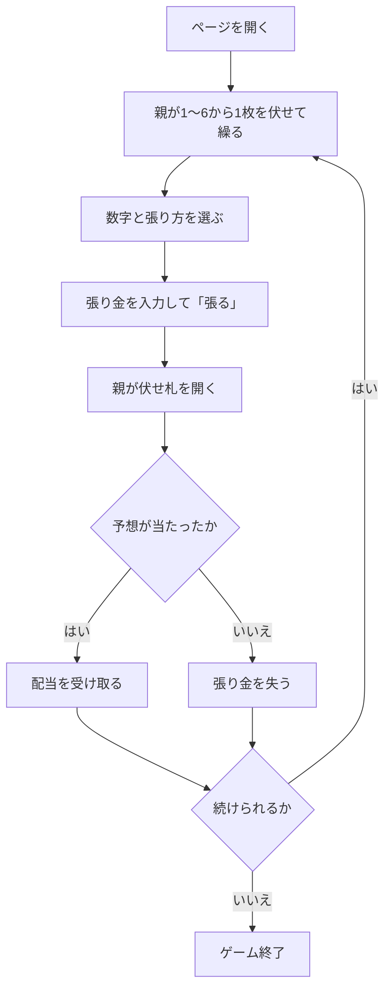

# 手本引き（Web版）遊び方

## ゲーム概要

手本引きは、日本（関西）の伝統的な賭博遊戯です。親が伏せて選んだ株札の数字を子が予想し、張り方に応じた配当を受けます。親1人と子（人間1人＋CPU）で遊ぶ、トリックテイキングでもラミーでもない予想と配当のゲームです。

## 起動方法

```sh
go run ./cmd/trumpcards web
go run ./cmd/server
```

サーバ起動後、ブラウザで `http://localhost:8080/tehonbiki` を開きます。ナビゲーションバーから「手本引き」を選び、ナビバーのJA/ENボタンで日本語・英語を切り替えられます。

## ルール

- 株札の1〜6を使います。各勝負で親が1〜6から1枚を伏せて選びます。これを「繰る」といいます。
- 子は伏せ札がどの数字かを予想し、張り方とチップの額を決めます。
- 全員が張り終えたら親が伏せ札を開き、予想に含まれていた張りに配当を払います。外れた張りは没収です。

| 張り方 | 覆う数字 | 配当（勝ち分） |
|--------|----------|----------------|
| 単張り | 1個 | 4.5倍 |
| 二丁掛け | 2個 | 1.8倍 |
| 三丁掛け | 3個 | 0.9倍 |
| 片山 | 決められた3個の組 | 0.9倍 |

この配当表は本リポジトリで採用したハウスルールであり、史実の配当ではありません。覆う数字を `k` 個とした公正オッズ `(6-k)/k` から、勝ち分の1割を引いて決めています。片山で選べる組は `1,2,3` または `4,5,6` のどちらかです。

## ゲームの流れ



## 画面の操作方法

| 操作 | 説明 |
|------|------|
| 数字ボタン | 覆う数字を選びます。張り方に応じた個数を選択します |
| 張り方の選択 | 単張り・二丁掛け・三丁掛け・片山を選びます |
| 張り金入力 | 10〜500の範囲でチップを指定します |
| 「張る」 | 予想と張り金を確定します |
| 「次の勝負」 | 決着後、次の勝負を始めます |
| ヒントボタン | 数字を選ぶためのヒントを表示します |
| 棋譜ボタン | 行動ログを表示します |
| リセットボタン | ゲームを最初からやり直します |

### キーボードショートカット

| キー | アクション | 有効条件 |
|------|-----------|---------|
| `r` | リセット | いつでも |
| `l` | 棋譜を表示 | いつでも |

## 画面構成

```
┌────────────────────────────────────────────┐
│ 手本引き                  チップ: 1000      │
├────────────────────────────────────────────┤
│ フェーズ: 予想          ラウンド: 1         │
│ 数字:  [1] [2] [3] [4] [5] [6]              │
│ 張り方: [単張り] [二丁掛け] [三丁掛け] [片山] │
│ 張り金: [       ]             [張る]         │
└────────────────────────────────────────────┘
```

- **チップ**: 現在の持ちチップです。
- **数字**: 予想する数字を選びます。選択数は張り方によって変わります。
- **張り方・張り金**: 配当とリスクを決めます。
- **結果**: 親の札、的中・外れ、受け取った勝ち分を表示します。

## 遊び方のコツ

- 単張りは配当が大きい代わりに覆う数字が1個だけ、三丁掛けと片山は配当が小さい代わりに3個を覆います。
- 親の札は開くまで分からないため、確実に当たる数字はありません。張り金と配当の釣り合いを考えて選びます。
