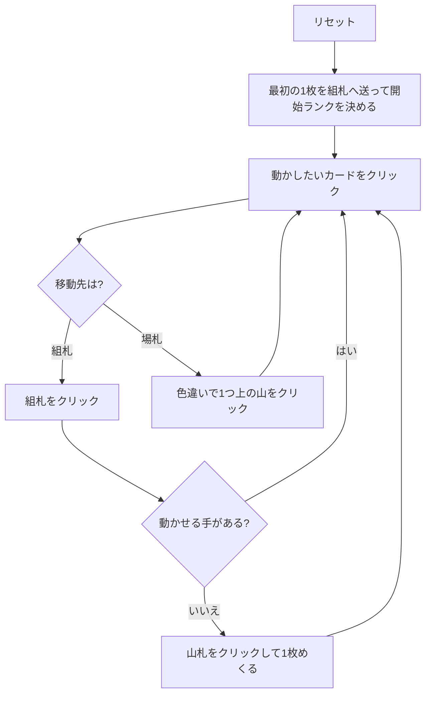

# テラス (Terrace) — Web マニュアル

## ゲーム概要

52 枚 2 組（104 枚）で遊ぶソリティア。別名 **クイーン・オブ・イタリー (Queen of Italy)**。**11 枚のテラス**を並べ、**9 つのタブロー山**に 1 枚ずつ配り、残り 84 枚が山札になる。

特徴は 2 つ。**基礎札を「色違い」で積むこと**（同スートではない）と、**テラスの札が基礎札にしか出せないこと**です。

## 起動方法

1. `go run ./cmd/trumpcards web` でサーバーを起動する
2. ブラウザで `http://localhost:8080` を開く
3. ゲーム一覧または左サイドバーから「テラス」を選ぶ

## ルール

- **基礎札**: 8 つ。**色違いで昇順**、K の次は A。13 枚で 1 つ完成。8×13 = 104 枚でクリア
- **開始ランク**: 最初に組札へ送った札のランクが 8 つすべての開始ランクになる
- **テラス**: 一番上だけが使え、**行き先は組札のみ**。場札へは動かせず、**補充もされない**
- **場札**: 9 山。**色違いの降順**、A の下には K。**1 枚ずつしか動かせない**
- **空き山**: 捨て札（無ければ山札）から**自動的に**埋まる
- 山札は 1 枚ずつ捨て札へ。**めくり直しは無い**

## ゲームの流れ

## 画面の操作方法

| 操作 | 説明 |
|------|------|
| テラスをクリック | 一番上の札を移動元として選択する（**行き先は組札だけ**） |
| 捨て札をクリック | 一番上の札を移動元として選択する |
| 山の一番上のカードをクリック | そのカードを移動元として選択する（下のカードは選べない） |
| 組札をクリック | 選択中のカードをその組札に置く |
| 別の山をクリック | 選択中のカードをその山に置く |
| 山札 / めくるボタン | 山札を 1 枚めくって捨て札へ送る |
| ドラッグ＆ドロップ | クリック 2 回と同じ移動をドラッグでも行える |
| ヒントボタン | テラス → 組札 → 場札 → めくる の順に手を 1 つ提示する |
| 自動完成ボタン | 組札へ送れる札がなくなるまで自動で送る（**場札の組み替えは行わない**） |
| 元に戻す / 手詰まり脱出ボタン | 1 手戻す / 脱出に必要な手数だけまとめて戻す |
| ギブアップ / リセットボタン | 確認ダイアログのうえで投了 / やり直す |
| CLI トグル | 同じゲームをコマンド入力で操作するモードに切り替える |

キーボードショートカット: `d` めくる / `h` ヒント / `a` 自動完成 / `z` 元に戻す / `g` ギブアップ（確認あり）。

## 画面構成

- **上部**: フェーズ表示、開始ランク（未決定のうちは「未決定」）、手数
- **中央上段**: テラス（残り枚数つき）、8 つの組札、山札と捨て札
- **中央下段**: 9 つの山。番号 `#0`〜`#8` はヒント表示の番号と一致する。空き山は押せない（自動で埋まるため）
- **下部**: ヒント表示、アクションログ、設定、キーボードショートカット一覧

## 遊び方のコツ

- **テラスを詰まらせたら負け。** 補充されず行き先も組札だけなので、テラスの一番上が上がる形を最優先で考える
- **開始ランクの選択がゲーム全体を決める。** テラスの上の方に固まっているランクを基準にすると序盤から削れる
- 組札は**色違い**なので、「次に欲しいのは赤の 7」という見方をする
- 場札は 1 枚ずつしか動かせない
- 山札は 1 巡だけ。めくる前に置き場所を考える
- 詰まったら元に戻すで分岐をやり直す
