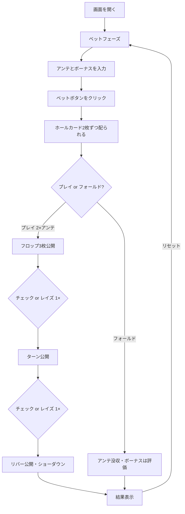

# テキサスホールデムボーナスポーカー（Web版）遊び方

## ゲーム概要

ディーラーと1対1で対戦するカジノ版テキサスホールデムです。プレイヤーとディーラーは2枚のホールカードを受け取り、5枚のコミュニティカードを使って最良の5枚役を作ります。プリフロップ・フロップ・ターンの各ストリートでベットを上乗せでき、ディーラーは「クオリファイ」せず常に勝負します。

## 起動方法

```sh
go run ./cmd/trumpcards web   # CLI経由でWebサーバーを起動
go run ./cmd/server           # 直接Webサーバーを起動
```

ブラウザで `http://localhost:8080` にアクセスし、ナビゲーションバーから「テキサスホールデムボーナスポーカー」を選択します。

## ルール

### 基本ルール

- 52枚のトランプ（ジョーカーなし）を使用
- プレイヤーとディーラーにそれぞれ2枚のホールカード、共有のコミュニティカード5枚を配る
- アンテベット必須＋ボーナスサイドベット任意
- プリフロップ：プレイヤーは「フロップベット（アンテの2倍）」または「フォールド」を選択
- フロップ／ターン後：「チェック」または「レイズ（アンテの1倍）」を選択
- リバー後にショーダウン（ディーラーは常に勝負＝クオリファイ判定なし）

### 手札ランキング（強い順）

| ランク | 説明 |
|--------|------|
| ロイヤルフラッシュ | 同じスートのA-K-Q-J-10 |
| ストレートフラッシュ | 同じスートの連続5枚 |
| フォーカード | 同じランク4枚 |
| フルハウス | スリーカード+ペア |
| フラッシュ | 同じスートの5枚 |
| ストレート | 連続する5枚 |
| スリーカード | 同じランク3枚 |
| ツーペア | ペア2組 |
| ワンペア | 同じランク2枚 |
| ハイカード | 上記以外 |

### ベットと配当

**アンテ／プレイベット（フロップ＋ターン＋リバー）：**

| 結果 | 配当 |
|------|------|
| プレイヤー勝ち | アンテ・各プレイベット 1:1 |
| 引き分け | プッシュ（返却） |
| ディーラー勝ち | アンテ・各プレイベット没収 |

**アンテボーナス（プレイヤーがストレート以上の役を作ったとき、勝敗に関係なく追加で支払い）:**

| 役 | 配当 |
|----|------|
| ロイヤルフラッシュ | 1000:1 |
| ストレートフラッシュ | 200:1 |
| フォーカード | 25:1 |
| フルハウス | 5:1 |
| フラッシュ | 4:1 |
| ストレート | 1:1 |

**ボーナスサイドベット（プレイヤー2枚のホールカード、勝敗に関係なく支払い）:**

| ホールカード | 配当 |
|--------------|------|
| AA（ペアエース） | 30:1 |
| AKスーテッド | 25:1 |
| AQ／AJスーテッド | 20:1 |
| AKオフスート | 15:1 |
| KK／QQ／JJ | 10:1 |
| AQ／AJオフスート | 5:1 |
| 22〜TT（ペア） | 3:1 |

## ゲームの流れ



## 画面の操作方法

### ベットフェーズ

1. **アンテ額**: 数値入力欄でアンテベット額を設定（10刻み、最低10）
2. **ボーナス額（任意）**: ボーナスサイドベット額を設定（0で無効）
3. **「ベット」ボタン**: クリックでベットを確定し、ホールカードが配られる

### プリフロップ

1. プレイヤーの2枚のホールカードが表示されます
2. **「プレイ」ボタン**: アンテの2倍のフロップベットを置いてフロップを公開
3. **「フォールド」ボタン**: アンテ放棄（ボーナスは評価される）

### フロップ／ターン

1. コミュニティカードが順番に公開されます
2. **「チェック」ボタン**: ベットせず次のストリートへ
3. **「レイズ」ボタン**: アンテの1倍を追加で賭けて次のストリートへ

### 結果フェーズ

1. ディーラーのホールカードが公開されます
2. プレイヤーとディーラーの最良5枚と役が表示されます
3. アンテ／プレイ／アンテボーナス／ボーナスサイドベットの各配当と合計配当が表示されます
4. **「リセット」ボタン**: 新しいラウンドを開始
5. **「棋譜を見る」ボタン**: アクションログを表示

### キーボードショートカット

| キー | アクション | 有効条件 |
|------|-----------|---------|
| `b` | ベット | ベットフェーズのみ |
| `p` | プレイ（フロップベット 2×） | プリフロップのみ |
| `f` | フォールド | プリフロップのみ |
| `c` | チェック | フロップ／ターンのみ |
| `a` | レイズ（1×アンテ） | フロップ／ターンのみ |
| `r` | リセット | 結果フェーズのみ |

## 画面構成

```
┌────────────────────────────────────────────────┐
│  チップ残高                フェーズ表示          │
│                                                │
│  ディーラー: [??] [??]                          │
│                                                │
│  ボード: [♠A] [♠K] [♠Q]   [♠J]   [♠10]         │
│                                                │
│  プレイヤー: [♥A] [♥K]                          │
│  役名: ペア（A）                                 │
│                                                │
│  ベット: アンテ [100]  ボーナス [10]             │
│  [プレイ] [フォールド] [チェック] [レイズ] [リセット]│
└────────────────────────────────────────────────┘
```

- **ヘッダー**: チップ残高と現在のフェーズ（BET / PRE-FLOP / FLOP / TURN / END）
- **ディーラーエリア**: 画面上部。ENDフェーズまで全カード伏せ
- **ボードエリア**: コミュニティカード（フロップ3＋ターン1＋リバー1）
- **プレイヤーエリア**: 自分の2枚のホールカード
- **操作ボタン**: フェーズに応じて「プレイ／フォールド」「チェック／レイズ」「リセット」が有効化

## 遊び方のコツ

- ポケットペアやAを含む2枚は基本プリフロップでプレイし、相手の弱手を取りに行きましょう
- フロップでペア以上が完成したらレイズして勝ち額を最大化、それ以下はチェックでベット額を抑えるのが基本
- アンテボーナスはストレート以上で支払われるため、強い役の可能性があるドローでは積極的にベットしてもよいでしょう
- ボーナスサイドベットはハウスエッジが高め。ポケットエースやAKスーテッドの夢を買うつもりで小額にとどめるのが無難です
