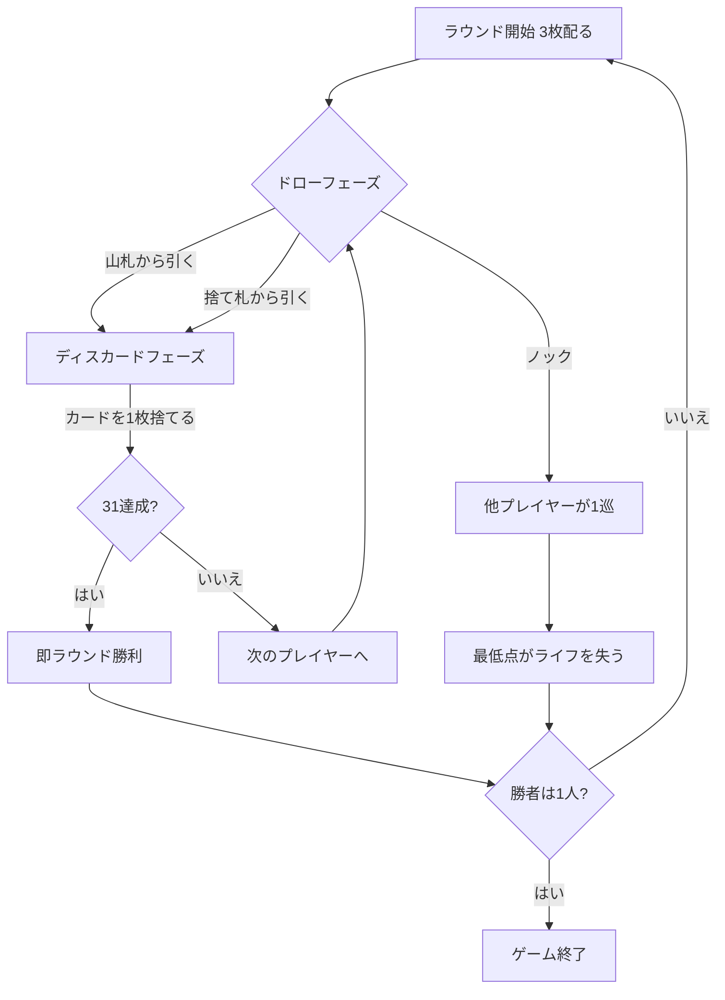

# サーティワン（Web版）遊び方

## ゲーム概要

サーティワン (Thirty-One、別名 Scat) は、欧米のパブやカジノで親しまれてきたドロー＆ディスカードのサバイバルゲームです。手札3枚の「同じスートの合計点」を31点に近づけ、誰かがノックした時点で最も点数の低いプレイヤーがライフを1つ失います。最後まで生き残ったプレイヤーが勝者です。

- プレイ人数: 4人 (あなた + CPU 3人)
- 使用カード: 52枚 (A=11点、J/Q/K=10点、2〜10=額面)
- 初期ライフ: 3 (設定で変更可能)

## 起動方法

```sh
go run ./cmd/trumpcards web         # CLI経由でWebサーバーを起動
go run ./cmd/trumpcards web --open  # サーバー起動 + ブラウザを開く
go run ./cmd/server                 # 直接Webサーバーを起動
```

ブラウザで `http://localhost:8080` にアクセスし、ナビゲーションバーから「サーティワン」を選択します。
ナビバーのJA/ENボタンで日本語・英語を切り替えられます。

## ルール

1. 各プレイヤーに3枚配り、1枚が捨て札の山に置かれます。
2. 自分の番では「山札から引く」または「捨て札から引く」を選び、手札から1枚を捨てます。
3. 引かずに勝負したい場合は「ノック」できます。ノック後は他のプレイヤーが1ターンずつプレイしてラウンドが終了します。
4. 手札の「同じスートの合計点」が最も低いプレイヤーがライフを1つ失います (同点なら全員)。
5. 合計がちょうど31点になった場合は即ラウンド勝利となり、他の全員がライフを失います。
6. ライフが尽きたプレイヤーは脱落します。最後の1人、またはあなたが脱落した時点でゲーム終了です。

## ゲームの流れ



## 画面の操作方法

- **山札から引く**: 山札の一番上を引きます (ドローフェーズ)。
- **捨て札から引く**: 捨て札の一番上を引きます (ドローフェーズ)。
- **ノック**: 引かずに勝負を締めます (ドローフェーズ、まだ誰もノックしていないとき)。
- **カード選択 → 捨てる**: ディスカードフェーズで手札のカードを1枚クリックして選び、「捨てる」を押します。
- **次のラウンド**: ラウンド終了後に次のラウンドへ進みます。
- **設定**: CPU難易度と初期ライフを変更できます。ヒント表示の ON/OFF も可能です。

## 画面構成

- **上部**: CPU 3人のエリア。各 CPU のライフ (❤) と手札 (裏向き) が並びます。ラウンド終了時にカードと得点が公開されます。
- **中央**: 山札 (残り枚数) と捨て札の一番上。
- **下部**: あなたの手札、スート別合計のバッジ、最高スート得点とライフ。
- **フッター**: 山札/捨て札から引く・ノック・捨てる・次のラウンド・リセット・アクションログのボタン。

## 遊び方のコツ

- 1つのスートに集中して集めましょう。A(11) と絵札(10) が同スートで揃うと31に近づきます。
- スート別合計バッジを見れば、どのスートを伸ばすべきかが一目で分かります。
- 手札が強い (27点前後以上) ときは、相手が伸びる前にノックすると有利です。
- ヒントを ON にすると、ノック・山札/捨て札のどちらを引くべきかの助言が表示されます。
